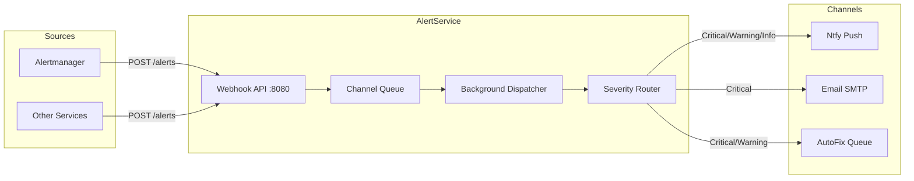

# AlertService

Centralized alert routing and notification dispatch service for ATLAS.

## Overview

AlertService receives alert webhooks from Prometheus Alertmanager and other ATLAS services, queues them for asynchronous processing, and dispatches notifications to configured channels (Ntfy, Email, AutoFix) based on severity routing rules. It uses an in-memory channel-based queue to decouple ingestion from delivery, with fingerprint-based deduplication to suppress repeated alerts within a 30-minute window.

## Architecture



Alerts arrive via POST webhook, get parsed (Alertmanager or direct format), enqueued into a `System.Threading.Channels` unbounded channel, then dispatched by a `BackgroundService` to the appropriate notification channels based on severity routing rules.

## Features

- **Dual Format Ingestion**: Accepts both Prometheus Alertmanager webhook format and direct JSON alerts
- **Async Queue Processing**: Decouples ingestion from delivery using `System.Threading.Channels`
- **Severity-Based Routing**: Configurable rules map alert severities to notification channels
- **Fingerprint Deduplication**: Suppresses duplicate alerts within a 30-minute window using fingerprint+status keys
- **Multi-Channel Dispatch**: Ntfy (push), Email (SMTP via MailKit), and AutoFix (file-based queue for automated remediation)
- **AutoFix Rate Limiting**: Configurable per-minute and daily session limits for automated fix attempts
- **RFC 9457 Problem Details**: Structured error responses with trace correlation
- **Observability**: OpenTelemetry metrics (queue depth, delivery latency, success/failure rates) and distributed tracing

## Configuration

| Variable | Description | Default |
|----------|-------------|---------|
| `OpenTelemetry__OtlpEndpoint` | OTLP collector endpoint | `http://otel-collector:4317` |
| `OpenTelemetry__ServiceName` | Service name for telemetry | `alert-service` |
| `Channels__Ntfy__Enabled` | Enable Ntfy channel | `true` |
| `Channels__Ntfy__Endpoint` | Ntfy server URL | `https://ntfy.sh` |
| `Channels__Ntfy__Topic` | Ntfy topic name | `atlas-alerts` |
| `Channels__Ntfy__Username` | Ntfy basic auth username | _empty_ |
| `Channels__Ntfy__Password` | Ntfy basic auth password | _empty_ |
| `Channels__Email__Enabled` | Enable Email channel | `false` |
| `Channels__Email__SmtpHost` | SMTP server hostname | `smtp.example.com` |
| `Channels__Email__SmtpPort` | SMTP server port | `587` |
| `Channels__Email__UseSsl` | Use StartTLS | `true` |
| `Channels__Email__FromAddress` | Sender email address | `alerts@atlas.local` |
| `Channels__Email__ToAddresses` | Recipient email addresses (array) | Required if enabled |
| `Channels__AutoFix__Enabled` | Enable AutoFix channel | `true` |
| `Channels__AutoFix__QueueDirectory` | Directory for autofix job files | `/opt/ai-inference/autofix-queue` |
| `Channels__AutoFix__RateLimitMinutes` | Minimum minutes between autofix sessions | `30` |
| `Channels__AutoFix__MaxSessionsPerDay` | Maximum autofix sessions per day | `3` |
| `Routing__SeverityRoutes__critical` | Channels for critical alerts | `["ntfy", "email", "autofix"]` |
| `Routing__SeverityRoutes__warning` | Channels for warning alerts | `["ntfy", "autofix"]` |
| `Routing__SeverityRoutes__info` | Channels for info alerts | `["ntfy"]` |

## API Endpoints

### REST API (Port 8080)

| Endpoint | Method | Description |
|----------|--------|-------------|
| `/alerts` | POST | Ingest alerts (Alertmanager webhook or direct JSON format) |
| `/health` | GET | Health check returning `{"status": "healthy"}` |

### Alert Payload Formats

**Direct Format**:
```json
{
  "source": "custom-source",
  "severity": "critical",
  "title": "Alert Title",
  "message": "Alert description.",
  "metadata": { "key": "value" }
}
```

**Alertmanager Format**:
```json
{
  "alerts": [{
    "status": "firing",
    "labels": { "alertname": "HighCpu", "severity": "warning" },
    "annotations": { "description": "CPU usage > 90%" },
    "fingerprint": "abc123"
  }]
}
```

## Project Structure

```
AlertService/
├── src/
│   ├── Program.cs           # Entry point, DI, OTEL setup
│   ├── appsettings.json     # Default configuration
│   ├── Channels/            # INotificationChannel implementations (Ntfy, Email, AutoFix)
│   ├── Endpoints/           # Minimal API route handlers
│   ├── Models/              # Alert, AlertRequest, AlertmanagerAlert
│   ├── Services/            # AlertQueue, NotificationDispatcher, RoutingOptions
│   └── Telemetry/           # AlertServiceMeter, AlertServiceActivitySource
├── tests/                   # Unit tests (parsing, queue, routing, dedup, channels)
└── .devcontainer/           # Dev container config
```

## Development

### Prerequisites

- VS Code with Dev Containers extension
- Access to shared infrastructure (observability stack)

### Getting Started

1. Open in VS Code: `code AlertService/`
2. Reopen in Container (Cmd/Ctrl+Shift+P -> "Dev Containers: Reopen in Container")
3. Build: `dotnet build`
4. Run: `dotnet run`

### Compile and Test

```bash
.devcontainer/compile.sh
```

### Build Container Image

```bash
.devcontainer/build.sh
```

## Deployment

```bash
ansible-playbook playbooks/deploy.yml --tags alert-service
```

## Ports

| Port | Description |
|------|-------------|
| 8080 | REST API (internal, container-to-container only) |

No host port mapping. Alertmanager reaches AlertService via the internal container network.

## See Also

- [ThresholdEngine](../ThresholdEngine/README.md) - Upstream pattern evaluation that triggers Alertmanager
- [docs/ARCHITECTURE.md](../docs/ARCHITECTURE.md) - System design
