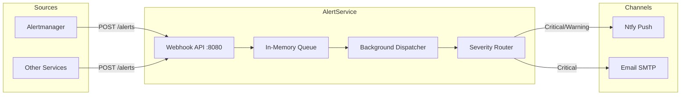

# AlertService

Centralized alert routing and notification dispatch service for ATLAS.

## Overview

AlertService receives alert webhooks from Prometheus Alertmanager and other monitoring systems, queues them for asynchronous processing, and dispatches notifications to configured channels (Ntfy, Email) based on severity routing rules. Decouples alert ingestion from delivery to ensure reliable notification handling under load.

## Architecture



## Features

- **Unified Ingestion**: Accepts both direct JSON alerts and Prometheus Alertmanager webhook format
- **Async Processing**: Decouples ingestion from delivery using in-memory background queue
- **Severity Routing**: Configurable rules map alert severities to specific notification channels
- **Multi-Channel Support**: Ntfy (push notifications) and Email (SMTP) channels included
- **Graceful Degradation**: Failed deliveries logged without blocking queue processing
- **Observability**: Metrics for queue depth, delivery latency, success/failure rates

## Configuration

| Variable | Default | Description |
|----------|---------|-------------|
| `OpenTelemetry__OtlpEndpoint` | `http://otel-collector:4317` | OTLP collector endpoint |
| `OpenTelemetry__ServiceName` | `alert-service` | Service name for telemetry |
| `OpenTelemetry__ServiceVersion` | `1.0.0` | Service version for telemetry |
| `Channels__Ntfy__Enabled` | `true` | Enable Ntfy channel |
| `Channels__Ntfy__Endpoint` | `https://ntfy.sh` | Ntfy server endpoint |
| `Channels__Ntfy__Topic` | `atlas-alerts` | Ntfy topic for push notifications |
| `Channels__Email__Enabled` | `false` | Enable Email channel |
| `Channels__Email__SmtpHost` | Required if enabled | SMTP server hostname |
| `Channels__Email__SmtpPort` | `587` | SMTP server port |
| `Channels__Email__UseSsl` | `true` | Use SSL/TLS for SMTP |
| `Channels__Email__Username` | Optional | SMTP authentication username |
| `Channels__Email__Password` | Optional | SMTP authentication password |
| `Channels__Email__FromAddress` | `alerts@atlas.local` | From email address |
| `Channels__Email__ToAddresses` | Required if enabled | Array of recipient email addresses |
| `Routing__SeverityRoutes__critical` | `["ntfy", "email"]` | Channels for critical alerts |
| `Routing__SeverityRoutes__warning` | `["ntfy"]` | Channels for warning alerts |
| `Routing__SeverityRoutes__info` | `["ntfy"]` | Channels for info alerts |

## API Endpoints

### REST API (Port 8080 internal, no host port)

| Method | Endpoint | Description |
|--------|----------|-------------|
| POST | `/alerts` | Ingest alerts (direct JSON or Alertmanager webhook format) |
| GET | `/health` | Health check endpoint |

### Alert Payload Formats

**Direct Format** (Simple JSON for custom alerts):

```json
{
  "source": "custom-source",
  "severity": "critical",
  "title": "Alert Title",
  "message": "Alert message describing the issue.",
  "metadata": { "key": "value" }
}
```

**Alertmanager Format** (Prometheus standard):

```json
{
  "alerts": [
    {
      "status": "firing",
      "labels": {
        "alertname": "HighCpu",
        "severity": "warning"
      },
      "annotations": {
        "description": "CPU usage > 90%"
      }
    }
  ]
}
```

## Project Structure

```
AlertService/
├── src/
│   ├── AlertService.csproj
│   ├── Program.cs                   # Application entry point
│   ├── appsettings.json             # Configuration
│   ├── Channels/                    # INotificationChannel implementations (Ntfy, Email)
│   ├── Endpoints/                   # API route handlers
│   ├── Models/                      # Domain models (Alert, AlertRequest, Severity)
│   ├── Services/                    # AlertQueue, NotificationDispatcher, SeverityRouter
│   ├── Telemetry/                   # OpenTelemetry activity source and metrics
│   └── Containerfile                # Multi-stage Docker build
├── .devcontainer/
│   ├── build.sh                     # Container image build script
│   ├── compile.sh                   # Compile and test script
│   ├── compose.yaml                 # Dev container configuration
│   └── devcontainer.json            # VS Code dev container config
└── tests/
    └── AlertService.UnitTests/      # Unit test project
```

## Development

### Compile and Test

```bash
.devcontainer/compile.sh
```

### Build Container Image

```bash
.devcontainer/build.sh
```

### Deploy

```bash
cd deployment/ansible
ansible-playbook playbooks/deploy.yml --tags alert-service
```

## Ports

| Port | Description |
|------|-------------|
| 8080 | Container internal (HTTP/1.1 REST) |
| N/A | Not exposed on host (internal service only) |

## Severity Routing

AlertService maps alert severities to notification channels via configurable routing rules:

```json
{
  "Routing": {
    "SeverityRoutes": {
      "critical": ["ntfy", "email"],
      "warning": ["ntfy"],
      "info": ["ntfy"]
    }
  }
}
```

**Severity Levels**:
- `critical`: Immediate attention required (system down, data loss, security breach)
- `warning`: Potential issue requiring investigation (high CPU, elevated error rates)
- `info`: Informational alerts (deployment completed, scheduled maintenance)

## Notification Channels

### Ntfy (Push Notifications)

Delivers push notifications to mobile devices and desktops via ntfy.sh or self-hosted Ntfy server.

Configuration:
```json
{
  "Channels": {
    "Ntfy": {
      "Enabled": true,
      "Endpoint": "https://ntfy.sh",
      "Topic": "atlas-alerts"
    }
  }
}
```

### Email (SMTP)

Sends email notifications via SMTP server.

Configuration:
```json
{
  "Channels": {
    "Email": {
      "Enabled": true,
      "SmtpHost": "smtp.gmail.com",
      "SmtpPort": 587,
      "UseSsl": true,
      "Username": "alerts@example.com",
      "Password": "app-password",
      "FromAddress": "alerts@example.com",
      "ToAddresses": ["oncall@example.com", "team@example.com"]
    }
  }
}
```

## Background Services

**NotificationDispatcher**: Background worker that continuously processes queued alerts and dispatches them to configured channels based on severity routing rules. Runs as a hosted service in the application.

## Observability

### Metrics

- `alert_service_queue_depth`: Current number of alerts in queue (gauge)
- `alert_service_alerts_received_total`: Total alerts received by source and severity
- `alert_service_notifications_sent_total`: Total notifications sent by channel and status (success/failure)
- `alert_service_delivery_duration_seconds`: Notification delivery latency histogram

### Tracing

All alert processing operations emit OpenTelemetry spans under `AlertService.Processing` activity source.

## See Also

- [Prometheus Alertmanager](https://prometheus.io/docs/alerting/latest/alertmanager/) - Primary alert source
- [ThresholdEngine](../ThresholdEngine/README.md) - Economic pattern evaluation service
