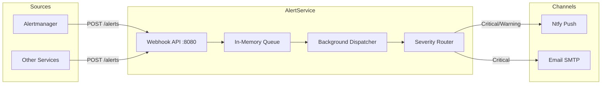

# AlertService

Centralized alert routing and notification dispatch service for ATLAS.

## Overview

AlertService receives alert webhooks from Prometheus Alertmanager and other monitoring systems, queues them for asynchronous processing, and dispatches notifications to configured channels (Ntfy, Email) based on severity routing rules. It decouples alert ingestion from delivery to ensure reliable notification handling under load.

## Architecture



## Features

- **Unified Ingestion**: Accepts both direct JSON alerts and Prometheus Alertmanager webhook format
- **Async Processing**: Decouples ingestion from delivery using in-memory background queue
- **Severity Routing**: Configurable rules map alert severities to notification channels
- **Multi-Channel Support**: Ntfy (push notifications) and Email (SMTP) channels
- **Graceful Degradation**: Failed deliveries logged without blocking queue processing
- **Observability**: OpenTelemetry metrics for queue depth, delivery latency, success/failure rates

## Configuration

| Variable | Default | Description |
|----------|---------|-------------|
| `OpenTelemetry__OtlpEndpoint` | `http://otel-collector:4317` | OTLP collector endpoint |
| `OpenTelemetry__ServiceName` | `alert-service` | Service name for telemetry |
| `Channels__Ntfy__Enabled` | `true` | Enable Ntfy channel |
| `Channels__Ntfy__Endpoint` | `https://ntfy.sh` | Ntfy server endpoint |
| `Channels__Ntfy__Topic` | `atlas-alerts` | Ntfy topic for push notifications |
| `Channels__Email__Enabled` | `false` | Enable Email channel |
| `Channels__Email__SmtpHost` | Required if enabled | SMTP server hostname |
| `Channels__Email__SmtpPort` | `587` | SMTP server port |
| `Channels__Email__FromAddress` | `alerts@atlas.local` | From email address |
| `Channels__Email__ToAddresses` | Required if enabled | Array of recipient addresses |
| `Routing__SeverityRoutes__critical` | `["ntfy", "email"]` | Channels for critical alerts |
| `Routing__SeverityRoutes__warning` | `["ntfy"]` | Channels for warning alerts |
| `Routing__SeverityRoutes__info` | `["ntfy"]` | Channels for info alerts |

## API Endpoints

### REST API (Port 8080)

| Method | Endpoint | Description |
|--------|----------|-------------|
| POST | `/alerts` | Ingest alerts (direct JSON or Alertmanager webhook format) |
| GET | `/health` | Health check endpoint |

### Alert Payload Formats

**Direct Format**:
```json
{
  "source": "custom-source",
  "severity": "critical",
  "title": "Alert Title",
  "message": "Alert message describing the issue.",
  "metadata": { "key": "value" }
}
```

**Alertmanager Format**:
```json
{
  "alerts": [{
    "status": "firing",
    "labels": { "alertname": "HighCpu", "severity": "warning" },
    "annotations": { "description": "CPU usage > 90%" }
  }]
}
```

## Project Structure

```
AlertService/
├── src/
│   ├── Program.cs                   # Application entry point
│   ├── appsettings.json             # Configuration
│   ├── Channels/                    # INotificationChannel (Ntfy, Email)
│   ├── Endpoints/                   # API route handlers
│   ├── Models/                      # Alert, AlertRequest, Severity
│   ├── Services/                    # AlertQueue, NotificationDispatcher
│   └── Telemetry/                   # OpenTelemetry metrics and traces
├── tests/
│   └── AlertService.Tests/          # Unit tests
└── .devcontainer/
    ├── build.sh                     # Container image build
    ├── compile.sh                   # Compile and test
    └── devcontainer.json            # VS Code dev container
```

## Development

### Prerequisites

- .NET 9 SDK (via devcontainer)
- Docker/nerdctl for container builds

### Compile and Test

```bash
.devcontainer/compile.sh
```

### Build Container Image

```bash
.devcontainer/build.sh
```

## Deployment

```bash
cd deployment/ansible
ansible-playbook playbooks/deploy.yml --tags alert-service
```

## Ports

| Port | Description |
|------|-------------|
| 8080 | Container internal (HTTP REST) |
| N/A | No host port (internal service only) |

## See Also

- [Prometheus Alertmanager](https://prometheus.io/docs/alerting/latest/alertmanager/) - Primary alert source
- [ThresholdEngine](../ThresholdEngine/README.md) - Economic pattern evaluation service
