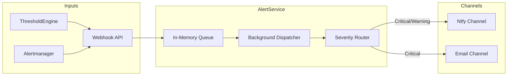

# AlertService

Centralized alert routing and notification dispatch service for ATLAS.

## Overview

AlertService receives alert webhooks from internal services (ThresholdEngine) and external monitoring (Alertmanager), queues them, and dispatches notifications to configured channels (Ntfy, Email) based on severity routing rules.

## Architecture



## Key Features

- **Unified Ingestion**: Accepts alerts in direct JSON format or Prometheus Alertmanager webhook format.
- **Async Processing**: Decouples ingestion from delivery using an in-memory background queue.
- **Severity Routing**: Configurable routing rules map alert severities (Critical, Warning, Info) to specific channels.
- **Multi-Channel**: Supports Ntfy (push notifications) and Email (SMTP) out of the box.
- **Observability**: Extensive metrics (queue depth, delivery latency) and tracing.

## Configuration

Configure via `appsettings.json` or Environment Variables (`__` separator).

### Channels

**Ntfy** (Push Notifications)
```json
"Channels": {
  "Ntfy": {
    "Enabled": true,
    "Endpoint": "https://ntfy.sh",
    "Topic": "atlas-alerts"
  }
}
```

**Email** (SMTP)
```json
"Channels": {
  "Email": {
    "Enabled": true,
    "SmtpHost": "smtp.example.com",
    "ToAddresses": ["oncall@example.com"]
  }
}
```

### Routing Rules

Define which severities go to which channels:

```json
"Routing": {
  "SeverityRoutes": {
    "critical": ["ntfy", "email"],
    "warning": ["ntfy"],
    "info": ["ntfy"]
  }
}
```

## Getting Started

**Note**: This service is designed to run as part of the larger ATLAS microservices architecture. It relies on upstream services (ThresholdEngine) to generate alerts.

### Development (Dev Containers)

The most robust way to develop is using the provided Dev Container, which includes the .NET SDK and tooling.

1. **Open in VS Code**: Open this folder and select "Reopen in Container".
2. **Configuration**: Update `src/appsettings.json` or set environment variables for your desired channels.
3. **Run Service**:
   ```bash
   cd src
   dotnet run
   ```

### Running the Full Stack

To run the entire ATLAS system (including AlertService):

```bash
cd ../deployment/ansible
ansible-playbook playbooks/deploy.yml
```

## API Endpoints

| Endpoint | Method | Description |
|----------|--------|-------------|
| `/alerts` | POST | Ingests alerts from ThresholdEngine or Alertmanager |
| `/health` | GET | Liveness probe (returns 200 OK) |

### Alert Payloads

The `/alerts` endpoint accepts two formats:

**1. Direct Format** (ATLAS Standard)
Used by ThresholdEngine for internal alerts.

```json
{
  "source": "ThresholdEngine",
  "severity": "critical",
  "title": "VIX Deployment Signal",
  "message": "VIX exceeded 30.0, triggering defensive allocation.",
  "metadata": { "patternId": "vix-l1", "value": "31.2" }
}
```

**2. Alertmanager Format** (Prometheus Standard)
Used by infrastructure monitoring.

```json
{
  "alerts": [
    {
      "status": "firing",
      "labels": { "alertname": "HighCpu", "severity": "warning" },
      "annotations": { "description": "CPU > 90%" }
    }
  ]
}
```

## Project Structure

```
AlertService/
├── src/
│   ├── Channels/               # INotificationChannel implementations
│   ├── Endpoints/              # API route handlers
│   ├── Models/                 # Domain models (Alert, Severity)
│   ├── Services/               # Queue, Dispatcher, Router
│   ├── Telemetry/              # OpenTelemetry metrics and tracing
│   ├── Program.cs              # Application entry point
│   ├── appsettings.json        # Configuration
│   └── Containerfile           # Production container
└── tests/                      # Unit tests
```

## See Also

- [ThresholdEngine](../ThresholdEngine/README.md) - Main alert source
- [Observability](../docs/OBSERVABILITY.md) - Metrics documentation
