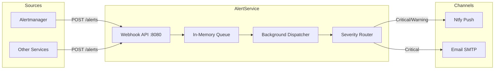

# AlertService

Centralized alert routing and notification dispatch service for ATLAS.

## Overview

AlertService receives alert webhooks from Prometheus Alertmanager and other monitoring systems, queues them for asynchronous processing, and dispatches notifications to configured channels (Ntfy, Email) based on severity routing rules. It decouples alert ingestion from delivery to ensure reliable notification handling under load.

## Architecture



## Features

- **Unified Ingestion**: Accepts both direct JSON alerts and Prometheus Alertmanager webhook format
- **Async Processing**: Decouples ingestion from delivery using in-memory background queue
- **Severity Routing**: Configurable rules map alert severities to notification channels
- **Multi-Channel Support**: Ntfy (push notifications) and Email (SMTP) channels
- **Graceful Degradation**: Failed deliveries logged without blocking queue processing
- **Observability**: OpenTelemetry metrics for queue depth, delivery latency, success/failure rates

## Configuration

| Variable | Description | Default |
|----------|-------------|---------|
| `OpenTelemetry__OtlpEndpoint` | OTLP collector endpoint | `http://otel-collector:4317` |
| `OpenTelemetry__ServiceName` | Service name for telemetry | `alert-service` |
| `Channels__Ntfy__Enabled` | Enable Ntfy channel | `true` |
| `Channels__Ntfy__Endpoint` | Ntfy server endpoint | `https://ntfy.sh` |
| `Channels__Ntfy__Topic` | Ntfy topic for push notifications | `atlas-alerts` |
| `Channels__Email__Enabled` | Enable Email channel | `false` |
| `Channels__Email__SmtpHost` | SMTP server hostname | Required if enabled |
| `Channels__Email__SmtpPort` | SMTP server port | `587` |
| `Channels__Email__FromAddress` | From email address | `alerts@atlas.local` |
| `Channels__Email__ToAddresses` | Array of recipient addresses | Required if enabled |
| `Routing__SeverityRoutes__critical` | Channels for critical alerts | `["ntfy", "email"]` |
| `Routing__SeverityRoutes__warning` | Channels for warning alerts | `["ntfy"]` |
| `Routing__SeverityRoutes__info` | Channels for info alerts | `["ntfy"]` |

## API Endpoints

### REST API (Port 8080)

| Endpoint | Method | Description |
|----------|--------|-------------|
| `/alerts` | POST | Ingest alerts (direct JSON or Alertmanager webhook format) |
| `/health` | GET | Health check endpoint |

### Alert Payload Formats

**Direct Format**:
```json
{
  "source": "custom-source",
  "severity": "critical",
  "title": "Alert Title",
  "message": "Alert message describing the issue.",
  "metadata": { "key": "value" }
}
```

**Alertmanager Format**:
```json
{
  "alerts": [{
    "status": "firing",
    "labels": { "alertname": "HighCpu", "severity": "warning" },
    "annotations": { "description": "CPU usage > 90%" }
  }]
}
```

## Project Structure

```
AlertService/
├── src/
│   ├── Program.cs           # Application entry point
│   ├── appsettings.json     # Configuration
│   ├── Channels/            # INotificationChannel (Ntfy, Email)
│   ├── Endpoints/           # API route handlers
│   ├── Models/              # Alert, AlertRequest, Severity
│   ├── Services/            # AlertQueue, NotificationDispatcher
│   └── Telemetry/           # OpenTelemetry metrics and traces
├── tests/                   # Unit tests
└── .devcontainer/           # Dev container config
```

## Development

### Prerequisites

- VS Code with Dev Containers extension
- Docker/nerdctl for container builds

### Getting Started

1. Open in VS Code: `code AlertService/`
2. Reopen in Container (Cmd/Ctrl+Shift+P -> "Dev Containers: Reopen in Container")
3. Build: `dotnet build`
4. Run: `dotnet run`

### Compile and Test

```bash
.devcontainer/compile.sh
```

### Build Container Image

```bash
.devcontainer/build.sh
```

## Deployment

```bash
cd deployment/ansible
ansible-playbook playbooks/deploy.yml --tags alert-service
```

## Ports

| Port | Description |
|------|-------------|
| 8080 | REST API (internal) |
| N/A | No host port mapping (internal service only) |

## See Also

- [ThresholdEngine](../ThresholdEngine/README.md) - Economic pattern evaluation service
- [Prometheus Alertmanager](https://prometheus.io/docs/alerting/latest/alertmanager/) - Primary alert source
- [docs/ARCHITECTURE.md](../docs/ARCHITECTURE.md) - System design
