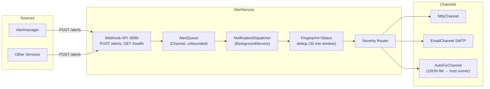

# AlertService

Centralized alert routing and notification dispatch service for ATLAS.

> **Agents:** read **[AGENT_README.md](AGENT_README.md)** first — the dense architecture card.

> **Operational status (2026-06-10):** UP by design — re-enabled and verified delivering end-to-end (Alertmanager → alert-service → ntfy `atlas-alert` topic) in #656. The Alertmanager webhook target (`http://alert-service:8080/alerts`) and the `autofix-queue/` consumer are wired and live.

## Overview

AlertService receives alert webhooks from Prometheus Alertmanager (and direct callers), enqueues them on an in-process `System.Threading.Channels` queue, then dispatches each alert to one or more notification channels (Ntfy, Email, AutoFix) based on severity routing rules. Fingerprint+status deduplication suppresses repeated alerts within a 30-minute window. Designed as a webhook sink only: no external port mapping, container-to-container reachable as `alert-service:8080` inside the compose network.

## Architecture


```mermaid
flowchart LR
    subgraph Sources
        AM[Alertmanager]
        SVC[Other Services]
    end

    subgraph AlertService
        API["Webhook API :8080<br/>POST /alerts, GET /health"]
        QUEUE["AlertQueue<br/>(Channel, unbounded)"]
        DISPATCH["NotificationDispatcher<br/>(BackgroundService)"]
        DEDUP["Fingerprint+Status<br/>dedup (30 min window)"]
        ROUTER[Severity Router]
    end

    subgraph Channels
        NTFY[NtfyChannel]
        EMAIL[EmailChannel SMTP]
        AUTOFIX["AutoFixChannel<br/>(JSON file → host runner)"]
    end

    AM & SVC -->|POST /alerts| API
    API --> QUEUE
    QUEUE --> DISPATCH
    DISPATCH --> DEDUP
    DEDUP --> ROUTER
    ROUTER --> NTFY & EMAIL & AUTOFIX
```

Flow: webhook POST → parse (Alertmanager array or direct single-alert format) → enqueue per alert → background dispatcher dedupes on `fingerprint:status`, looks up channels for the alert's severity, fans out to enabled channels in parallel. The queue is `Channel.CreateUnbounded`, so the `QueueFull` (503) response path only triggers on writer-side cancellation, not back-pressure.

## Features

- **Dual-format ingestion**: accepts Prometheus Alertmanager webhook payloads (`alerts[]` with `labels`/`annotations`/`fingerprint`/`status`) and direct single-alert JSON (`title`/`message`/`severity`/...).
- **In-process async queue**: `System.Threading.Channels.Channel<Alert>` (unbounded, single-reader) decouples ingestion from delivery.
- **Severity-based routing**: `Routing:SeverityRoutes` maps each severity to a list of channel names (case-insensitive match against `INotificationChannel.Name`). Unknown severities fall back to the `info` route.
- **Fingerprint deduplication**: `fingerprint:status` key, 30-minute window, in-memory `ConcurrentDictionary` with periodic cleanup. Only applied when an incoming alert carries a non-empty `Fingerprint` (Alertmanager always does; direct alerts usually don't).
- **NtfyChannel**: POSTs to `{Endpoint}/{Topic}` with `Title`, `Priority`, `Tags` headers. Severity → priority map: `critical→urgent`, `warning→high`, else `default`. Optional HTTP Basic auth.
- **EmailChannel**: MailKit SMTP (StartTLS when `UseSsl=true`). Subject `[{SEVERITY}] {title}`; plain-text body. Disabled by default and additionally gated on a non-empty `ToAddresses` list.
- **AutoFixChannel**: writes `{sessionId}.json` to `QueueDirectory` for a host-side runner to pick up. Process-wide rate limit (minimum minutes between sessions + max sessions per day). Per-alert opt-out via `metadata.autofix = "disabled"`. Severity gate via `EnabledSeverities` (default `["critical", "warning"]`).
- **RFC 9457 Problem Details**: error responses carry `type`, `title`, `detail`, `traceId`, `timestamp`, `service` and a `/traces/{traceId}` instance URI.
- **OpenTelemetry**: metrics (`AlertService` meter — see [Metrics](#metrics)), traces (`AlertService` ActivitySource), and Serilog log export, all via OTLP gRPC to `OpenTelemetry:OtlpEndpoint`.

## Configuration

All keys are bound from `appsettings.json` and can be overridden by environment variables using `__` as the section separator (e.g. `Channels__Ntfy__Topic`). List items use `__0`, `__1`, ... indices (e.g. `Channels__Email__ToAddresses__0`).

| Variable | Description | Default (appsettings.json) |
|----------|-------------|----------------------------|
| `OpenTelemetry__OtlpEndpoint` | OTLP gRPC endpoint (traces, metrics, Serilog sink) | `http://otel-collector:4317` |
| `OpenTelemetry__ServiceName` | OTEL `service.name` resource attribute | `alert-service` |
| `OpenTelemetry__ServiceVersion` | OTEL `service.version` resource attribute | `1.0.0` |
| `Channels__Ntfy__Enabled` | Enable Ntfy channel | `true` |
| `Channels__Ntfy__Endpoint` | Ntfy server base URL | `https://ntfy.sh` |
| `Channels__Ntfy__Topic` | Ntfy topic | `atlas-alerts` (deployed value: `atlas-alert`) |
| `Channels__Ntfy__Username` | Basic-auth username (optional) | _empty_ |
| `Channels__Ntfy__Password` | Basic-auth password (optional) | _empty_ |
| `Channels__Email__Enabled` | Enable Email channel | `false` |
| `Channels__Email__SmtpHost` | SMTP host | `smtp.example.com` |
| `Channels__Email__SmtpPort` | SMTP port | `587` |
| `Channels__Email__UseSsl` | StartTLS when true; plain when false | `true` |
| `Channels__Email__Username` | SMTP auth username (optional) | _empty_ |
| `Channels__Email__Password` | SMTP auth password (optional) | _empty_ |
| `Channels__Email__FromAddress` | Envelope/from address | `alerts@atlas.local` |
| `Channels__Email__FromName` | From display name | `ATLAS Alerts` |
| `Channels__Email__ToAddresses__N` | Recipient addresses (indexed list) | `[]` — required if Enabled |
| `Channels__AutoFix__Enabled` | Enable AutoFix channel | `true` |
| `Channels__AutoFix__QueueDirectory` | Directory for `{sessionId}.json` job files | `/opt/ai-inference/autofix-queue` |
| `Channels__AutoFix__RateLimitMinutes` | Minimum minutes between AutoFix sessions (process-wide) | `30` |
| `Channels__AutoFix__MaxSessionsPerDay` | Max AutoFix sessions per UTC day (process-wide) | `10` |
| `Channels__AutoFix__EnabledSeverities__N` | Severities eligible for AutoFix (indexed list) | `["critical", "warning"]` |
| `Routing__SeverityRoutes__critical__N` | Channels for `critical` alerts | `["ntfy", "email", "autofix"]` |
| `Routing__SeverityRoutes__warning__N` | Channels for `warning` alerts | `["ntfy", "autofix"]` |
| `Routing__SeverityRoutes__info__N` | Channels for `info` alerts | `["ntfy"]` |

> The C# `RoutingOptions` class hard-codes a more conservative default (`critical→[ntfy,email]`, `warning→[ntfy]`, `info→[ntfy]`) that takes effect only if the `Routing` section is missing entirely. The values above are the as-shipped defaults from `appsettings.json` and override the class default in normal use.

## API Endpoints

### REST API (Port 8080, internal)

| Endpoint | Method | Success | Errors | Description |
|----------|--------|---------|--------|-------------|
| `/alerts` | POST | `202 Accepted` `{ "queued": N }` | `400` invalid alert, `503` queue full | Ingest alerts (Alertmanager or direct format) |
| `/health` | GET | `200 OK` `{ "status": "healthy" }` | — | Liveness check |

Error responses use RFC 9457 `application/problem+json` with these `type` URIs:

| Type URI | Status | Trigger |
|----------|--------|---------|
| `/problems/validation/invalid-alert` | 400 | Request has neither a non-empty `alerts[]` (Alertmanager) nor a non-empty `title` (direct) |
| `/problems/internal/queue-full` | 503 | Queue writer rejected the alert (unbounded channel: typically only on shutdown/cancellation) |
| `/problems/internal/unexpected` | 500 | Unhandled exception (handled via `UseExceptionHandler`) |

### Alert Payload Formats

**Direct format** (single alert):

```json
{
  "source": "custom-source",
  "severity": "critical",
  "title": "Alert Title",
  "message": "Alert description.",
  "metadata": { "autofix": "disabled" }
}
```

`severity` defaults to `"info"` if omitted; `source` defaults to `"unknown"`; `message` defaults to `""`. `title` is required (request is rejected as `invalid-alert` if both `alerts[]` and `title` are empty). `metadata.autofix = "disabled"` opts the alert out of AutoFix.

**Alertmanager format** (one webhook → N alerts):

```json
{
  "alerts": [{
    "status": "firing",
    "labels":      { "alertname": "HighCpu", "severity": "warning" },
    "annotations": { "description": "CPU usage > 90%" },
    "fingerprint": "abc123"
  }]
}
```

Mapping: `Title = labels.alertname` (default `"Unknown Alert"`); `Severity = labels.severity` (default `"warning"`); `Message = annotations.description ?? annotations.summary ?? "No description"`; `Source = "alertmanager"`; `Metadata = labels`; `Fingerprint`/`Status` passed through for deduplication.

### AutoFix queue-file format

`AutoFixChannel` writes one file per accepted alert to `Channels:AutoFix:QueueDirectory` (filename `{sessionId}.json`, 8-char hex). A host-side runner is expected to consume and delete these files.

```json
{
  "Title": "...",
  "Message": "...",
  "Severity": "critical",
  "Metadata": { ... },
  "Source": "...",
  "SessionId": "a1b2c3d4",
  "QueuedAt": "2026-05-27T12:34:56.7890123Z"
}
```

## Metrics

All metrics are emitted on the `AlertService` meter (version `1.0.0`) and exported via OTLP. Tag cardinality is bounded (severity, channel name, source, channel count, failure reason).

| Metric | Type | Tags | Description |
|--------|------|------|-------------|
| `alertservice.webhooks.received` | Counter | `source` | Total webhook requests received |
| `alertservice.alerts.received` | Counter | `source`, `severity` | Alerts parsed out of webhooks |
| `alertservice.alerts.queued` | Counter | `severity` | Alerts successfully enqueued |
| `alertservice.alerts.dispatched` | Counter | `severity`, `channel_count` | Alerts handed off to the router |
| `alertservice.alerts.sent` | Counter | `channel`, `severity` | Alerts that a channel reported successful |
| `alertservice.alerts.failed` | Counter | `channel`, `severity`, `reason` | Channel returned false or threw |
| `alertservice.alerts.deduplicated` | Counter | `severity` | Alerts suppressed by the 30-min dedup window |
| `alertservice.alerts.processing_duration_ms` | Histogram (ms) | `severity` | Dispatch-side end-to-end latency |
| `alertservice.channels.send_duration_ms` | Histogram (ms) | `channel` | Per-channel send latency |
| `alertservice.channels.sends` | Counter | `channel` | Send attempts per channel |
| `alertservice.channels.successes` | Counter | `channel` | Successful sends per channel |
| `alertservice.channels.failures` | Counter | `channel` | Failed sends per channel |
| `alertservice.queue.depth` | ObservableGauge | — | Current `AlertQueue` depth |

## Project Structure

```
AlertService/
├── src/
│   ├── Program.cs                      # Entry point, DI, OTEL + Serilog setup
│   ├── ProblemTypes.cs                 # RFC 9457 type URIs
│   ├── appsettings.json                # Default configuration
│   ├── Containerfile                   # Multi-stage build (build/development/runtime)
│   ├── Channels/                       # INotificationChannel + Ntfy/Email/AutoFix
│   ├── Endpoints/                      # Minimal-API handlers (AlertEndpoints.cs)
│   ├── Models/                         # Alert, AlertRequest, AlertmanagerAlert
│   ├── Services/                       # AlertQueue, NotificationDispatcher, RoutingOptions
│   └── Telemetry/                      # AlertServiceMeter, AlertServiceActivitySource
├── tests/                              # xUnit: parsing, queue, routing, dedup, channels
└── .devcontainer/                      # devcontainer.json, build.sh, compile.sh
```

## Development

### Prerequisites

- VS Code with Dev Containers extension
- Access to the shared observability stack (OTEL collector, Loki/Prometheus/Tempo/Grafana)

### Getting Started

1. Open in VS Code: `code AlertService/`
2. Reopen in Container (Cmd/Ctrl+Shift+P → "Dev Containers: Reopen in Container")
3. Build: `dotnet build src/AlertService.csproj`
4. Run: `dotnet run --project src/AlertService.csproj`

### Compile and Test

```bash
AlertService/.devcontainer/compile.sh            # build + xUnit tests
AlertService/.devcontainer/compile.sh --no-test  # build only
```

`compile.sh` runs the .NET 10 SDK in a throwaway nerdctl container against the monorepo working tree and, on test success, refreshes the project-level push-guard marker.

### Build Container Image

```bash
AlertService/.devcontainer/build.sh              # build alert-service:latest
AlertService/.devcontainer/build.sh --no-cache   # clean rebuild
```

## Deployment

```bash
ansible-playbook playbooks/deploy.yml --tags alert-service
```

Container `alert-service` is provisioned from `/opt/ai-inference/compose.yaml`:

- Image: `alert-service:latest`
- Resource limits: 256 MiB memory, 0.5 CPU
- Volumes:
  - `/opt/ai-inference/logs/alert-service:/app/logs`
  - `/opt/ai-inference/autofix-queue:/opt/ai-inference/autofix-queue` (AutoFix drop)
  - `/opt/ai-inference/logs/autofix:/opt/ai-inference/logs/autofix`
- Healthcheck: `ss -ltn | grep -q ':8080 '` every 30 s (10 s start period, 3 retries)
- Restart policy: `unless-stopped`

Do not edit `compose.yaml` directly — it is Ansible-managed (see project `CLAUDE.md`).

## Ports

| Port | Description |
|------|-------------|
| 8080 | REST API (internal, container-to-container only — no host mapping) |

Prometheus Alertmanager reaches AlertService at `http://alert-service:8080/alerts` over the internal compose network.

## See Also

- [ThresholdEngine](../ThresholdEngine/README.md) — upstream pattern evaluation that triggers Alertmanager rules
- [docs/ARCHITECTURE.md](../docs/ARCHITECTURE.md) — system design
- [docs/OBSERVABILITY.md](../docs/OBSERVABILITY.md) — OTEL conventions used here
