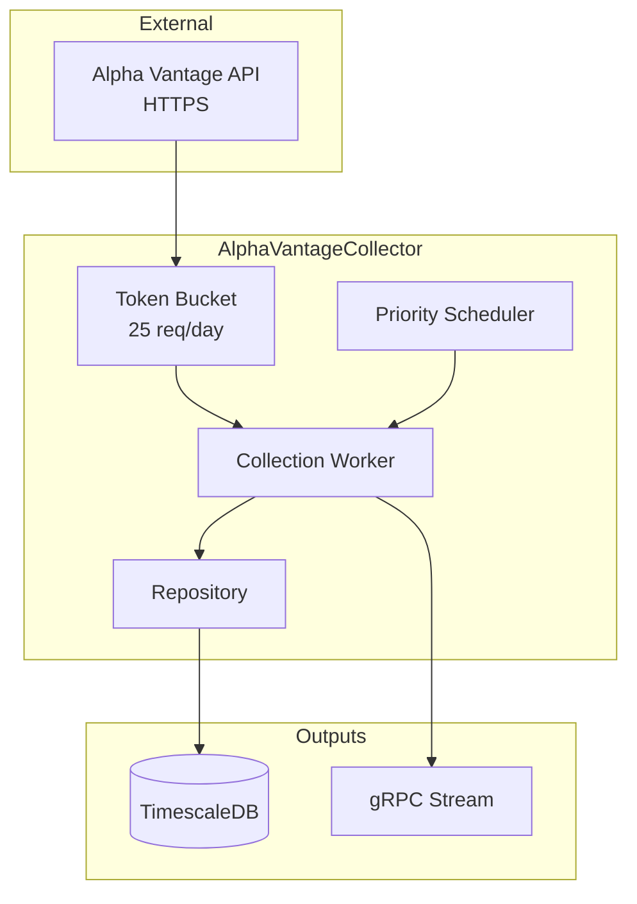

# AlphaVantageCollector

Collector service for Alpha Vantage commodities and equities data with strict rate limiting.

## Overview

AlphaVantageCollector is responsible for fetching specialized economic data not available in FRED, particularly commodities (Copper, Oil, Natural Gas). It implements a sophisticated priority-based scheduling system to strictly adhere to the Alpha Vantage free tier limit (25 requests/day).

## Architecture



## Key Features

- **Strict Rate Limiting**: Enforces 25 requests/day limit with daily counter reset.
- **Priority Scheduling**: Schedules high-priority series (e.g., daily Oil) more frequently than low-priority ones (e.g., monthly Copper).
- **Token Bucket Algorithm**: Allows small bursts while maintaining long-term limits.
- **Efficient Storage**: Stores data in TimescaleDB for time-series optimization.

## Series Configuration

Default configuration includes key commodities for economic ratios:

| Series ID | Symbol | Priority | Interval | Purpose |
|-----------|--------|----------|----------|---------|
| `AV/COPPER` | COPPER | 1 | Monthly | Copper/Gold Ratio (Leading Indicator) |
| `AV/WTI` | WTI | 2 | Daily | Energy Costs |
| `AV/BRENT` | BRENT | 3 | Daily | Global Energy |
| `AV/NATURAL_GAS` | NATURAL_GAS | 5 | Daily | Industrial Energy |
| `AV/ALL_COMMODITIES` | ALL_COMMODITIES | 10 | Monthly | Broad Index |

## Configuration

Environment variables:

| Variable | Description | Default |
|----------|-------------|---------|
| `ConnectionStrings__AtlasDb` | PostgreSQL connection | `Host=timescaledb;...` |
| `AlphaVantage__ApiKey` | API Key from alphavantage.co | **Required** |
| `AlphaVantage__DailyLimit` | Max requests per day | `25` |

## Getting Started

**Note**: This service is designed to run as part of the larger ATLAS microservices architecture. It relies on shared infrastructure (TimescaleDB) and other services to function correctly.

### Development (Dev Containers)

The most robust way to develop is using the provided Dev Container, which includes the .NET SDK and tooling.

1. **Open in VS Code**: Open this folder and select "Reopen in Container".
2. **Configure Secrets**: Create a `.env` file in the root of the service with your API key:
   ```bash
   AlphaVantage__ApiKey=your_api_key_here
   ```
3. **Start Infrastructure**: Ensure the shared database is running:
   ```bash
   docker compose up -d postgres
   ```
4. **Run Service**:
   ```bash
   cd src/AlphaVantageCollector.Service
   dotnet run
   ```

### Running with Docker (Standalone)

If you just want to run the service image without a dev environment:

```bash
export ALPHAVANTAGE_API_KEY=your_key_here
docker compose up -d alphavantage-collector
```

### Running the Full Stack

To run the entire ATLAS system:

```bash
cd ../ansible
ansible-playbook playbooks/site.yml
```

## API Endpoints

### REST API (Port 5006)

| Endpoint | Method | Description |
|----------|--------|-------------|
| `/api/admin/series` | GET | List configured series |
| `/api/admin/series` | POST | Add new series configuration |
| `/api/admin/search` | GET | Search for available symbols in Alpha Vantage |
| `/health` | GET | Liveness probe |

### gRPC API (Port 5007)

**Service Definition**: `events.proto`

- `SubscribeToEvents`: Streams `SeriesCollectedEvent` messages in real-time.

## Project Structure

```
AlphaVantageCollector/
├── src/
│   ├── AlphaVantageCollector.Core/           # Domain models (Series, Observation)
│   ├── AlphaVantageCollector.Application/    # Scheduler, Rate Limiter logic
│   ├── AlphaVantageCollector.Infrastructure/ # API Client, EF Core
│   ├── AlphaVantageCollector.Grpc/           # gRPC Service
│   └── AlphaVantageCollector.Service/        # Worker Host
└── .devcontainer/                            # Development environment
```

## See Also

- [ThresholdEngine](../ThresholdEngine/README.md) - Downstream consumer
- [Events](../Events/README.md) - Shared contracts
