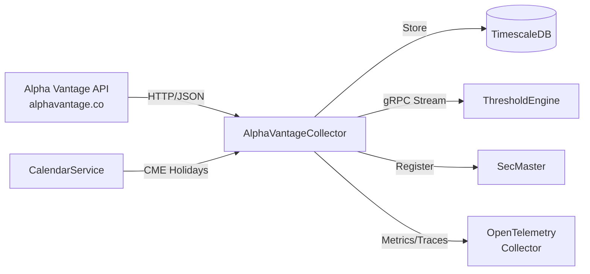

# AlphaVantageCollector

Collector service for Alpha Vantage market data with strict rate limiting and priority-based scheduling.

## Overview

AlphaVantageCollector fetches financial and economic data from Alpha Vantage, including commodities, economic indicators, equities, forex, and cryptocurrencies. It implements priority-based scheduling to efficiently work within the free tier limit (25 requests/day). Integrates with ThresholdEngine via gRPC streaming, SecMaster for instrument registration, and CalendarService for market holidays.

## Architecture



## Features

- **Multi-Asset Support**: Commodities, economic indicators, equities (OHLCV), forex, cryptocurrencies, technical indicators
- **Priority Scheduling**: High-priority series collected more frequently based on urgency and configurable intervals
- **Rate Limiting**: Enforces 25 requests/day limit with intelligent scheduling
- **Market Calendar Integration**: Skips collection on CME market holidays via CalendarService
- **Real-time Streaming**: gRPC event stream for downstream consumers (ThresholdEngine)
- **SecMaster Integration**: Automatic instrument registration via gRPC
- **Admin API**: Dynamic series management without service restart
- **Symbol Discovery**: Search upstream Alpha Vantage API for new instruments
- **Full Observability**: OpenTelemetry instrumentation (metrics, traces, logs to OTLP)

## Configuration

| Variable | Description | Default |
|----------|-------------|---------|
| `ConnectionStrings__AtlasDb` | PostgreSQL connection string | **Required** |
| `AlphaVantage__ApiKey` | API key from alphavantage.co | **Required** |
| `AlphaVantage__DailyLimit` | Max requests per day | `25` |
| `OpenTelemetry__OtlpEndpoint` | OTLP collector endpoint | `http://otel-collector:4317` |
| `OpenTelemetry__ServiceName` | Service name for telemetry | `alphavantage-collector` |
| `SECMASTER_GRPC_ENDPOINT` | SecMaster gRPC endpoint | `http://secmaster:8080` |

## API Endpoints

### REST API

| Endpoint | Method | Description |
|----------|--------|-------------|
| `/api/series` | GET | List all active series |
| `/api/series/{seriesId}` | GET | Get specific series details |
| `/api/series/{seriesId}/observations` | GET | Get observations (query: startDate, endDate, limit) |
| `/api/series/{seriesId}/latest` | GET | Get latest observation |
| `/api/search` | GET | Unified search for SecMaster gateway (query: q, limit) |
| `/api/discover` | GET | Search upstream Alpha Vantage API (query: q, limit) |
| `/api/health` | GET | Health check |
| `/health` | GET | Full health check with database status |
| `/health/ready` | GET | Readiness probe |
| `/health/live` | GET | Liveness probe |

### Admin API

| Endpoint | Method | Description |
|----------|--------|-------------|
| `/api/admin/series` | GET | List all configured series |
| `/api/admin/series` | POST | Add new series (body: {symbol, type, title, priority}) |
| `/api/admin/series/{id}/toggle` | PUT | Enable/disable series |
| `/api/admin/series/{id}` | DELETE | Delete series |

### gRPC API

**Service**: `ObservationEventStream` (port 5001)

| Method | Description |
|--------|-------------|
| `SubscribeToEvents` | Stream observation events in real-time |

## Project Structure

```
AlphaVantageCollector/
├── src/
│   ├── Api/                    # Alpha Vantage API client
│   ├── Data/                   # EF Core DbContext and repository
│   ├── Grpc/                   # gRPC event stream service
│   ├── HealthChecks/           # Database health check
│   ├── Interfaces/             # Service contracts
│   ├── Models/                 # Domain models (AlphaSeries, AlphaObservation)
│   ├── Services/               # Scheduler, series management
│   ├── Telemetry/              # OpenTelemetry metrics and traces
│   ├── Workers/                # Background collection worker
│   └── Program.cs              # Service host
├── tests/                      # Unit tests
├── migrations/                 # Database migrations
└── .devcontainer/              # VS Code dev container
```

## Development

### Using Dev Container

```bash
# Open in VS Code and select "Reopen in Container"
cd /workspace/AlphaVantageCollector/src
dotnet run
```

### Compile

```bash
.devcontainer/compile.sh
```

### Build Container Image

```bash
.devcontainer/build.sh
```

## Deployment

```bash
ansible-playbook playbooks/deploy.yml --tags alphavantage-collector
```

## Ports

| Port | Type | Description |
|------|------|-------------|
| 8080 | HTTP (internal) | REST API, health checks |
| 5001 | HTTP/2 (internal) | gRPC event stream |

No host port mapping - internal service only.

## See Also

- [ThresholdEngine](../ThresholdEngine/README.md) - Consumes observation events
- [SecMaster](../SecMaster/README.md) - Instrument registration
- [CalendarService](../CalendarService/README.md) - Market calendar provider
- [Events](../Events/README.md) - Shared gRPC event contracts
