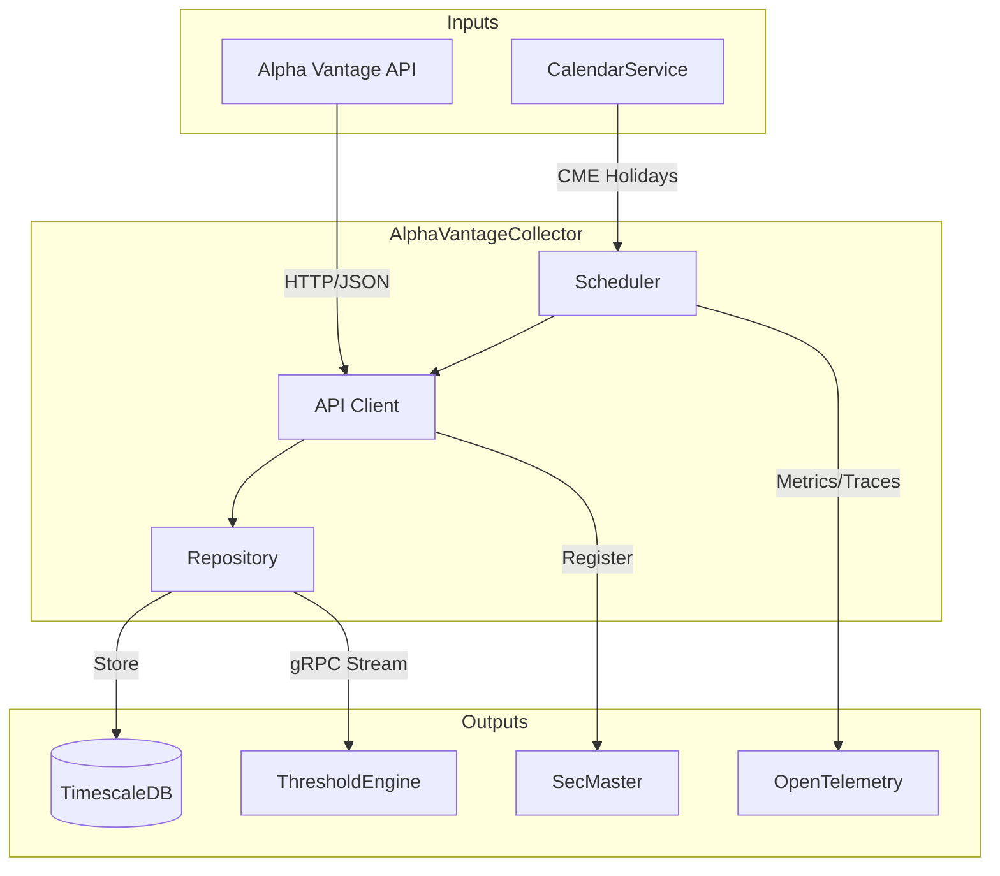

# AlphaVantageCollector

Collector service for Alpha Vantage market data with strict rate limiting and priority-based scheduling.

## Overview

AlphaVantageCollector fetches financial and economic data from Alpha Vantage, including commodities, economic indicators, equities, forex, and cryptocurrencies. It implements priority-based scheduling to efficiently work within the free tier limit (25 requests/day). Integrates with ThresholdEngine via gRPC streaming, SecMaster for instrument registration, and CalendarService for market holidays.

## Architecture



The scheduler prioritizes series collection within the daily API limit, skipping market holidays. New observations are stored in TimescaleDB and streamed to ThresholdEngine for real-time analysis.

## Features

- **Multi-Asset Support**: Commodities, economic indicators, equities (OHLCV), forex, crypto, technical indicators
- **Priority Scheduling**: High-priority series collected more frequently based on configurable intervals
- **Rate Limiting**: Enforces 25 requests/day limit with intelligent scheduling
- **Market Calendar**: Skips collection on CME market holidays via CalendarService
- **Real-time Streaming**: gRPC event stream for downstream consumers (ThresholdEngine)
- **SecMaster Integration**: Automatic instrument registration via gRPC
- **Admin API**: Dynamic series management without service restart
- **Symbol Discovery**: Search upstream Alpha Vantage API for new instruments

## Configuration

| Variable | Description | Default |
|----------|-------------|---------|
| `ConnectionStrings__AtlasDb` | PostgreSQL connection string | Required |
| `AlphaVantage__ApiKey` | API key from alphavantage.co | Required |
| `AlphaVantage__DailyLimit` | Max requests per day | `25` |
| `OpenTelemetry__OtlpEndpoint` | OTLP collector endpoint | `http://otel-collector:4317` |
| `SECMASTER_GRPC_ENDPOINT` | SecMaster gRPC endpoint | `http://secmaster:5001` |

## API Endpoints

### REST API (Port 8080)

| Endpoint | Method | Description |
|----------|--------|-------------|
| `/api/series` | GET | List all active series |
| `/api/series/{seriesId}` | GET | Get specific series details |
| `/api/series/{seriesId}/observations` | GET | Get observations with date filtering |
| `/api/series/{seriesId}/latest` | GET | Get latest observation |
| `/api/search` | GET | Unified search for SecMaster gateway |
| `/api/discover` | GET | Search upstream Alpha Vantage API |
| `/health` | GET | Health check with database status |
| `/health/ready` | GET | Readiness probe |
| `/health/live` | GET | Liveness probe |

### Admin API

| Endpoint | Method | Description |
|----------|--------|-------------|
| `/api/admin/series` | GET | List all configured series |
| `/api/admin/series` | POST | Add new series |
| `/api/admin/series/{seriesId}/toggle` | PUT | Enable/disable series |
| `/api/admin/series/{seriesId}` | DELETE | Delete series |

### gRPC Services (Port 5001)

| Service | Method | Description |
|---------|--------|-------------|
| `ObservationEventStream` | `SubscribeToEvents` | Stream observation events in real-time |
| `ObservationEventStream` | `GetEventsSince` | Get events from a specific time |
| `ObservationEventStream` | `GetHealth` | gRPC health check |

## Project Structure

```
AlphaVantageCollector/
├── src/
│   ├── Api/              # Alpha Vantage API client
│   ├── Data/             # EF Core DbContext and repository
│   ├── Grpc/             # gRPC event stream service
│   ├── HealthChecks/     # Database health check
│   ├── Interfaces/       # Service contracts
│   ├── Models/           # Domain models
│   ├── Services/         # Scheduler, series management
│   ├── Telemetry/        # OpenTelemetry instrumentation
│   └── Workers/          # Background collection worker
├── tests/                # Unit and integration tests
├── migrations/           # Database migrations
└── .devcontainer/        # Dev container config
```

## Development

### Prerequisites

- VS Code with Dev Containers extension
- Access to shared infrastructure (PostgreSQL, observability stack)

### Getting Started

1. Open in VS Code: `code AlphaVantageCollector/`
2. Reopen in Container (Cmd/Ctrl+Shift+P -> "Dev Containers: Reopen in Container")
3. Build: `dotnet build`
4. Run: `dotnet run`

### Build Scripts

```bash
# Compile and test
.devcontainer/compile.sh

# Build container image
.devcontainer/build.sh
```

## Deployment

```bash
ansible-playbook playbooks/deploy.yml --tags alphavantage-collector
```

## Ports

| Port | Description |
|------|-------------|
| 8080 | REST API (internal) |
| 5001 | gRPC event streaming (internal) |

No host port mapping - internal service only.

## See Also

- [ThresholdEngine](../ThresholdEngine/README.md) - Consumes observation events
- [SecMaster](../SecMaster/README.md) - Instrument registration
- [CalendarService](../CalendarService/README.md) - Market calendar provider
- [Events](../Events/README.md) - Shared gRPC event contracts
