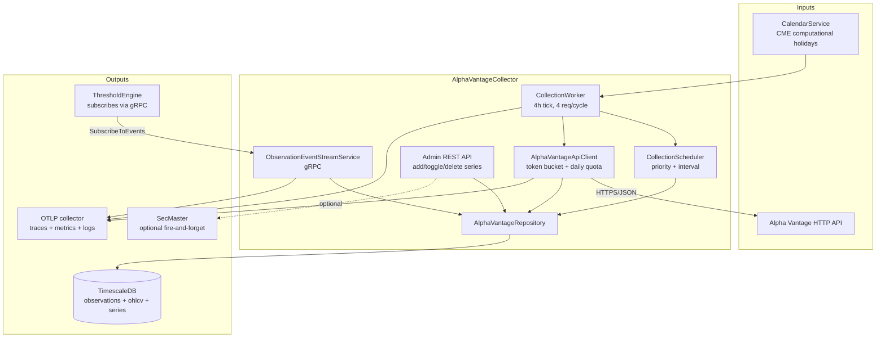

# AlphaVantageCollector

Collector service for Alpha Vantage market data with strict daily-quota enforcement, token-bucket rate limiting, and priority-based scheduling.

## Overview

AlphaVantageCollector fetches commodities, economic indicators, equities (OHLCV), forex, and crypto from the Alpha Vantage HTTP API and persists them to TimescaleDB. A background worker (`CollectionWorker`) ticks every 4 hours, asks the scheduler for at most 4 series due for collection (priority-ordered), and pulls them respecting a 25-request daily cap. Downstream consumers subscribe to a gRPC `ObservationEventStream` for change notifications. SecMaster instrument registration is optional and fire-and-forget.

## Architecture


```mermaid
flowchart TD
    subgraph Inputs
        AV[Alpha Vantage HTTP API]
        CAL[CalendarService<br/>CME computational holidays]
    end

    subgraph AlphaVantageCollector
        WORKER[CollectionWorker<br/>4h tick, 4 req/cycle]
        SCHED[CollectionScheduler<br/>priority + interval]
        API[AlphaVantageApiClient<br/>token bucket + daily quota]
        REPO[AlphaVantageRepository]
        ADMIN[Admin REST API<br/>add/toggle/delete series]
        STREAM[ObservationEventStreamService<br/>gRPC]
    end

    subgraph Outputs
        DB[(TimescaleDB<br/>observations + ohlcv + series)]
        TE[ThresholdEngine<br/>subscribes via gRPC]
        SM[SecMaster<br/>optional fire-and-forget]
        OTEL[OTLP collector<br/>traces + metrics + logs]
    end

    CAL --> WORKER
    WORKER --> SCHED --> REPO
    WORKER --> API
    API -->|HTTPS/JSON| AV
    API --> REPO --> DB
    ADMIN --> REPO
    ADMIN -.optional.-> SM
    TE -->|SubscribeToEvents| STREAM
    STREAM --> REPO
    WORKER --> OTEL
    API --> OTEL
    STREAM --> OTEL
```

The worker skips entire cycles on CME market holidays. The scheduler returns series whose `Interval` has elapsed since `LastCollectedAt`, ordered by `Priority` ascending then by oldest `LastCollectedAt`. The gRPC stream service polls the repository every 5s and emits an `Event` per newly-collected observation per subscribed series.

## Features

- **Multi-asset endpoints**: commodities, economic indicators, equities OHLCV (daily/weekly/monthly, adjusted variants), forex (rate + OHLC daily), crypto daily, symbol search
- **Hard daily quota**: free-tier 25 requests/day enforced in-process by `AlphaVantageApiClient` (resets at UTC midnight)
- **Token-bucket rate limiter**: 5-token bucket, 1 token replenished/minute (smooths bursts under the daily cap)
- **Priority + interval scheduling**: `daily`/`weekly`/`monthly`/`quarterly`/`annual` cadences with priority tiebreak
- **CME holiday awareness**: `CalendarService.Core` computational holidays via `MarketCalendarAdapter`
- **gRPC change stream**: `SubscribeToEvents` (long-poll, 5s tick) + `GetEventsSince` (one-shot range) + `GetHealth`
- **Admin REST API**: add / toggle / delete series at runtime (`/api/admin/series`)
- **Symbol discovery**: `/api/discover` proxies Alpha Vantage `SYMBOL_SEARCH`
- **Optional SecMaster registration**: fire-and-forget on series add; service runs fine without `SECMASTER_GRPC_ENDPOINT`

> Note: `SeriesType.TechnicalIndicator` is defined and routable via the admin API but the `CollectionWorker` has no branch for it - adding a technical-indicator series will log `Unknown series type` each cycle. Treat as scaffolded-only.

## Configuration

All env vars use `__` (double underscore) as the `:` separator per .NET configuration binding.

| Variable | Description | Default |
|----------|-------------|---------|
| `ConnectionStrings__AtlasDb` | PostgreSQL/TimescaleDB connection string | Required (validated at startup) |
| `AlphaVantage__ApiKey` | API key from alphavantage.co | Required (validated at startup) |
| `AlphaVantage__BaseUrl` | Alpha Vantage API base URL | `https://www.alphavantage.co/query` |
| `AlphaVantage__DailyLimit` | Max requests per UTC day | `25` |
| `AlphaVantage__MaxRetries` | Max retry attempts (currently unused by client) | `2` |
| `SECMASTER_GRPC_ENDPOINT` | SecMaster gRPC endpoint for instrument registration | Unset = registration disabled |
| `OpenTelemetry__OtlpEndpoint` | OTLP gRPC collector endpoint (traces, metrics, logs) | `http://otel-collector:4317` |
| `OpenTelemetry__ServiceName` | `service.name` resource attribute | `alphavantage-collector` |
| `OpenTelemetry__ServiceVersion` | `service.version` resource attribute | `1.0.0` |
| `ASPNETCORE_URLS` | Kestrel bind URLs (set in Containerfile) | `http://+:8080;http://+:5001` |
| `ASPNETCORE_ENVIRONMENT` | Standard ASP.NET environment selector | `Production` (in compose) |

## API Endpoints

### REST API (Port 8080, internal)

| Endpoint | Method | Description |
|----------|--------|-------------|
| `/api/search` | GET | Local DB title/symbol search; shape: `{ Query, Count, Results[{SeriesId, Title, Interval}] }`. Used by SecMaster gateway. |
| `/api/discover` | GET | Proxies Alpha Vantage upstream `SYMBOL_SEARCH` |
| `/api/health` | GET | Custom JSON health (always 200 if process is up) |
| `/api/series` | GET | List active series |
| `/api/series/{seriesId}` | GET | Get a specific series |
| `/api/series/{seriesId}/observations` | GET | Get observations (OHLCV shape for Equity/Forex/Crypto, scalar shape otherwise; `startDate`, `endDate`, `limit` query params) |
| `/api/series/{seriesId}/latest` | GET | Latest observation (OHLCV or scalar by type) |
| `/api/admin/series` | GET | List all series (active + inactive) with priority |
| `/api/admin/series` | POST | Add new series (body: `{ Symbol, Type, Title?, Priority? }`) |
| `/api/admin/series/{seriesId}/toggle` | PUT | Flip `IsActive` |
| `/api/admin/series/{seriesId}` | DELETE | Delete a series |
| `/health` | GET | Aggregate health check (includes deep DB check, tagged `ready`,`db`) |
| `/health/ready` | GET | Readiness probe (filters checks by `ready` tag) |
| `/health/live` | GET | Liveness probe (no checks; always returns healthy if process responds) |

### gRPC Services (Port 5001, internal)

| Service | Method | Description |
|---------|--------|-------------|
| `ATLAS.Events.Grpc.ObservationEventStream` | `SubscribeToEvents` | Server-streaming long-poll (5s tick). Filters by optional `SeriesIds`; emits one `Event` per new observation per series. |
| `ATLAS.Events.Grpc.ObservationEventStream` | `GetEventsSince` | One-shot range stream from a timestamp; optional series filter and `Limit` cap. |
| `ATLAS.Events.Grpc.ObservationEventStream` | `GetHealth` | gRPC-side health response (currently returns `Healthy=true`, `TotalEvents=0`, `LatestEventTime=now`). |

`Event` payload is `SeriesCollectedEvent` (series ID + collected-at timestamp); consumers fetch the actual values via REST or repository.

## Project Structure

```
AlphaVantageCollector/
|-- src/
|   |-- AlphaVantageCollector.csproj
|   |-- Program.cs
|   |-- Containerfile               # multi-stage: build / development / runtime
|   |-- appsettings.json
|   |-- appsettings.Development.json
|   |-- Api/                        # AlphaVantageApiClient + options (token bucket, daily quota)
|   |-- Data/                       # EF Core DbContext, design-time factory, repository
|   |-- Grpc/                       # ObservationEventStreamService
|   |-- HealthChecks/               # DatabaseHealthCheck (deep DB check)
|   |-- Interfaces/                 # service contracts
|   |-- Models/                     # AlphaVantageSeries, AlphaVantageObservation, OhlcvObservation, SeriesType, SymbolSearchResult
|   |-- Services/                   # CollectionScheduler, SeriesManagementService, MarketCalendarAdapter
|   |-- Telemetry/                  # AlphaVantageActivitySource, AlphaVantageMeter
|   `-- Workers/                    # CollectionWorker (background service)
|-- tests/                          # Unit + integration tests
|-- migrations/                     # Raw .sql migration scripts (001_initial_schema.sql, 002_add_ohlcv_and_series.sql)
`-- .devcontainer/                  # devcontainer.json, compose.yaml, compile.sh, build.sh
```

> Note: `migrations/` contains hand-written SQL, not EF migrations. The ATLAS convention (CLAUDE.md `DATABASE [ef_core]`) is EF-managed migrations; this service predates that convention and has not been migrated.

## Development

### Prerequisites

- VS Code with Dev Containers extension
- Access to shared infrastructure (TimescaleDB, OTEL collector)

### Getting Started

1. Open in VS Code: `code AlphaVantageCollector/`
2. Reopen in Container (Cmd/Ctrl+Shift+P -> "Dev Containers: Reopen in Container")
3. Build: `dotnet build src/AlphaVantageCollector.csproj`
4. Run: `dotnet run --project src/AlphaVantageCollector.csproj`

### Build Scripts

```bash
# Compile + run tests (used by git-push-guard)
AlphaVantageCollector/.devcontainer/compile.sh

# Build production container image (alphavantage-collector:latest)
AlphaVantageCollector/.devcontainer/build.sh
```

## Deployment

```bash
ansible-playbook playbooks/deploy.yml --tags alphavantage-collector
```

Image name: `alphavantage-collector:latest`. Container name: `alphavantage-collector`. Memory limit: 256M. CPU limit: 0.5. Restart policy: `unless-stopped`. Log mount: `/opt/ai-inference/logs/alphavantage-collector:/app/logs`.

## Ports

| Port | Description |
|------|-------------|
| 8080 | REST + health endpoints (internal, no host mapping) |
| 5001 | gRPC `ObservationEventStream` (internal, no host mapping) |

No host port mapping - reachable only by other containers on the compose network.

## See Also

- [ThresholdEngine](../ThresholdEngine/README.md) - Consumes `ObservationEventStream`
- [SecMaster](../SecMaster/README.md) - Optional instrument registration target
- [CalendarService](../CalendarService/README.md) - Provides CME computational holidays
- [Events](../Events/README.md) - Shared gRPC event contracts (`ATLAS.Events.Grpc.ObservationEventStream`)
