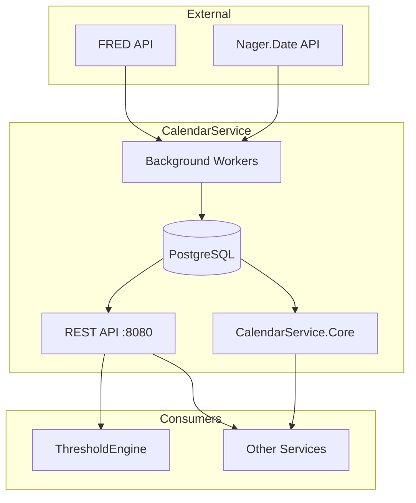

# CalendarService

Market and economic calendar service providing temporal data for the ATLAS ecosystem.

## Overview

CalendarService tracks trading days, market holidays, and scheduled economic events. It provides REST API endpoints for external access and a shared library (CalendarService.Core) for in-process calendar operations used by other services. Background workers synchronize holiday data and economic release schedules from FRED and Nager.Date APIs.

## Architecture



Background workers collect data on a schedule (FRED releases every 6 hours, market holidays every 24 hours) and persist to PostgreSQL. The REST API and Core library serve consumers from the database and static NYSE holiday data respectively.

## Features

- **Market Calendar**: Trading day calculations accounting for weekends and NYSE holidays
- **Real-Time Status**: Check if markets are currently open or closed
- **Economic Events**: Track scheduled FRED releases with impact ratings
- **Holiday Sync**: Automated collection of market holidays from static NYSE data and Nager.Date
- **Shared Library**: CalendarService.Core for in-process calendar operations (Quartz integration, caching)
- **Date Math**: Next/previous trading day, trading days in range, holiday lookups

## Configuration

| Variable | Description | Default |
|----------|-------------|---------|
| `ConnectionStrings__Calendar` | PostgreSQL connection string | Required |
| `FRED_API_KEY` | FRED API key for economic release dates | Required |
| `FINNHUB_API_KEY` | Finnhub API key (economic calendar, paid subscription) | Optional |
| `ASPNETCORE_URLS` | Listen address | `http://+:8080` |

## API Endpoints

### REST API (Port 8080)

#### Market Calendar

| Method | Endpoint | Description |
|--------|----------|-------------|
| GET | `/api/market/status` | Current market status (open/closed) |
| GET | `/api/market/holidays` | Market holidays for specified year |
| GET | `/api/market/is-trading-day` | Check if date is a trading day |
| GET | `/api/market/next-trading-day` | Next trading day from specified date |
| GET | `/api/market/trading-days` | Trading days in date range |
| GET | `/api/market/holidays/external` | US public holidays from Nager.Date API |

#### Economic Calendar

| Method | Endpoint | Description |
|--------|----------|-------------|
| GET | `/api/economic/events` | Economic events filtered by date range, impact, type, country |
| GET | `/api/economic/upcoming` | Upcoming events (default 7 days ahead) |
| GET | `/api/economic/high-impact` | Upcoming high-impact events only |
| GET | `/api/economic/has-high-impact` | Check if date has high-impact events |

#### Health

| Method | Endpoint | Description |
|--------|----------|-------------|
| GET | `/health` | Health check endpoint |

API documentation available at `/scalar/v1` (Scalar UI) and `/openapi/v1.json` (OpenAPI spec).

## Project Structure

```
CalendarService/
├── src/
│   ├── Core/              # Shared library (interfaces, models, providers, Quartz)
│   ├── Endpoints/         # REST API endpoint handlers
│   ├── External/          # External API clients (FRED, Finnhub, Nager.Date)
│   ├── Persistence/       # EF Core DbContext, repositories, entities
│   ├── Workers/           # Background data collection workers
│   └── Migrations/        # EF Core database migrations
├── tests/                 # Unit tests
└── .devcontainer/         # Dev container configuration
```

## Development

### Prerequisites

- VS Code with Dev Containers extension
- Access to shared infrastructure (PostgreSQL, FRED API key)

### Getting Started

1. Open in VS Code: `code CalendarService/`
2. Reopen in Container (Cmd/Ctrl+Shift+P -> "Dev Containers: Reopen in Container")
3. Build: `dotnet build`
4. Run: `dotnet run`

### Build & Test

```bash
.devcontainer/compile.sh           # build + test
.devcontainer/compile.sh --no-test # build only
.devcontainer/build.sh             # container image
```

## Deployment

```bash
ansible-playbook playbooks/deploy.yml --tags calendar-service
```

## Ports

| Port | Type | Description |
|------|------|-------------|
| 8080 | HTTP (container) | REST API, health checks |
| N/A | Host | Internal service only, not exposed |

## See Also

- [ThresholdEngine](../ThresholdEngine/README.md) - Uses market calendar for trading day validation
- [FredCollector](../FredCollector/README.md) - Economic data collector
- [FinnhubCollector](../FinnhubCollector/README.md) - Stock quotes and economic calendar
