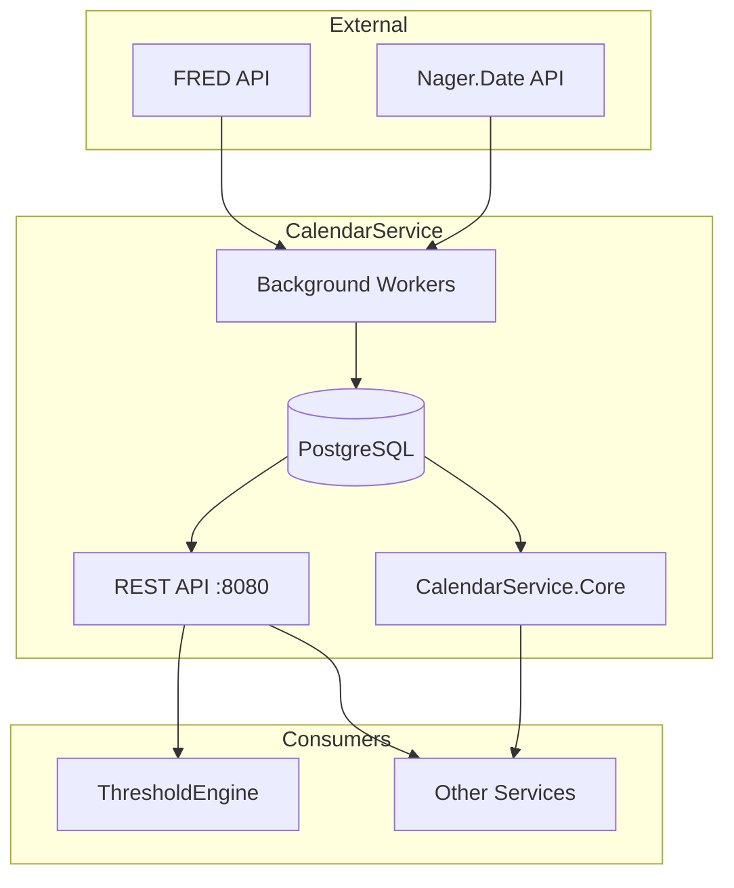

# CalendarService

Market and economic calendar service providing temporal data for the ATLAS ecosystem.

## Overview

CalendarService tracks trading days, market holidays, and scheduled economic events. It provides REST API endpoints for external access and a shared library (CalendarService.Core) for in-process calendar operations. Synchronizes holiday data and economic release schedules from FRED and Nager.Date APIs.

## Architecture



## Features

- **Market Calendar**: Trading day calculations accounting for weekends and NYSE holidays
- **Real-Time Status**: Check if markets are currently open or closed
- **Economic Events**: Track scheduled events (CPI, FOMC, NFP) with impact ratings
- **Holiday Integration**: Sync US public holidays from Nager.Date API
- **Shared Library**: CalendarService.Core for in-process high-performance calendar operations
- **Background Sync**: Automated collection of holiday and economic event data
- **Date Math**: Next/previous trading day, trading days in range, holiday lookups

## Configuration

| Variable | Default | Description |
|----------|---------|-------------|
| `ConnectionStrings__Calendar` | Required | PostgreSQL connection string |
| `FRED_API_KEY` | Required | FRED API key for economic release dates |
| `FINNHUB_API_KEY` | Optional | Finnhub API key (economic calendar, paid subscription) |
| `ASPNETCORE_URLS` | `http://+:8080` | Listen address |

## API Endpoints

### REST API (Port 8080)

#### Market Calendar

| Method | Endpoint | Description |
|--------|----------|-------------|
| GET | `/api/market/status` | Current market status (open/closed) |
| GET | `/api/market/holidays` | Market holidays for specified year |
| GET | `/api/market/is-trading-day` | Check if date is a trading day |
| GET | `/api/market/next-trading-day` | Next trading day from specified date |
| GET | `/api/market/trading-days` | Trading days in date range |
| GET | `/api/market/holidays/external` | US public holidays from Nager.Date API |

#### Economic Calendar

| Method | Endpoint | Description |
|--------|----------|-------------|
| GET | `/api/economic/events` | Economic events filtered by date range, impact, type, country |
| GET | `/api/economic/upcoming` | Upcoming events (default 7 days ahead) |
| GET | `/api/economic/high-impact` | Upcoming high-impact events only |
| GET | `/api/economic/has-high-impact` | Check if date has high-impact events |

#### Health

| Method | Endpoint | Description |
|--------|----------|-------------|
| GET | `/health` | Health check endpoint |

## Project Structure

```
CalendarService/
├── src/
│   ├── Core/                       # Shared library (abstractions, models, providers)
│   │   ├── Abstractions/           # IMarketCalendar, IEconomicCalendar interfaces
│   │   ├── Models/                 # MarketHoliday, EconomicEvent, MarketStatus
│   │   ├── Providers/              # NyseMarketCalendar, StaticNyseHolidays
│   │   └── Quartz/                 # Quartz calendar integrations
│   ├── Endpoints/                  # API endpoint handlers
│   ├── External/                   # External API clients (FRED, Nager)
│   ├── Persistence/                # Database context and repositories
│   ├── Workers/                    # Background data collection workers
│   └── Migrations/                 # EF Core database migrations
├── tests/                          # Unit tests
└── .devcontainer/                  # Dev container configuration
```

## Development

### Prerequisites

- .NET 9 SDK
- PostgreSQL/TimescaleDB
- FRED API key

### Getting Started

```bash
# Open in dev container
cd CalendarService
code .
# Select "Reopen in Container"
```

### Build Commands

```bash
# Compile and test
.devcontainer/compile.sh

# Build container image
.devcontainer/build.sh
```

## Deployment

```bash
ansible-playbook playbooks/deploy.yml --tags calendar-service
```

## Ports

| Port | Type | Description |
|------|------|-------------|
| 8080 | HTTP (container) | REST API, health checks |
| N/A | Host | Internal service only, not exposed |

## See Also

- [ThresholdEngine](../ThresholdEngine/README.md) - Uses market calendar for trading day validation
- [FredCollector](../FredCollector/README.md) - Economic data collector
- [FinnhubCollector](../FinnhubCollector/README.md) - Stock quotes and economic calendar
