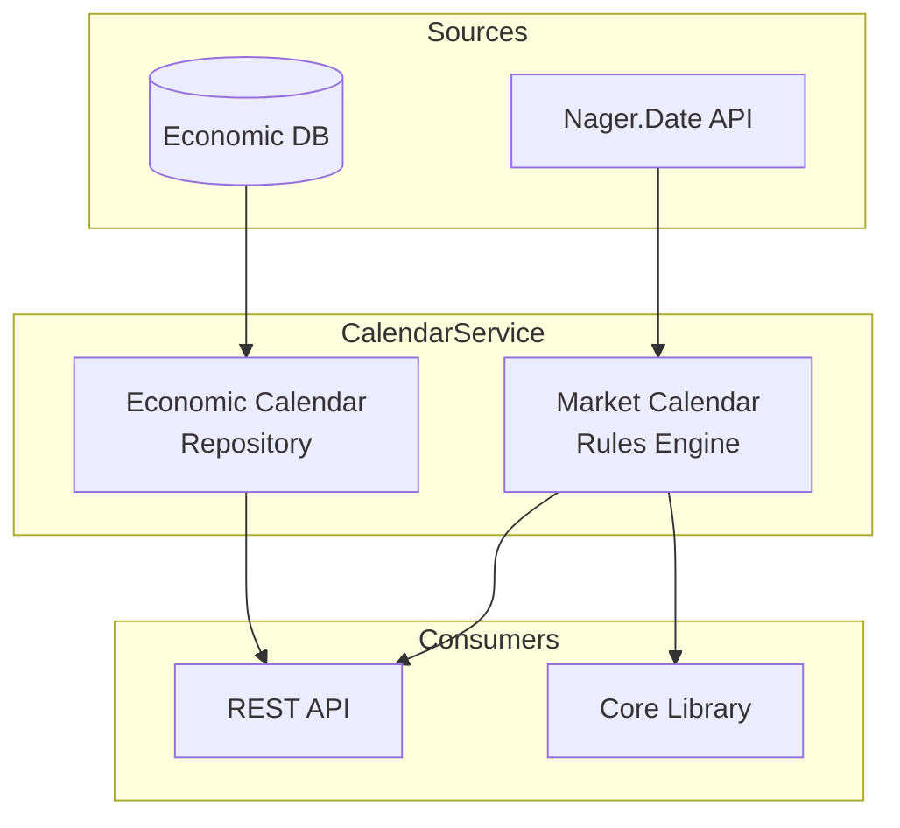

# CalendarService

Unified market and economic calendar service for ATLAS.

## Overview

CalendarService provides a single source of truth for temporal data in the financial system. It handles two main domains:
1.  **Market Calendar**: Trading days, holidays, and market status (Open/Closed) for major exchanges (NYSE/Nasdaq).
2.  **Economic Calendar**: Scheduled economic events (CPI, FOMC, etc.) with impact ratings.

It exposes these capabilities via a REST API and provides a shared core library (`CalendarService.Core`) for in-process use by high-performance collectors.

## Architecture



## Key Features

- **Trading Schedule**: Calculates valid trading days, accounting for weekends and NYSE holidays.
- **Market Status**: Real-time "Is Market Open?" checks.
- **Economic Events**: Tracks high-impact events that might trigger volatility.
- **Holiday Data**: Integrates with Nager.Date for accurate public holiday data.

## Configuration

Environment variables:

| Variable | Description | Default |
|----------|-------------|---------|
| `ConnectionStrings__AtlasDb` | PostgreSQL connection | `Host=timescaledb;...` |

## Getting Started

**Note**: This service is designed to run as part of the larger ATLAS microservices architecture. It relies on shared infrastructure (PostgreSQL) and other services to function correctly.

### Development (Dev Containers)

The most robust way to develop is using the provided Dev Container, which includes the .NET SDK and tooling.

1. **Open in VS Code**: Open this folder and select "Reopen in Container".
2. **Start Infrastructure**: Ensure the shared database is running:
   ```bash
   docker compose up -d postgres
   ```
3. **Run Service**:
   ```bash
   cd src/CalendarService.Api
   dotnet run
   ```

### Running with Docker (Standalone)

If you just want to run the service image without a dev environment:

```bash
docker compose up -d calendar-service
```

### Running the Full Stack

To run the entire ATLAS system:

```bash
cd ../ansible
ansible-playbook playbooks/site.yml
```

## API Endpoints

### Market Calendar

| Endpoint | Method | Description |
|----------|--------|-------------|
| `/api/market/status` | GET | Returns current market status (Open/Closed) |
| `/api/market/is-trading-day` | GET | Boolean check if a specific date is a trading day |
| `/api/market/next-trading-day` | GET | Returns the date of the next valid trading session |
| `/api/market/holidays` | GET | Lists market holidays for the specified year |

### Economic Calendar

| Endpoint | Method | Description |
|----------|--------|-------------|
| `/api/economic/events` | GET | Query economic events by date range and impact level |
| `/api/economic/high-impact` | GET | Get upcoming high-impact events for the next N days |
| `/api/economic/has-high-impact`| GET | Boolean check if a date has high volatility events |

## Project Structure

```
CalendarService/
├── src/
│   ├── CalendarService.Core/           # Shared logic (Trading rules, Models)
│   ├── CalendarService.Infrastructure/ # Data access, External APIs
│   └── CalendarService.Api/            # REST API Host
├── tests/
│   └── CalendarService.Tests/          # Unit tests
└── migrations/                         # EF Core migrations
```

## Library Usage

Services like `FredCollector` reference `CalendarService.Core` directly to perform fast, in-memory trading day calculations without HTTP overhead.

```csharp
// In-process usage example
public class MyService
{
    private readonly IMarketCalendar _calendar;

    public void Process()
    {
        if (_calendar.IsTradingDay(DateOnly.FromDateTime(DateTime.UtcNow)))
        {
            // Execute trading logic
        }
    }
}
```

