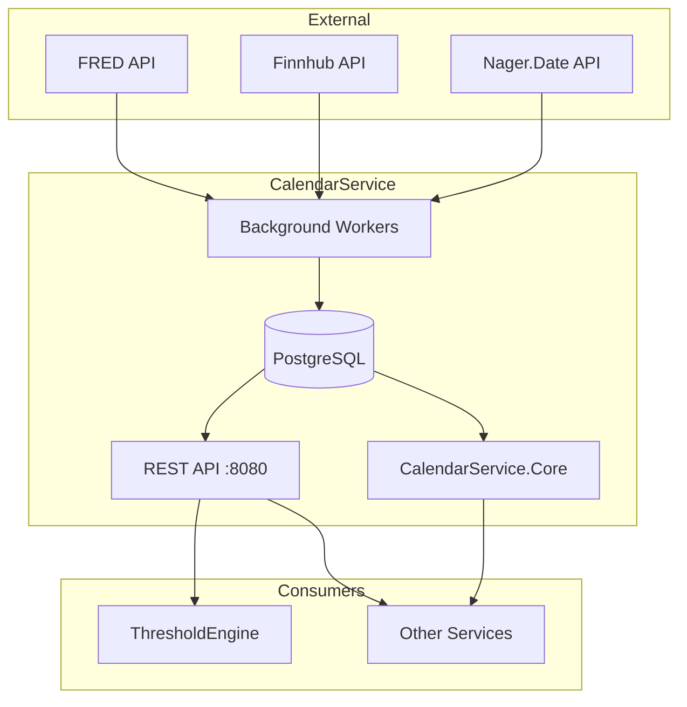

# CalendarService

Market and economic calendar service providing temporal data for the ATLAS ecosystem.

## Overview

CalendarService tracks trading days, market holidays, and scheduled economic events. It provides both REST API endpoints for external access and a shared library (CalendarService.Core) for in-process calendar operations by other services. Synchronizes NYSE holiday data and economic release schedules from FRED and Finnhub APIs.

## Architecture



## Features

- **Market Calendar**: Trading day calculations accounting for weekends and NYSE holidays
- **Real-Time Status**: Check if markets are currently open or closed
- **Economic Events**: Track scheduled events (CPI, FOMC, NFP) with impact ratings
- **Holiday Integration**: Sync US public holidays from Nager.Date API
- **Shared Library**: CalendarService.Core for in-process high-performance calendar operations
- **Background Sync**: Automated daily collection of holiday and event data
- **Date Math**: Next trading day, trading days in range, holiday lookups

## Configuration

| Variable | Default | Description |
|----------|---------|-------------|
| `ConnectionStrings__Calendar` | Required | PostgreSQL connection string |
| `FRED_API_KEY` | Required | FRED API key for economic release dates |
| `FINNHUB_API_KEY` | Optional | Finnhub API key (economic calendar, paid subscription) |
| `ASPNETCORE_URLS` | `http://+:8080` | Listen address |

## API Endpoints

### REST API (Port 8080 internal, no host port)

#### Market Calendar

| Method | Endpoint | Description |
|--------|----------|-------------|
| GET | `/api/market/status` | Current market status (open/closed) |
| GET | `/api/market/holidays` | Market holidays for specified year |
| GET | `/api/market/is-trading-day` | Check if date is a trading day |
| GET | `/api/market/next-trading-day` | Next trading day from specified date |
| GET | `/api/market/trading-days` | Trading days in date range |
| GET | `/api/market/holidays/external` | US public holidays from Nager.Date API |

#### Economic Calendar

| Method | Endpoint | Description |
|--------|----------|-------------|
| GET | `/api/economic/events` | Economic events filtered by date range, impact, type, country |
| GET | `/api/economic/upcoming` | Upcoming events (default 7 days ahead) |
| GET | `/api/economic/high-impact` | Upcoming high-impact events only |
| GET | `/api/economic/has-high-impact` | Check if date has high-impact events |

#### Health

| Method | Endpoint | Description |
|--------|----------|-------------|
| GET | `/health` | Health check endpoint |

## Project Structure

```
CalendarService/
├── src/
│   ├── CalendarService.csproj
│   ├── Program.cs                   # Application entry point
│   ├── appsettings.json             # Configuration
│   ├── Core/                        # Shared library (abstractions, models, providers)
│   ├── Endpoints/                   # API endpoint handlers
│   ├── External/                    # External API clients (Finnhub, FRED, Nager)
│   ├── Persistence/                 # Database context and repositories
│   ├── Workers/                     # Background data collection workers
│   ├── Migrations/                  # EF Core database migrations
│   └── Containerfile                # Multi-stage Docker build
├── .devcontainer/
│   ├── build.sh                     # Container image build script
│   ├── compile.sh                   # Compile and test script
│   ├── compose.yaml                 # Dev container configuration
│   └── devcontainer.json            # VS Code dev container config
└── tests/
    └── CalendarService.UnitTests/   # Unit test project
```

## Background Workers

CalendarService runs three background workers for automated data collection:

- **MarketHolidaySyncWorker**: Syncs NYSE holidays to database (runs every 24 hours)
- **FredReleasesCollectorWorker**: Collects economic release dates from FRED API daily
- **EconomicCalendarCollectorWorker**: Collects economic events from Finnhub (requires paid subscription, disabled by default)

## Development

### Compile and Test

```bash
.devcontainer/compile.sh
```

### Build Container Image

```bash
.devcontainer/build.sh
```

### Deploy

```bash
cd deployment/ansible
ansible-playbook playbooks/deploy.yml --tags calendar-service
```

## Ports

| Port | Description |
|------|-------------|
| 8080 | Container internal (HTTP/1.1 REST) |
| N/A | Not exposed on host (internal service only) |

## Library Usage

Other ATLAS services can reference CalendarService.Core for in-memory calendar operations:

```csharp
using CalendarService.Core;

public class MyService
{
    private readonly IMarketCalendar _calendar;

    public MyService(IMarketCalendar calendar)
    {
        _calendar = calendar;
    }

    public void ProcessIfMarketOpen()
    {
        var today = DateOnly.FromDateTime(DateTime.UtcNow);

        if (_calendar.IsTradingDay(today))
        {
            // Execute trading logic
        }

        var nextDay = _calendar.GetNextTradingDay(today);
        var tradingDays = _calendar.GetTradingDaysInRange(today, today.AddDays(30));
    }
}
```

## Database

CalendarService uses PostgreSQL with:
- **EF Core migrations**: Auto-applied on startup via `db.Database.MigrateAsync()`
- **MarketHolidays table**: Stores NYSE holidays by date
- **EconomicEvents table**: Stores scheduled economic events with impact ratings
- **Indexed lookups**: Optimized for date range queries

## See Also

- [ThresholdEngine](../ThresholdEngine/README.md) - Uses market calendar for trading day validation
- [FredCollector](../FredCollector/README.md) - Economic data collector
- [FinnhubCollector](../FinnhubCollector/README.md) - Stock quotes and economic calendar
