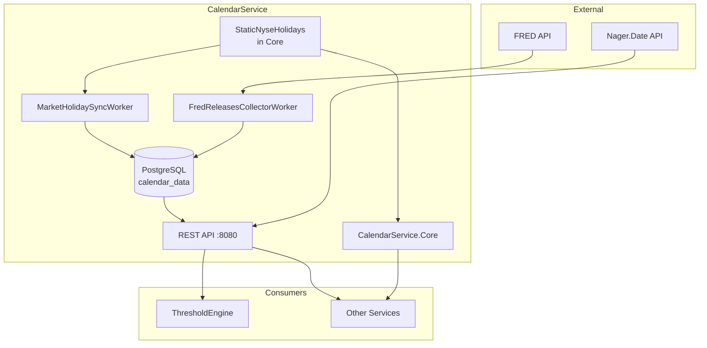

# CalendarService

Market and economic calendar service providing temporal data for the ATLAS ecosystem.

> **Agents:** read **[AGENT_README.md](AGENT_README.md)** first — the dense architecture card.

## Overview

CalendarService tracks NYSE trading days/holidays and scheduled economic releases. It exposes a REST API and ships a shared library (`CalendarService.Core`) for in-process calendar use by other services. Two background workers persist data: holidays are seeded from the static NYSE list baked into Core, and FRED economic-release dates are collected on a schedule. Nager.Date is exposed as an on-demand passthrough only; Finnhub support is wired but its collection worker is currently disabled in `DependencyInjection.cs` (requires a paid Finnhub subscription).

## Architecture


```mermaid
flowchart TD
    subgraph External
        FRED[FRED API]
        NAGER[Nager.Date API]
    end

    subgraph CalendarService
        STATIC[StaticNyseHolidays<br/>in Core]
        HOL_WORKER[MarketHolidaySyncWorker]
        FRED_WORKER[FredReleasesCollectorWorker]
        DB[(PostgreSQL<br/>calendar_data)]
        API[REST API :8080]
        CORE[CalendarService.Core]
    end

    subgraph Consumers
        TE[ThresholdEngine]
        APPS[Other Services]
    end

    STATIC --> HOL_WORKER
    HOL_WORKER --> DB
    FRED --> FRED_WORKER
    FRED_WORKER --> DB
    DB --> API
    STATIC --> CORE
    NAGER --> API
    API --> TE
    API --> APPS
    CORE --> APPS
```

`MarketHolidaySyncWorker` runs every 24 h, reads NYSE holidays from `IMarketCalendar` (backed by `StaticNyseHolidays` in Core), and upserts the current year plus next year into `market_holidays`. `FredReleasesCollectorWorker` runs every 6 h and persists the next 60 days of FRED releases into `economic_events`. Nager.Date is queried only when `/api/market/holidays/external` is hit — it is not collected on a schedule.

## Features

- **Market Calendar**: Trading-day calculations using NYSE rules (weekends + holidays + early-close half-days)
- **Real-Time Status**: Check if markets are currently open or closed
- **Economic Events**: Persisted FRED release schedule with impact ratings, queryable by date range / impact / type / country
- **Holiday Sync**: 24 h periodic upsert of NYSE holidays (current year + next) from the static list in `CalendarService.Core`
- **FRED Release Sync**: 6 h periodic collection of upcoming FRED releases (60 days ahead) classified by `FredReleasesClient`
- **External Holiday Passthrough**: On-demand US public holidays from Nager.Date via `/api/market/holidays/external`
- **Shared Library**: `CalendarService.Core` for in-process calendar use (interfaces, NYSE provider, Quartz calendar integrations)
- **Resilience**: Polly retry pipeline (3 attempts, exponential backoff) per worker; consecutive-failure escalation from `LogWarning` to `LogError` at 3 failures
- **OpenAPI**: Scalar UI at `/scalar/v1`, spec at `/openapi/v1.json`
- **RFC 9457 Problem Details**: Errors include `traceId`, `timestamp`, and `service` extensions

## Configuration

| Variable | Description | Default |
|----------|-------------|---------|
| `ConnectionStrings__Calendar` | PostgreSQL connection string for `calendar_data` | Required |
| `FRED_API_KEY` | FRED API key for `FredReleasesClient` | Required (worker no-ops without it) |
| `FINNHUB_API_KEY` | Finnhub API key (read into `FinnhubOptions`; `EconomicCalendarCollectorWorker` is currently disabled in `DependencyInjection.cs`) | Optional (unused at runtime) |
| `ASPNETCORE_URLS` | Listen address | `http://+:8080` (set in `Containerfile`) |
| `ASPNETCORE_ENVIRONMENT` | ASP.NET Core environment | `Production` (set in compose) |
| `OpenTelemetry__OtlpEndpoint` | OTLP collector endpoint (set in compose; no OTEL exporter is wired in `Program.cs` today — env vars are present for future use) | Unused |
| `OpenTelemetry__ServiceName` | OTEL service name (unused — see above) | Unused |
| `OpenTelemetry__ServiceVersion` | OTEL service version (unused — see above) | Unused |

## API Endpoints

REST surface lives in `src/Endpoints/`:

- **MarketCalendarEndpoints** (`/api/market/*`) — trading-day calculations, market status, holiday lookups, Nager.Date passthrough.
- **EconomicCalendarEndpoints** (`/api/economic/*`) — economic-event queries backed by the persisted FRED release schedule.

### REST API (Port 8080)

#### Market Calendar

| Method | Endpoint | Query Params | Description |
|--------|----------|--------------|-------------|
| GET | `/api/market/status` | — | Current market status + today's holiday name + today's trading flag |
| GET | `/api/market/holidays` | `year` (optional, default current UTC year) | Market holidays from `StaticNyseHolidays` |
| GET | `/api/market/is-trading-day` | `date` (optional, default today UTC) | Whether the date is a trading day |
| GET | `/api/market/next-trading-day` | `from` (optional, default today UTC) | Next trading day on or after `from` |
| GET | `/api/market/trading-days` | `from`, `to` (both required) | Trading days in `[from, to]` |
| GET | `/api/market/holidays/external` | `year` (optional, default current UTC year) | US public holidays from Nager.Date, filtered to NYSE-relevant ones |

#### Economic Calendar

| Method | Endpoint | Query Params | Description |
|--------|----------|--------------|-------------|
| GET | `/api/economic/events` | `from`, `to` (both `DateTimeOffset`, required), `impact`, `eventType`, `country` (optional) | Filtered persisted economic events |
| GET | `/api/economic/upcoming` | `daysAhead` (optional, default `7`) | Upcoming economic events |
| GET | `/api/economic/high-impact` | `daysAhead` (optional, default `7`) | Upcoming high-impact economic events |
| GET | `/api/economic/has-high-impact` | `date` (optional, default today UTC) | Whether the date has any high-impact event |

#### Health

| Method | Endpoint | Description |
|--------|----------|-------------|
| GET | `/health` | Returns `{ "status": "healthy" }` |

OpenAPI: `/openapi/v1.json`. Scalar UI: `/scalar/v1`.

## Project Structure

```
CalendarService/
├── src/
│   ├── Core/                 # CalendarService.Core (separate csproj; see Core/README.md)
│   │   ├── Abstractions/     # IMarketCalendar, IEconomicCalendar, IEconomicEventSource, ITradingHoursProvider
│   │   ├── Models/           # MarketHoliday, EconomicEvent, MarketStatus, TradingSession, enums
│   │   ├── Providers/        # NyseMarketCalendar, StaticNyseHolidays, CachedEconomicCalendar
│   │   ├── Quartz/           # MarketHolidayCalendar, TradingHoursCalendar
│   │   └── Extensions/       # AddMarketCalendar, AddMarketQuartzCalendars, AddEconomicCalendar<TSource>
│   ├── Endpoints/            # MarketCalendarEndpoints, EconomicCalendarEndpoints
│   ├── External/             # FredReleasesClient, FinnhubCalendarClient, NagerDateClient
│   ├── Persistence/          # CalendarDbContext, repositories, Entities/
│   ├── Workers/              # MarketHolidaySyncWorker, FredReleasesCollectorWorker, EconomicCalendarCollectorWorker (disabled)
│   ├── Migrations/           # EF Core migrations (InitialCreate, AddMarketHolidays)
│   ├── DependencyInjection.cs  # AddCalendarInfrastructure (namespace CalendarService.Infrastructure)
│   ├── Program.cs
│   └── Containerfile
├── tests/                    # xUnit tests (Core providers: NYSE calendar, holidays, sessions)
└── .devcontainer/            # Dev container (compose.yaml, devcontainer.json, build.sh, compile.sh)
```

## Development

### Prerequisites

- VS Code with Dev Containers extension
- Access to shared infrastructure (TimescaleDB on the `ai-inference` network, FRED API key)

### Getting Started

1. Open in VS Code: `code CalendarService/`
2. Reopen in Container (Cmd/Ctrl+Shift+P → "Dev Containers: Reopen in Container")
3. Build: `dotnet build src/CalendarService.csproj`
4. Test: `dotnet test tests/CalendarService.Tests.csproj`

### Build & Test

```bash
.devcontainer/compile.sh           # build + test (sets the test-pass marker on success)
.devcontainer/compile.sh --no-test # build only
.devcontainer/build.sh             # container image (calendar-service:latest), built from monorepo root
```

## Deployment

```bash
ansible-playbook playbooks/deploy.yml --tags calendar-service
```

EF migrations are applied automatically on startup (`Program.cs` calls `Database.MigrateAsync()` before mapping endpoints).

## Ports

| Port | Type | Description |
|------|------|-------------|
| 8080 | HTTP (container) | REST API, health checks |
| —    | Host | Not exposed; internal service only (no host port mapping in compose) |

## See Also

- [CalendarService.Core](src/Core/README.md) — shared library API and Quartz integration
- [ThresholdEngine](../ThresholdEngine/README.md) — consumes the market calendar for trading-day validation
- [FredCollector](../FredCollector/README.md) — separate FRED economic data collector
- [FinnhubCollector](../FinnhubCollector/README.md) — separate Finnhub stock-quote collector
