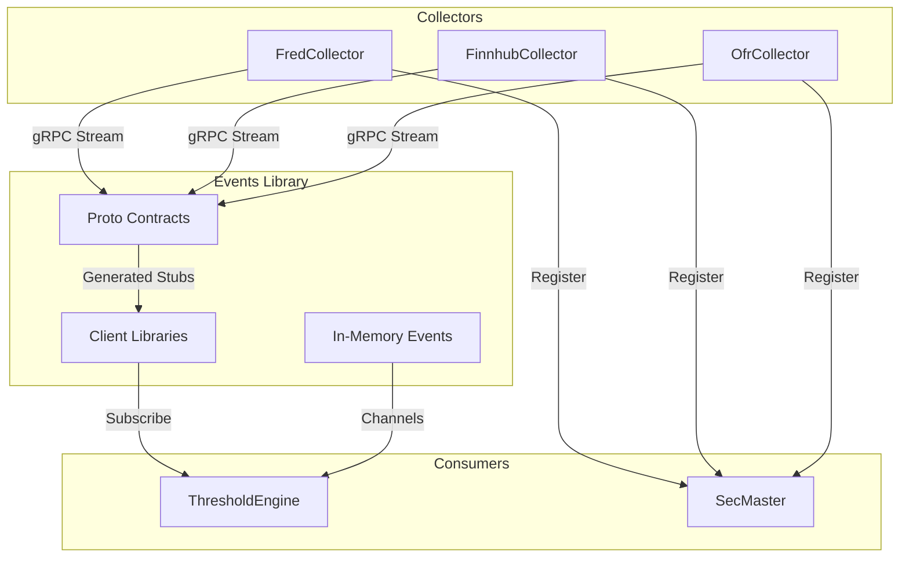

# Events

Shared gRPC event contracts and in-memory event definitions for ATLAS microservices.

## Overview

Events is the schema registry for ATLAS. It defines gRPC Protobuf contracts for inter-service streaming and C# event records for internal event buses. All collectors stream events using the same gRPC interface, and all consumers subscribe using the same client libraries.

## Architecture



Collectors publish events via gRPC using proto contracts. The Events.Client library provides typed clients for subscription and registration. In-memory events flow through System.Threading.Channels for internal processing.

## Features

- **gRPC Event Streaming**: Protobuf contracts for real-time data collection events
- **SecMaster Integration**: Registration and resolution services for symbol management
- **In-Memory Events**: C# record types for internal event buses
- **Client Libraries**: Ready-to-use gRPC clients with retry logic and DI integration
- **Auto-Generated Code**: Grpc.Tools generates C# stubs from proto files during build

## gRPC Contracts

### Proto Files

| File | Services | Purpose |
|------|----------|---------|
| `observation_events.proto` | ObservationEventStream | Data collection event streaming |
| `secmaster.proto` | SecMasterRegistry, SecMasterResolver | Symbol registration and resolution |

### Event Types

| Event | Description | Publishers |
|-------|-------------|------------|
| `SeriesCollectedEvent` | Scalar data points (economic indicators) | FredCollector, AlphaVantageCollector, OfrCollector |
| `OhlcvCollectedEvent` | OHLCV candles (equities, forex) | FinnhubCollector |
| `CollectionFailedEvent` | Collection failures | All collectors |

### In-Memory Events

| Event | Publisher | Consumer |
|-------|-----------|----------|
| `ObservationCollectedEvent` | Collectors | ThresholdEngine |
| `ThresholdCrossedEvent` | ThresholdEngine | AlertService |
| `RegimeTransitionEvent` | ThresholdEngine | AlertService |

## Project Structure

```
Events/
├── src/
│   ├── Events/                     # Core contracts
│   │   ├── Protos/
│   │   │   ├── observation_events.proto
│   │   │   └── secmaster.proto
│   │   ├── IEvent.cs
│   │   ├── ObservationCollectedEvent.cs
│   │   ├── ThresholdCrossedEvent.cs
│   │   └── RegimeTransitionEvent.cs
│   └── Events.Client/              # gRPC client libraries
│       ├── ObservationEventClient.cs
│       ├── SecMasterRegistryClient.cs
│       ├── SecMasterResolverClient.cs
│       └── ServiceCollectionExtensions.cs
└── README.md
```

## Development

### Prerequisites

- .NET 9.0 SDK
- Grpc.Tools NuGet package (included)

### Building

gRPC code is auto-generated during build:

```bash
cd Events/src/Events.Client
dotnet build
```

### Usage

Add as a project reference:

```xml
<ProjectReference Include="../Events/src/Events.Client/Events.Client.csproj" />
```

Register clients via DI:

```csharp
services.AddObservationEventClient(opt => opt.Endpoint = "http://fred-collector:5002");
services.AddSecMasterRegistryClient(opt => opt.Endpoint = "http://secmaster:8080");
services.AddSecMasterResolverClient(opt => opt.Endpoint = "http://secmaster:8080");
```

## Versioning

- **Forward compatible**: New fields are always optional
- **Backward compatible**: Never remove or renumber fields
- **Breaking changes**: Create new message types (e.g., `SeriesCollectedEventV2`)

## See Also

- [FredCollector](../FredCollector/) - FRED economic data collector
- [FinnhubCollector](../FinnhubCollector/) - Finnhub market data collector
- [ThresholdEngine](../ThresholdEngine/) - Event consumer and threshold evaluation
- [SecMaster](../SecMaster/) - Instrument and source registry
