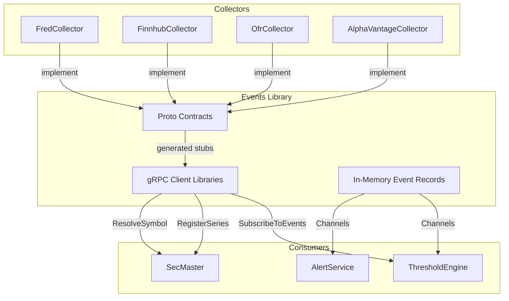

# Events

Shared gRPC event contracts and in-memory event definitions for ATLAS microservices.

## Overview

Events is the schema registry for ATLAS. It provides two packages: `Events` (in-memory C# record types for internal event buses via `System.Threading.Channels`) and `Events.Client` (gRPC client libraries with Protobuf contracts for inter-service streaming). All collectors publish using the same gRPC interface and all consumers subscribe using the same typed clients.

## Architecture



Collectors implement the `ObservationEventStream` gRPC service and register with SecMaster via `SecMasterRegistry`. ThresholdEngine subscribes to collector events via `ObservationEventClient` and resolves symbols via `SecMasterResolverClient`. In-memory events (`IEvent` records) flow through `System.Threading.Channels` for intra-process communication.

## Features

- **gRPC Event Streaming**: Protobuf contracts for real-time and historical data collection events
- **SecMaster Integration**: Registration and resolution gRPC services for instrument/symbol management
- **In-Memory Events**: C# record types implementing `IEvent` for internal event buses
- **Client Libraries**: Ready-to-use gRPC clients with retry logic, keepalive, and DI registration
- **Auto-Generated Code**: `Grpc.Tools` generates C# stubs from `.proto` files at build time

## gRPC Contracts

### Proto Files

| File | Services | Purpose |
|------|----------|---------|
| `observation_events.proto` | `ObservationEventStream` | Data collection event streaming (subscribe, query, health) |
| `secmaster.proto` | `SecMasterRegistry`, `SecMasterResolver` | Series registration, symbol resolution, source lookup |

### Event Types (gRPC)

| Event | Description | Publishers |
|-------|-------------|------------|
| `SeriesCollectedEvent` | Scalar data points with point-in-time `as_of` tracking | FredCollector, AlphaVantageCollector, OfrCollector |
| `OhlcvCollectedEvent` | OHLCV candles (equities, forex, crypto) | FinnhubCollector |
| `CollectionFailedEvent` | Collection failures with error classification | All collectors |
| `ThresholdCrossedEvent` | Pattern threshold triggered with signal/metadata | ThresholdEngine |

### In-Memory Events

| Event | Publisher | Consumer |
|-------|-----------|----------|
| `ObservationCollectedEvent` | Collectors | ThresholdEngine |
| `ThresholdCrossedEvent` | ThresholdEngine | AlertService |
| `RegimeTransitionEvent` | ThresholdEngine | AlertService |

### Client Libraries

| Client | Target Service | Methods |
|--------|---------------|---------|
| `ObservationEventClient` | Collectors (port 5001) | `SubscribeAsync`, `GetEventsSinceAsync`, `GetEventsBetweenAsync`, `GetObservationsSinceAsync` |
| `SecMasterRegistryClient` | SecMaster (port 8080) | `RegisterSeriesAsync`, `RegisterBatchAsync` |
| `SecMasterResolverClient` | SecMaster (port 8080) | `ResolveSymbolAsync`, `ResolveBatchAsync`, `LookupSourceAsync` |

## Project Structure

```
Events/
├── src/
│   ├── Events/                        # Core contracts (NuGet: Events 1.0.0)
│   │   ├── Protos/
│   │   │   ├── observation_events.proto
│   │   │   └── secmaster.proto
│   │   ├── IEvent.cs                  # Marker interface
│   │   ├── ObservationCollectedEvent.cs
│   │   ├── ThresholdCrossedEvent.cs
│   │   └── RegimeTransitionEvent.cs
│   └── Events.Client/                 # gRPC client libraries
│       ├── Observation.cs             # Flattened observation record
│       ├── ObservationEventClient.cs
│       ├── SecMasterRegistryClient.cs
│       ├── SecMasterResolverClient.cs
│       └── ServiceCollectionExtensions.cs
├── nupkg/                             # Packaged NuGet output
└── README.md
```

## Usage

Add project references:

```xml
<!-- In-memory events only -->
<ProjectReference Include="../Events/src/Events/Events.csproj" />

<!-- gRPC clients (includes proto stubs) -->
<ProjectReference Include="../Events/src/Events.Client/Events.Client.csproj" />
```

Register clients via DI:

```csharp
services.AddObservationEventClient(opt => opt.Endpoint = "http://fred-collector:5001");
services.AddSecMasterRegistryClient(opt => opt.Endpoint = "http://secmaster:8080");
services.AddSecMasterResolverClient(opt => opt.Endpoint = "http://secmaster:8080");
```

## Development

### Prerequisites

- .NET 10.0 SDK (C# 14)
- `Grpc.Tools` NuGet package (included in `Events.Client.csproj`)

### Building

gRPC stubs are auto-generated during build:

```bash
cd Events/src/Events.Client
dotnet build
```

### Implementing a gRPC Server

`Events.Client` generates both client and server stubs (`GrpcServices="Both"`). Collectors implement `ObservationEventStreamBase`, SecMaster implements `SecMasterRegistryBase` and `SecMasterResolverBase`.

## Versioning

- **Forward compatible**: New fields are always optional
- **Backward compatible**: Never remove or renumber fields
- **Breaking changes**: Create new message types (e.g., `SeriesCollectedEventV2`)

## See Also

- [FredCollector](../FredCollector/) - FRED economic data collector
- [FinnhubCollector](../FinnhubCollector/) - Finnhub market data collector
- [OfrCollector](../OfrCollector/) - OFR financial data collector
- [ThresholdEngine](../ThresholdEngine/) - Event consumer and threshold evaluation
- [SecMaster](../SecMaster/) - Instrument and source registry
