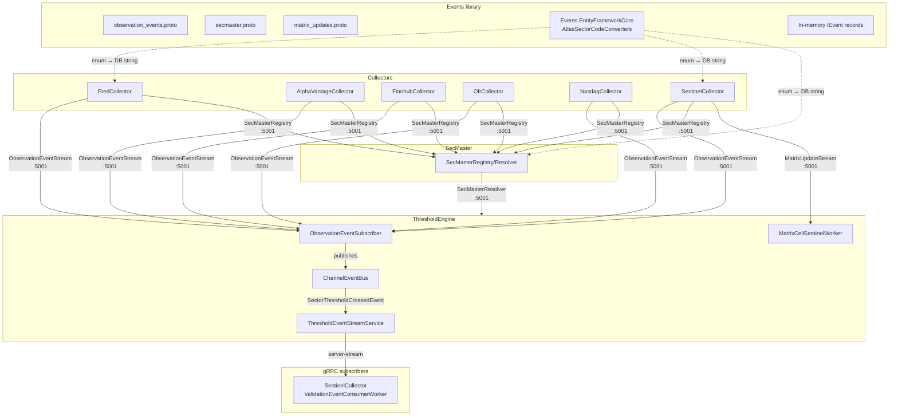

# Events

Shared event contracts for ATLAS microservices — gRPC streaming, in-memory channel events, and EF Core value-converters.

## Overview

Events is the schema registry for ATLAS. It ships three packages: `Events` (in-memory C# record types for intra-process buses built on `System.Threading.Channels`, plus the `.proto` files), `Events.Client` (gRPC client libraries with auto-generated stubs and the shared `AtlasSectorCode` taxonomy), and `Events.EntityFrameworkCore` (reusable value-converters that round-trip `AtlasSectorCode` through DB columns). Every collector publishes via the same gRPC services and every downstream consumer reads via the same typed clients, so producers and consumers cannot drift apart.

## Architecture


```mermaid
flowchart TD
    subgraph Collectors
        FC[FredCollector]
        AV[AlphaVantageCollector]
        FH[FinnhubCollector]
        OC[OfrCollector]
        NC[NasdaqCollector]
        SC[SentinelCollector]
    end

    subgraph EventsLib[Events library]
        OP[observation_events.proto]
        SP[secmaster.proto]
        MP[matrix_updates.proto]
        EFCore[Events.EntityFrameworkCore<br/>AtlasSectorCodeConverters]
        Mem[In-memory IEvent records]
    end

    subgraph SecMasterSvc[SecMaster]
        SMR[SecMasterRegistry/Resolver]
    end

    subgraph TE[ThresholdEngine]
        OES[ObservationEventSubscriber]
        EB[ChannelEventBus]
        TES[ThresholdEventStreamService]
        MCSW[MatrixCellSentinelWorker]
    end

    subgraph DownstreamGrpc[gRPC subscribers]
        SCSub[SentinelCollector<br/>ValidationEventConsumerWorker]
    end

    FC & AV & FH & OC & NC & SC -->|ObservationEventStream<br/>:5001| OES
    FC & AV & FH & OC & NC & SC -->|SecMasterRegistry<br/>:5001| SMR
    OES -->|publishes| EB
    EB -->|SectorThresholdCrossedEvent| TES
    TES -->|server-stream| SCSub
    SC -->|MatrixUpdateStream<br/>:5001| MCSW
    SMR -.->|SecMasterResolver<br/>:5001| TE
    EFCore -.->|enum ↔ DB string| FC
    EFCore -.->|enum ↔ DB string| SC
    EFCore -.->|enum ↔ DB string| SMR
```

Collectors implement `ObservationEventStream` (port 5001) and register with SecMaster via `SecMasterRegistry` (port 5001). ThresholdEngine pulls events with `ObservationEventClient`, resolves symbols with `SecMasterResolverClient`, runs them through its in-process `ChannelEventBus`, and re-broadcasts sector-threshold crossings over its own `ThresholdEventStreamService` for downstream subscribers (e.g. SentinelCollector's validation worker). Sentinel matrix-cell updates flow through a separate `MatrixUpdateStream` service so they evolve independently of the scalar/OHLCV stream.

## Features

- **gRPC Event Streaming**: Protobuf contracts for collector observations, sector-aggregate broadcasts, and Sentinel matrix-cell updates
- **SecMaster Integration**: Registration and resolution gRPC services for instrument / symbol management
- **In-Memory Events**: `IEvent` record types for ThresholdEngine's intra-process pub/sub bus (`System.Threading.Channels`)
- **Shared Sector Taxonomy**: `AtlasSectorCode` enum + DB-string round-trip used by every writer (FRED, Sentinel, SecMaster)
- **EF Value-Converters**: `Events.EntityFrameworkCore` package centralises enum ↔ string persistence so every DB writer round-trips identically
- **Client Libraries**: Ready-to-use gRPC clients with retry, keepalive, and DI registration
- **Auto-Generated Stubs**: `Grpc.Tools` regenerates both client and server stubs from `.proto` at build (`GrpcServices="Both"`)

## Packages

| NuGet ID | Project | Purpose |
|----------|---------|---------|
| `Events` | `src/Events/` | `IEvent` records + `.proto` source files (packed, version 1.0.0) |
| _(project-ref only)_ | `src/Events.Client/` | gRPC clients, generated stubs, `AtlasSectorCode` taxonomy |
| _(project-ref only)_ | `src/Events.EntityFrameworkCore/` | `AtlasSectorCodeConverters` for EF persistence |

## gRPC Contracts

### Proto Files

| File | Service(s) | C# namespace | Purpose |
|------|-----------|--------------|---------|
| `observation_events.proto` | `ObservationEventStream` | `ATLAS.Events.Grpc` | Collector event streaming (subscribe, historical query, health) |
| `secmaster.proto` | `SecMasterRegistry`, `SecMasterResolver` | `ATLAS.SecMaster.Grpc` | Series registration + symbol/source resolution |
| `matrix_updates.proto` | `MatrixUpdateStream` | `ATLAS.Events.Grpc.Matrix` | SentinelCollector → ThresholdEngine matrix-cell update bridge (Phase 5.5) |

### gRPC Event Types

Wire payloads carried inside the `ObservationEventStream.Event.payload` `oneof`:

| Payload (proto) | Description | Publishers | Consumers |
|-----------------|-------------|------------|-----------|
| `SeriesCollectedEvent` | Scalar observations with point-in-time `as_of` tracking | FredCollector, AlphaVantageCollector, FinnhubCollector, OfrCollector, NasdaqCollector | ThresholdEngine (`ObservationEventClient`) |
| `OhlcvCollectedEvent` | OHLCV candles for equities / forex / crypto (defined; no live publisher yet) | _(none currently)_ | ThresholdEngine (`ObservationEventClient`) |
| `CollectionFailedEvent` | Collection failure with classified error code | All collectors (when collection fails) | ThresholdEngine (`ObservationEventClient`) |
| `ThresholdCrossedEvent` | Pattern threshold triggered with signal / metadata | ThresholdEngine (`ThresholdEventStreamService`) | SentinelCollector (`ValidationEventConsumerWorker`) |
| `SectorThresholdCrossedEvent` | Sector-aggregated score crossed a configured bound | ThresholdEngine (`ThresholdEventStreamService`) | SentinelCollector (`ValidationEventConsumerWorker`) |

`MatrixUpdateStream.SubscribeToMatrixCellUpdates` carries `MatrixCellUpdateMessage` + nested `SourceProvenanceMessage` (Phase 5.5; SentinelCollector publishes, ThresholdEngine `MatrixCellSentinelWorker` consumes).

### In-Memory Events (`IEvent`)

These flow only through `ChannelEventBus` inside ThresholdEngine — they do not cross process boundaries. Verified from `ThresholdEngine/src/Workers/` and `ThresholdEngine/src/Services/`.

| Event | Publisher (intra-process) | Consumer (intra-process) |
|-------|---------------------------|--------------------------|
| `ObservationCollectedEvent` | `ObservationEventSubscriber` (per gRPC event ingested) | `ObservationEventSubscriber` evaluation pipeline |
| `ThresholdCrossedEvent` | `ObservationEventSubscriber` (pattern firing) | `ThresholdEventStreamService` (gRPC fan-out) |
| `CellProjectedEvent` | `ObservationEventSubscriber` (values computed by `CellProjector`) | `MatrixCellPersistenceWorker` (writes `matrix_cells`) |
| `SectorScoreEvent` | `ObservationEventSubscriber` (values computed by `SectorAggregator`, one per sector per cycle) | `SectorRegimePersistenceWorker` |
| `SectorThresholdCrossedEvent` | `ObservationEventSubscriber` (crossings detected by `SectorThresholdCrossingDetector`) | `ThresholdEventStreamService` (gRPC fan-out) |

> **Note**: AlertService is **not** an in-memory event consumer — it receives alerts via HTTP webhook (`POST /alerts`) from Alertmanager. The gRPC `ThresholdEventStreamService` is the bridge that turns intra-process `ChannelEventBus` events into the cross-process gRPC stream subscribers attach to.

### Transport Contracts (Sentinel matrix bridge)

| Type | Where it lives | Purpose |
|------|----------------|---------|
| `MatrixCellUpdate` | `Events/MatrixCellUpdate.cs` | One weighted (sector, industry, bucket) contribution from a DSL EVT/NUM block. Validating factory; UTC-midnight invariant enforced at construction. |
| `SourceProvenance` | `Events/SourceProvenance.cs` | Audit-trail record paired with every `MatrixCellUpdate`; serialised JSONB into `MatrixCellEntity.SourceProvenance`. |

### Sector Taxonomy

`AtlasSectorCode` (in `Events.Client`) is the 11-sector enum every writer round-trips through. Enum names are PascalCase for C# readability; DB form is fixed and uppercase:

```
ENERGY, MATERIALS, INDUSTRIALS, CONS_DISC, CONS_STAPLES, HEALTHCARE,
FINANCIALS, INFOTECH, COMM_SVC, UTILITIES, REAL_ESTATE
```

`AtlasSectorCodes.ToDbString` / `Parse` / `TryParse` are the single point of conversion. The static constructor self-checks every enum member round-trips; missing entries fail loud at type-init time.

### Client Libraries

| Client | Target | Methods |
|--------|--------|---------|
| `ObservationEventClient` | Collectors (`:5001`) | `SubscribeAsync`, `GetEventsSinceAsync`, `GetEventsBetweenAsync`, `GetLatestEventTimeAsync`, `GetHealthAsync`, `IsHealthyAsync`, `GetObservationsSinceAsync` |
| `SecMasterRegistryClient` | SecMaster (`:5001`) | `RegisterSeriesAsync`, `RegisterBatchAsync` (with retry on `Unavailable`/`DeadlineExceeded`) |
| `SecMasterResolverClient` | SecMaster (`:5001`) | `ResolveSymbolAsync`, `ResolveBatchAsync`, `LookupSourceAsync` (with retry + exponential backoff) |

The `MatrixUpdateStream` client is consumed via `MatrixUpdateStream.MatrixUpdateStreamClient` (generated) registered through `AddGrpcClient` in `ThresholdEngine/src/DependencyInjection.cs` — there is no hand-written wrapper.

## Project Structure

```
Events/
├── nupkg/                                              # Packaged NuGet output (Events 1.0.0)
├── src/
│   ├── Events/                                         # NuGet: Events
│   │   ├── Protos/
│   │   │   ├── observation_events.proto                # ObservationEventStream + payloads
│   │   │   ├── secmaster.proto                         # Registry + Resolver services
│   │   │   └── matrix_updates.proto                    # Phase 5.5 matrix bridge
│   │   ├── IEvent.cs                                   # Marker interface
│   │   ├── ObservationCollectedEvent.cs
│   │   ├── ThresholdCrossedEvent.cs
│   │   ├── CellProjectedEvent.cs
│   │   ├── SectorScoreEvent.cs
│   │   ├── SectorThresholdCrossedEvent.cs
│   │   ├── MatrixCellUpdate.cs                         # + validating factory
│   │   └── SourceProvenance.cs                         # + validating factory
│   ├── Events.Client/                                  # gRPC clients + generated stubs
│   │   ├── AtlasSectorCode.cs                          # enum + AtlasSectorCodes helpers
│   │   ├── Observation.cs                              # Flattened observation DTO
│   │   ├── ObservationEventClient.cs
│   │   ├── SecMasterRegistryClient.cs
│   │   ├── SecMasterResolverClient.cs
│   │   └── ServiceCollectionExtensions.cs
│   └── Events.EntityFrameworkCore/                     # EF value-converters
│       └── AtlasSectorCodeConverters.cs                # Nullable + NonNullable
└── README.md
```

## Usage

Add project references:

```xml
<!-- In-memory contracts + .proto source -->
<ProjectReference Include="../Events/src/Events/Events.csproj" />

<!-- gRPC clients (transitively pulls Events) -->
<ProjectReference Include="../Events/src/Events.Client/Events.Client.csproj" />

<!-- EF value-converters for AtlasSectorCode persistence -->
<ProjectReference Include="../Events/src/Events.EntityFrameworkCore/Events.EntityFrameworkCore.csproj" />
```

Register clients via DI:

```csharp
services.AddObservationEventClient(opt => opt.Endpoint = "http://fred-collector:5001");
services.AddSecMasterRegistryClient(opt => opt.Endpoint = "http://secmaster:5001");
services.AddSecMasterResolverClient(opt => opt.Endpoint = "http://secmaster:5001");
```

Apply the sector converter to an EF entity property:

```csharp
builder.Property(e => e.AtlasSectorCode)
       .HasConversion(AtlasSectorCodeConverters.Nullable);   // or .NonNullable
```

## Development

### Prerequisites

- .NET 10.0 SDK (C# 14)
- `Grpc.Tools` (transitive via `Events.Client.csproj`)

### Building

gRPC stubs are auto-generated at build:

```bash
cd Events/src/Events.Client
dotnet build
```

### Implementing a gRPC Server

`Events.Client` generates both client and server stubs (`GrpcServices="Both"`). Collectors derive from `ObservationEventStream.ObservationEventStreamBase`; SecMaster implements `SecMasterRegistry.SecMasterRegistryBase` and `SecMasterResolver.SecMasterResolverBase`; SentinelCollector implements `MatrixUpdateStream.MatrixUpdateStreamBase` (`MatrixCellUpdateStreamService`).

## Versioning

- **Forward compatible**: new fields are always optional
- **Backward compatible**: never remove or renumber fields
- **Reservations**: retired fields are kept with `reserved` (see `ThresholdCrossedEvent.category` retired in Epic 2 Story 2.1.2)
- **Breaking changes**: create a new message (e.g. `SeriesCollectedEventV2`)

## See Also

- [FredCollector](../FredCollector/) — FRED economic series collector
- [AlphaVantageCollector](../AlphaVantageCollector/) — Alpha Vantage equity / FX / crypto collector
- [FinnhubCollector](../FinnhubCollector/) — Finnhub market data collector
- [OfrCollector](../OfrCollector/) — OFR financial-stability data collector
- [NasdaqCollector](../NasdaqCollector/) — Nasdaq Data Link collector
- [SentinelCollector](../SentinelCollector/) — Sentinel news extraction + matrix-cell publisher
- [SecMaster](../SecMaster/) — Instrument and source registry (Registry / Resolver gRPC)
- [ThresholdEngine](../ThresholdEngine/) — Event consumer + pattern evaluation + sector aggregation
- [AlertService](../AlertService/) — HTTP webhook receiver for Alertmanager (not a direct Events consumer)
