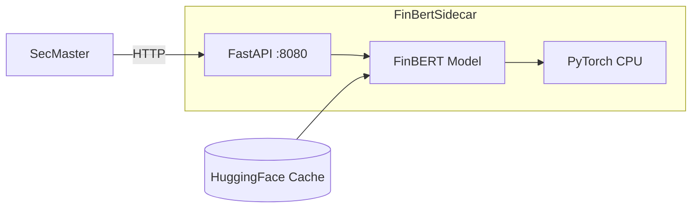

# FinBertSidecar

CPU-based financial domain embedding service using FinBERT.

## Overview

FinBertSidecar provides financial domain-specific text embeddings using the ProsusAI/FinBERT model, optimized for CPU inference. It exposes a REST API for generating single or batch embeddings and calculating cosine similarity between texts. Designed as an internal sidecar service for SecMaster and other ATLAS components requiring financial NLP capabilities.

## Architecture



## Features

- **Single Embeddings**: Generate normalized 768-dimension vectors for individual texts
- **Batch Embeddings**: Process up to 100 texts in a single request with configurable batch size
- **Cosine Similarity**: Calculate semantic similarity between two texts
- **CPU Optimized**: Multi-threaded inference without GPU requirements
- **Pre-loaded Model**: Model downloaded during container build for fast startup
- **Normalized Output**: All embeddings are L2-normalized for direct cosine similarity

## Configuration

| Variable | Default | Description |
|----------|---------|-------------|
| `FINBERT_MODEL` | `ProsusAI/finbert` | HuggingFace model identifier |
| `MAX_TEXT_LENGTH` | `512` | Maximum tokens per text input |
| `BATCH_SIZE` | `32` | Batch size for embedding generation |
| `NUM_THREADS` | `4` | PyTorch CPU threads |

## API Endpoints

| Method | Endpoint | Description |
|--------|----------|-------------|
| GET | `/health` | Health check with model status |
| POST | `/embed` | Generate embedding for single text |
| POST | `/embed/batch` | Generate embeddings for multiple texts |
| GET | `/similarity` | Calculate cosine similarity between two texts |

### Request/Response Examples

**POST /embed**
```json
// Request
{ "text": "Federal Reserve raises interest rates by 25 basis points" }

// Response
{
  "embedding": [0.023, -0.045, ...],
  "model": "ProsusAI/finbert",
  "dimension": 768
}
```

**POST /embed/batch**
```json
// Request
{ "texts": ["Bullish market sentiment", "Bear market conditions"] }

// Response
{
  "embeddings": [[0.023, ...], [0.045, ...]],
  "model": "ProsusAI/finbert",
  "dimension": 768,
  "count": 2
}
```

**GET /similarity**
```
?text1=Strong quarterly earnings&text2=Positive financial results
```
```json
{
  "similarity": 0.85,
  "text1_preview": "Strong quarterly earnings",
  "text2_preview": "Positive financial results"
}
```

## Project Structure

```
FinBertSidecar/
├── src/
│   ├── main.py           # FastAPI application
│   ├── requirements.txt  # Python dependencies
│   └── Containerfile     # Container build definition
└── .devcontainer/
    ├── build.sh          # Container image build script
    └── compile.sh        # Python syntax validation
```

## Development

### Prerequisites

- Python 3.12+
- PyTorch, sentence-transformers

### Validate Syntax

```bash
.devcontainer/compile.sh
```

### Build Container Image

```bash
.devcontainer/build.sh
```

### Run Locally

```bash
cd src
pip install -r requirements.txt
python main.py
```

## Deployment

```bash
ansible-playbook playbooks/deploy.yml --tags finbert-sidecar
```

## Ports

| Port | Type | Description |
|------|------|-------------|
| 8080 | HTTP (internal) | REST API, health checks |

## See Also

- [SecMaster](../SecMaster/README.md) - Primary consumer for semantic search embeddings
- [docs/ARCHITECTURE.md](../docs/ARCHITECTURE.md) - System design
