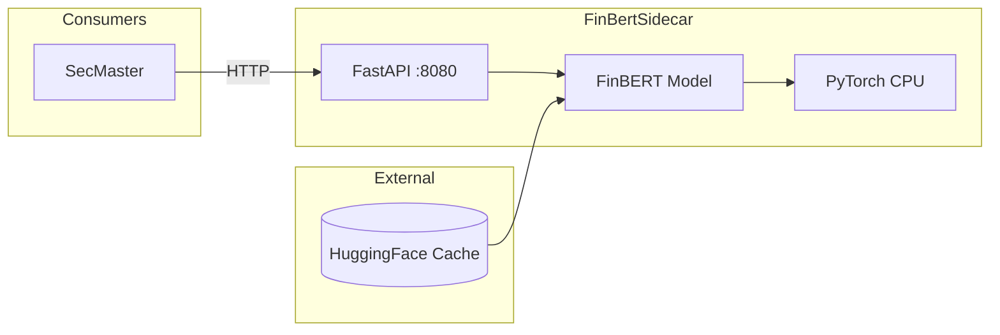

# FinBertSidecar

CPU-based financial domain embedding service using FinBERT.

## Overview

FinBertSidecar provides financial domain-specific text embeddings using the ProsusAI/FinBERT model, optimized for CPU inference. It exposes a REST API for generating single or batch embeddings and calculating cosine similarity between texts. Designed as an internal sidecar service for SecMaster and other ATLAS components requiring financial NLP capabilities.

## Architecture



SecMaster sends text to the FastAPI endpoint, which passes it through the FinBERT model running on PyTorch CPU for embedding generation. The model is pre-downloaded from HuggingFace during container build.

## Features

- **Single Embeddings**: Generate normalized 768-dimension vectors for individual texts
- **Batch Embeddings**: Process up to 100 texts per request with configurable batch size
- **Cosine Similarity**: Calculate semantic similarity between two texts
- **CPU Optimized**: Multi-threaded PyTorch inference without GPU requirements
- **Pre-loaded Model**: Model downloaded during container build for fast startup
- **Normalized Output**: L2-normalized embeddings for direct cosine similarity computation

## Configuration

| Variable | Description | Default |
|----------|-------------|---------|
| `FINBERT_MODEL` | HuggingFace model identifier | `ProsusAI/finbert` |
| `MAX_TEXT_LENGTH` | Maximum tokens per text input | `512` |
| `BATCH_SIZE` | Batch size for embedding generation | `32` |
| `NUM_THREADS` | PyTorch CPU threads | `4` |

## API Endpoints

### REST API (Port 8080)

| Endpoint | Method | Description |
|----------|--------|-------------|
| `/health` | GET | Health check with model status |
| `/embed` | POST | Generate embedding for single text |
| `/embed/batch` | POST | Generate embeddings for multiple texts (max 100) |
| `/similarity` | GET | Cosine similarity between two texts (query params `text1`, `text2`) |

## Project Structure

```
FinBertSidecar/
├── src/
│   ├── main.py           # FastAPI application
│   ├── requirements.txt  # Python dependencies
│   └── Containerfile     # Container build definition
└── .devcontainer/
    ├── build.sh          # Container image build script
    └── compile.sh        # Python syntax validation
```

## Development

### Prerequisites

- Python 3.12+
- PyTorch, sentence-transformers

### Getting Started

1. Install dependencies: `pip install -r src/requirements.txt`
2. Run: `python src/main.py`

### Validate Syntax

```bash
.devcontainer/compile.sh
```

### Build Container

```bash
.devcontainer/build.sh
```

## Deployment

```bash
ansible-playbook playbooks/deploy.yml --tags finbert-sidecar
```

## Ports

| Port | Type | Description |
|------|------|-------------|
| 8080 | HTTP (internal) | REST API, health checks |

## See Also

- [SecMaster](../SecMaster/README.md) - Primary consumer for semantic search embeddings
- [docs/ARCHITECTURE.md](../docs/ARCHITECTURE.md) - System design
