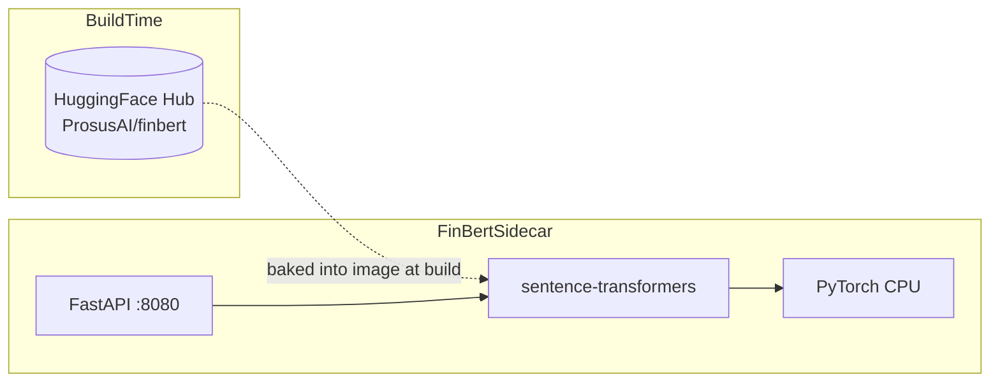

# FinBertSidecar

CPU-based financial-domain embedding service exposing FinBERT over a small HTTP API.

## Overview

FinBertSidecar wraps `ProsusAI/finbert` via `sentence-transformers` and serves L2-normalized 768-dimension embeddings over FastAPI on port 8080. The container runs PyTorch on CPU only (no GPU bindings); the model is pre-downloaded into the image at build time so first-request latency is bounded by tokenization, not by a HuggingFace fetch. The service is internal-only (no host port mapping) and is intended as a shared embedding endpoint for ATLAS components that need a finance-tuned alternative to a general-purpose embedding model. It has no production consumer wired into the codebase today.

## Architecture


```mermaid
flowchart LR
    subgraph FinBertSidecar
        API[FastAPI :8080]
        ST[sentence-transformers]
        TORCH[PyTorch CPU]
    end

    subgraph BuildTime
        HF[(HuggingFace Hub<br/>ProsusAI/finbert)]
    end

    HF -.->|baked into image at build| ST
    API --> ST --> TORCH
```

The model is fetched from HuggingFace during `nerdctl build` (Containerfile `RUN python -c "SentenceTransformer('ProsusAI/finbert')"`) and cached under `/app/.cache` via `HF_HOME`. At runtime FastAPI loads the model in its `lifespan` startup hook and serves embedding/similarity requests synchronously.

## Features

- **Single embedding** — `POST /embed` returns one 768-dimension L2-normalized vector.
- **Batch embedding** — `POST /embed/batch` accepts 1-100 texts and returns vectors in a single call (uses `BATCH_SIZE` internally for encoder micro-batching).
- **Cosine similarity** — `GET /similarity` returns dot-product of two normalized vectors (equivalent to cosine because outputs are L2-normalized).
- **CPU-only** — device is hard-coded to `cpu`; `torch.set_num_threads(NUM_THREADS)` controls intra-op parallelism.
- **Model baked into image** — no first-request download; startup time bounded by model load only.
- **Text truncation** — inputs longer than `MAX_TEXT_LENGTH` characters are truncated server-side before encoding (note: character truncation, not token truncation; `model.max_seq_length` separately bounds token count).

## Configuration

All settings are read from environment variables at process start.

| Variable | Description | Default (Containerfile) | Set in compose |
|----------|-------------|-------------------------|----------------|
| `FINBERT_MODEL` | HuggingFace model id loaded by `SentenceTransformer` | `ProsusAI/finbert` | `ProsusAI/finbert` |
| `MAX_TEXT_LENGTH` | Per-text character cap (also sets `model.max_seq_length` tokens) | `512` | `512` |
| `BATCH_SIZE` | Encoder micro-batch size used by `/embed/batch` | `32` | `32` |
| `NUM_THREADS` | `torch.set_num_threads` value (intra-op CPU threads) | `4` | `8` |

Note: the deployed compose sets `NUM_THREADS=8` to match the `cpus: '8'` resource limit; the Containerfile default of `4` is a conservative dev fallback.

## API Endpoints

All endpoints listen on port 8080 (HTTP, internal).

| Endpoint | Method | Request | Response |
|----------|--------|---------|----------|
| `/health` | GET | — | `{status, model, model_loaded, device, dimension}`; 503 if model not loaded |
| `/embed` | POST | JSON `{text: str}` (1-10000 chars) | `{embedding: float[], model, dimension}` |
| `/embed/batch` | POST | JSON `{texts: str[]}` (1-100 items) | `{embeddings: float[][], model, dimension, count}` |
| `/similarity` | GET | query `text1`, `text2` (each 1-10000 chars) | `{similarity: float, text1_preview, text2_preview}` |

Errors are returned as FastAPI `HTTPException` with status 500 on encoder failure and 503 when the model is not yet loaded.

## Project Structure

```
FinBertSidecar/
├── src/
│   ├── main.py           # FastAPI app + lifespan model loader
│   ├── requirements.txt  # Python runtime dependencies
│   └── Containerfile     # Multi-stage-free image build (uv + slim python:3.12)
└── .devcontainer/
    ├── build.sh          # Wraps `sudo nerdctl build` from the monorepo root
    └── compile.sh        # `python3 -m py_compile` syntax check
```

## Development

### Prerequisites

- Python 3.12 (matches the `python:3.12-slim` base image)
- Dependencies from `src/requirements.txt`: `fastapi`, `uvicorn[standard]`, `sentence-transformers`, `torch`, `numpy`, `pydantic`, `transformers`

### Getting Started

1. Install dependencies into a venv: `python3 -m venv .venv && . .venv/bin/activate && pip install -r src/requirements.txt`
2. Run: `uvicorn main:app --host 0.0.0.0 --port 8080 --app-dir src` (or `python src/main.py`, which calls uvicorn programmatically)

First start downloads the model from HuggingFace into `~/.cache/huggingface` unless `HF_HOME` is set.

### Validate Syntax

```bash
.devcontainer/compile.sh
```

### Build Container

```bash
.devcontainer/build.sh             # standard build
.devcontainer/build.sh --no-cache  # force-rebuild including model download layer
```

The build script invokes `sudo nerdctl build` with the monorepo root as context (the Containerfile uses `COPY FinBertSidecar/src/...` paths).

## Deployment

```bash
ansible-playbook deployment/ansible/playbooks/deploy.yml --tags finbert-sidecar
```

The playbook rebuilds the `finbert-sidecar:latest` image and recreates the container via the generated `compose.yaml`. The deployed container has a 4 GB memory limit and 8 CPU cap, mounts `/opt/ai-inference/models/finbert` for the HuggingFace cache, and mounts `/opt/ai-inference/logs/finbert-sidecar` for logs. A Docker healthcheck polls `/health` every 30 s with a 120 s start period.

## Ports

| Port | Type | Description |
|------|------|-------------|
| 8080 | HTTP (internal only) | REST API and healthcheck. No host port mapping. |

## See Also

- [docs/ARCHITECTURE.md](../docs/ARCHITECTURE.md) — system design (includes FinBertSidecar in the inference topology)
- [deployment/README.md](../deployment/README.md) — service-to-tag mapping for ansible deploys
