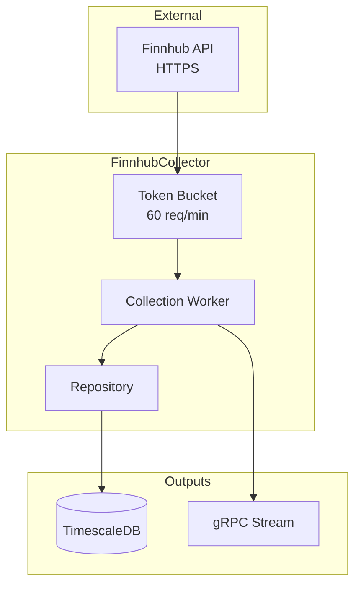

# FinnhubCollector

Collector service for equity, sentiment, and economic data from Finnhub API.

## Overview

FinnhubCollector ingests diverse market data including stock quotes, news sentiment, analyst ratings, and economic calendar events. It operates under a strict 60 requests/minute rate limit and streams normalized data to downstream consumers.

## Architecture



## Key Features

- **Diverse Data Types**:
  - **Quotes**: Real-time stock prices (AAPL, MSFT, NVDA, etc.)
  - **Sentiment**: News sentiment scores
  - **Analyst Ratings**: Buy/Sell/Hold recommendations
  - **Economic Events**: Global economic indicators
- **Rate Limiting**: Token bucket algorithm implementation (60 req/min).
- **Data Ownership**: Dedicated TimescaleDB instance for isolation.

## Configuration

Environment variables:

| Variable | Description | Default |
|----------|-------------|---------|
| `ConnectionStrings__Atlas` | PostgreSQL connection | `Host=timescaledb;...` |
| `Finnhub__ApiKey` | API Key from finnhub.io | **Required** |
| `Finnhub__RateLimit` | Requests per minute | `60` |

## Getting Started

**Note**: This service is designed to run as part of the larger ATLAS microservices architecture. It relies on shared infrastructure (TimescaleDB) and other services to function correctly.

### Development (Dev Containers)

The most robust way to develop is using the provided Dev Container, which includes the .NET SDK and tooling.

1. **Open in VS Code**: Open this folder and select "Reopen in Container".
2. **Configure Secrets**: Create a `.env` file in the root of the service with your API key:
   ```bash
   Finnhub__ApiKey=your_api_key_here
   ```
3. **Start Infrastructure**: Ensure the shared database is running:
   ```bash
   docker compose up -d postgres
   ```
4. **Run Service**:
   ```bash
   cd src/FinnhubCollector.Service
   dotnet run
   ```

### Running with Docker (Standalone)

If you just want to run the service image without a dev environment:

```bash
export FINNHUB_API_KEY=your_key_here
docker compose up -d finnhub-collector
```

### Running the Full Stack

To run the entire ATLAS system:

```bash
cd ../ansible
ansible-playbook playbooks/site.yml
```

## API Endpoints

### REST API (Port 8080)

| Endpoint | Method | Description |
|----------|--------|-------------|
| `/health` | GET | Liveness probe |
| `/health/ready` | GET | Readiness check (DB connected) |

### gRPC API (Port 5008)

**Service Definition**: `events.proto`

- `SubscribeToEvents`: Streams `SeriesCollectedEvent` messages in real-time.

## Project Structure

```
FinnhubCollector/
├── src/
│   ├── FinnhubCollector.Core/          # Domain models
│   ├── FinnhubCollector.Application/   # Business logic
│   ├── FinnhubCollector.Infrastructure/# API Client, EF Core
│   ├── FinnhubCollector.Grpc/          # gRPC Service
│   └── FinnhubCollector.Service/       # Worker Host
├── tests/
│   └── FinnhubCollector.UnitTests/     # Unit tests
└── migrations/                         # Database migrations
```

## See Also

- [ThresholdEngine](../ThresholdEngine/README.md) - Downstream consumer
- [Events](../Events/README.md) - Shared contracts

