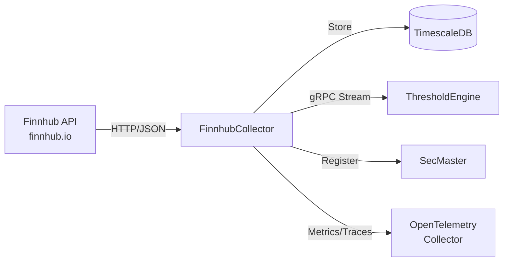

# FinnhubCollector

Market data collector service for Finnhub API.

## Overview

FinnhubCollector ingests diverse market data including stock quotes, candles, news sentiment, analyst ratings, economic calendars, and earnings calendars from the Finnhub API. It operates under a strict rate limit (60 requests/minute), stores data in TimescaleDB, and streams observations to downstream consumers via gRPC.

## Architecture



## Features

- Data Collection: Automated collection of configured series (quotes, sentiment, calendars)
- Live Data Endpoints: On-demand queries directly to Finnhub API (quotes, candles, profiles, recommendations, price targets, sentiment, peers)
- Admin API: Series management (add, toggle, delete, trigger collection)
- Rate Limiting: Token bucket algorithm (60 req/min default)
- gRPC Streaming: Real-time observation events to downstream services
- SecMaster Integration: Automatic instrument registration via gRPC
- Full Observability: Distributed tracing and metrics with OTLP export
- Swagger UI: Interactive API documentation

## Configuration

| Variable | Description | Default |
|----------|-------------|---------|
| `ConnectionStrings__Atlas` | PostgreSQL connection | `Host=timescaledb;Database=atlas;Username=atlas;Password=...` |
| `Finnhub__ApiKey` | API Key from finnhub.io | **Required** |
| `Finnhub__RateLimit` | Requests per minute | `60` |
| `OpenTelemetry__OtlpEndpoint` | OTLP collector endpoint | `http://otel-collector:4317` |
| `OpenTelemetry__ServiceName` | Service name for telemetry | `finnhub-collector` |
| `SECMASTER_GRPC_ENDPOINT` | SecMaster gRPC endpoint | `http://secmaster:8080` |

## API Endpoints

### REST API

**Health Checks**

| Endpoint | Method | Description |
|----------|--------|-------------|
| `/health` | GET | Liveness probe |
| `/health/ready` | GET | Readiness check (DB validation) |
| `/health/live` | GET | Simple liveness endpoint |

**Data API**

| Endpoint | Method | Description |
|----------|--------|-------------|
| `/api/series` | GET | Get all configured series (optionally filtered by type) |
| `/api/series/{seriesId}` | GET | Get specific series |
| `/api/quotes/{symbol}` | GET | Get latest quote |
| `/api/quotes/{symbol}/history` | GET | Get quote history |
| `/api/calendar/economic` | GET | Get upcoming economic events |
| `/api/calendar/economic/high-impact` | GET | Get high-impact economic events |
| `/api/calendar/earnings` | GET | Get upcoming earnings |
| `/api/calendar/ipo` | GET | Get upcoming IPOs |
| `/api/sentiment/{symbol}/news` | GET | Get news sentiment |
| `/api/sentiment/{symbol}/insider` | GET | Get insider sentiment |
| `/api/analyst/{symbol}/recommendations` | GET | Get analyst recommendations |
| `/api/analyst/{symbol}/price-target` | GET | Get price target |
| `/api/company/{symbol}` | GET | Get company profile |
| `/api/market/status` | GET | Get market status |
| `/api/symbols/search` | GET | Search symbols (query: q) |

**Live Data API**

Direct Finnhub API queries (bypasses local storage):

| Endpoint | Method | Description |
|----------|--------|-------------|
| `/api/live/quote/{symbol}` | GET | Live quote |
| `/api/live/candles/{symbol}` | GET | Live candles (historical OHLCV) |
| `/api/live/profile/{symbol}` | GET | Live company profile |
| `/api/live/recommendation/{symbol}` | GET | Live recommendations |
| `/api/live/price-target/{symbol}` | GET | Live price target |
| `/api/live/news-sentiment/{symbol}` | GET | Live news sentiment |
| `/api/live/peers/{symbol}` | GET | Live company peers |

**Admin API**

| Endpoint | Method | Description |
|----------|--------|-------------|
| `/api/admin/series` | GET | Get all series (including inactive) |
| `/api/admin/series` | POST | Add new series |
| `/api/admin/series/{seriesId}/toggle` | PUT | Enable/disable series |
| `/api/admin/series/{seriesId}` | DELETE | Delete series |
| `/api/admin/series/{seriesId}/collect` | POST | Trigger immediate collection |

**Documentation**

| Endpoint | Description |
|----------|-------------|
| `/swagger` | Interactive API documentation |

### gRPC API

**Service**: `ObservationEventService`

| Method | Description |
|--------|-------------|
| `SubscribeToEvents` | Server-streaming RPC that emits SeriesCollectedEvent messages in real-time |

## Project Structure

```
FinnhubCollector/
├── src/
│   ├── Api/              # Finnhub API client
│   ├── Data/             # EF Core DbContext, repositories
│   ├── Endpoints/        # REST API endpoints (API, Live, Admin)
│   ├── Events/           # Observation channel
│   ├── Grpc/             # gRPC services and repositories
│   ├── HealthChecks/     # Database health check
│   ├── Interfaces/       # Service interfaces
│   ├── Models/           # Domain models
│   ├── Services/         # Application services (rate limiter, series management)
│   ├── Telemetry/        # OpenTelemetry activity source and meter
│   ├── Workers/          # Background collection worker
│   └── Program.cs        # Application entry point
├── tests/                # Unit tests
└── .devcontainer/        # VS Code dev container
```

## Development

### Using Dev Container

```bash
# Open in VS Code and select "Reopen in Container"
cd /workspace/FinnhubCollector/src
dotnet run
```

### Compile

```bash
.devcontainer/compile.sh
```

### Build Container Image

```bash
.devcontainer/build.sh
```

## Deployment

```bash
ansible-playbook playbooks/deploy.yml --tags finnhub-collector
```

## Ports

| Port | Type | Description |
|------|------|-------------|
| 8080 | HTTP (container) | REST API, health checks |
| 5001 | HTTP/2 (container) | gRPC event stream |
| 5012 | Host | Mapped to container port 8080 |

## See Also

- [ThresholdEngine](../ThresholdEngine/README.md) - Consumes observation events
- [SecMaster](../SecMaster/README.md) - Instrument registration
- [Events](../Events/README.md) - Shared gRPC event contracts
- [FinnhubMcp](../FinnhubMcp/README.md) - MCP server for AI assistants
