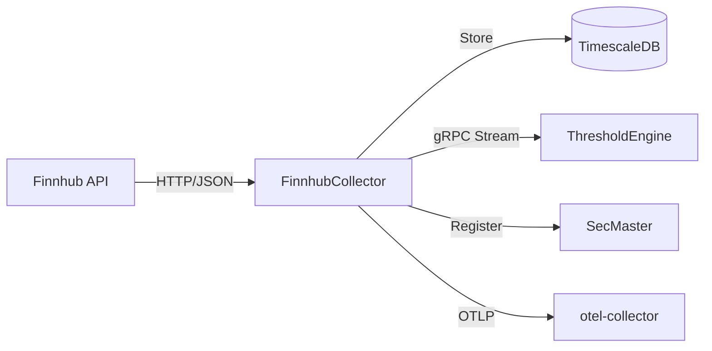

# FinnhubCollector

Market data collector service for Finnhub API.

## Overview

FinnhubCollector ingests diverse market data including stock quotes, candles, news sentiment, analyst ratings, economic calendars, and earnings calendars from the Finnhub API. It operates under a strict rate limit (60 requests/minute), stores data in TimescaleDB, and streams observation events to downstream consumers via gRPC. The service integrates with SecMaster for instrument registration and exports telemetry to the observability stack.

## Architecture



## Features

- **Data Collection**: Automated background collection of configured series (quotes, sentiment, calendars, analyst data)
- **Live Data API**: On-demand queries directly to Finnhub API bypassing local storage
- **Admin API**: Series management (add, toggle, delete, trigger collection, check status)
- **Rate Limiting**: Token bucket algorithm enforcing 60 requests/minute
- **gRPC Streaming**: Real-time observation events to downstream services
- **SecMaster Integration**: Automatic instrument registration via gRPC
- **Resilience**: Retry policies with exponential backoff and circuit breaker
- **Full Observability**: Distributed tracing, metrics, and structured logging via OTLP

## Configuration

| Variable | Description | Default |
|----------|-------------|---------|
| `ConnectionStrings__AtlasDb` | PostgreSQL/TimescaleDB connection string | Required |
| `Finnhub__ApiKey` | API key from finnhub.io | Required |
| `Finnhub__BaseUrl` | Finnhub API base URL | `https://finnhub.io/api/v1/` |
| `RATE_LIMITER_CAPACITY` | Requests per minute | `60` |
| `OpenTelemetry__OtlpEndpoint` | OTLP collector endpoint | `http://otel-collector:4317` |
| `OpenTelemetry__ServiceName` | Service name for telemetry | `finnhub-collector` |
| `SECMASTER_GRPC_ENDPOINT` | SecMaster gRPC endpoint (optional) | - |
| `Kestrel__HttpPort` | HTTP API port | `8080` |
| `Kestrel__GrpcPort` | gRPC streaming port | `5001` |

## API Endpoints

### REST API (Port 8080)

| Endpoint | Method | Description |
|----------|--------|-------------|
| `/health` | GET | Full health check |
| `/health/ready` | GET | Readiness probe |
| `/health/live` | GET | Liveness probe |
| `/api/series` | GET | Get active series |
| `/api/series/{seriesId}` | GET | Get specific series |
| `/api/quotes/{symbol}` | GET | Get latest quote |
| `/api/quotes/{symbol}/history` | GET | Get quote history |
| `/api/calendar/economic` | GET | Economic calendar events |
| `/api/calendar/economic/high-impact` | GET | High-impact economic events |
| `/api/calendar/earnings` | GET | Earnings calendar |
| `/api/calendar/ipo` | GET | IPO calendar |
| `/api/sentiment/{symbol}/news` | GET | News sentiment |
| `/api/sentiment/{symbol}/insider` | GET | Insider sentiment |
| `/api/analyst/{symbol}/recommendations` | GET | Analyst recommendations |
| `/api/analyst/{symbol}/price-target` | GET | Price target |
| `/api/company/{symbol}` | GET | Company profile |
| `/api/market/status` | GET | Market status |
| `/api/symbols/search` | GET | Symbol search |
| `/swagger` | GET | API documentation |

### Live Data API (Direct Finnhub Queries)

| Endpoint | Method | Description |
|----------|--------|-------------|
| `/api/live/quote/{symbol}` | GET | Live quote |
| `/api/live/candles/{symbol}` | GET | Live OHLCV candles |
| `/api/live/profile/{symbol}` | GET | Live company profile |
| `/api/live/recommendation/{symbol}` | GET | Live recommendations |
| `/api/live/price-target/{symbol}` | GET | Live price target |
| `/api/live/news-sentiment/{symbol}` | GET | Live news sentiment |
| `/api/live/peers/{symbol}` | GET | Live company peers |

### Admin API

| Endpoint | Method | Description |
|----------|--------|-------------|
| `/api/admin/series` | GET | Get all series (including inactive) |
| `/api/admin/series` | POST | Add new series |
| `/api/admin/series/{seriesId}/toggle` | PUT | Enable/disable series |
| `/api/admin/series/{seriesId}` | DELETE | Delete series |
| `/api/admin/series/{seriesId}/collect` | POST | Trigger collection |

### gRPC Services (Port 5001)

| Service | Method | Description |
|---------|--------|-------------|
| `ObservationEventStream` | `SubscribeToEvents` | Real-time event subscription |
| `ObservationEventStream` | `GetEventsSince` | Historical events since timestamp |
| `ObservationEventStream` | `GetEventsBetween` | Events within time range |
| `ObservationEventStream` | `GetLatestEventTime` | Most recent event timestamp |
| `ObservationEventStream` | `GetHealth` | Service health with statistics |

## Project Structure

```
FinnhubCollector/
├── src/
│   ├── Api/              # Finnhub HTTP client
│   ├── Data/             # EF Core DbContext, repositories
│   ├── Endpoints/        # REST endpoints (API, Live, Admin)
│   ├── Events/           # Observation channel
│   ├── Grpc/             # gRPC services and repositories
│   ├── HealthChecks/     # Database health check
│   ├── Interfaces/       # Service contracts
│   ├── Models/           # Domain models
│   ├── Services/         # Application services
│   ├── Telemetry/        # OpenTelemetry instrumentation
│   ├── Workers/          # Background collection worker
│   └── Program.cs        # Application entry point
├── tests/                # Unit tests
└── .devcontainer/        # Development container
```

## Development

### Prerequisites

- .NET 9 SDK
- VS Code with Dev Containers extension
- Docker/nerdctl

### Getting Started

```bash
# Open in VS Code and select "Reopen in Container"
cd /workspace/FinnhubCollector/src
dotnet run
```

### Build Commands

```bash
# Compile
.devcontainer/compile.sh

# Build container image
.devcontainer/build.sh
```

## Deployment

```bash
ansible-playbook playbooks/deploy.yml --tags finnhub-collector
```

## Ports

| Port | Type | Description |
|------|------|-------------|
| 8080 | HTTP (internal) | REST API, health checks |
| 5001 | HTTP/2 (internal) | gRPC event stream |

## See Also

- [ThresholdEngine](../ThresholdEngine/README.md) - Consumes observation events
- [SecMaster](../SecMaster/README.md) - Instrument registration
- [Events](../Events/README.md) - Shared gRPC event contracts
- [FinnhubMcp](mcp/README.md) - MCP server for AI assistants
