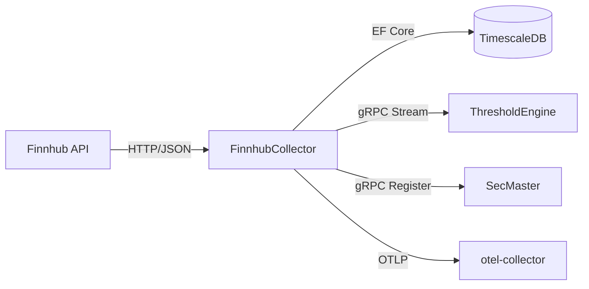

# FinnhubCollector

Market data collector service for the Finnhub API.

> 🤖 **Agents:** read **[AGENT_README.md](AGENT_README.md)** first — the dense architecture card.

## Overview

FinnhubCollector ingests market data including stock quotes, candles, news/insider sentiment, analyst recommendations & price targets, economic events, earnings, and IPO calendars from the Finnhub API. It enforces a 60 requests/minute token-bucket rate limit, persists data via EF Core to TimescaleDB, and streams observation events to downstream consumers over gRPC. It optionally registers instruments with SecMaster and exports telemetry (traces, metrics, logs) to the OTEL collector.

## Architecture


```mermaid
flowchart LR
    FH[Finnhub API] -->|HTTP/JSON| FC[FinnhubCollector]
    FC -->|EF Core| DB[(TimescaleDB)]
    FC -->|gRPC Stream| TE[ThresholdEngine]
    FC -->|gRPC Register| SM[SecMaster]
    FC -->|OTLP| OC[otel-collector]
```

Scheduled background workers poll configured series via the rate-limited HTTP client and persist results. Each successful collection is published to an in-memory channel and streamed via gRPC to ThresholdEngine. Live-data endpoints bypass storage entirely and proxy directly to Finnhub. Migrations are applied at startup (`Program.cs:141`).

## Features

- **Background Collection**: `QuoteCollectionWorker` polls configured series on per-series schedules
- **Live Data API**: On-demand pass-through to Finnhub (`/api/live/*`), no storage
- **Admin API**: Add/toggle/delete series; trigger ad-hoc collection via bounded queue with duplicate-suppression
- **Token-Bucket Rate Limiting**: 60 req/min default (Finnhub free tier), tunable via `RATE_LIMITER_CAPACITY`
- **gRPC Streaming**: `ObservationEventStream` service for real-time + historical event consumption
- **SecMaster Integration**: Optional series registration when `SECMASTER_GRPC_ENDPOINT` is set
- **Resilience**: Polly retry (3x, exponential), circuit breaker (5 failures / 60s break), 30s timeout
- **Observability**: OpenTelemetry traces + metrics, Serilog → OTLP, ASP.NET health checks

## Configuration

Required:

| Variable | Description | Default |
|----------|-------------|---------|
| `ConnectionStrings__AtlasDb` | PostgreSQL/TimescaleDB connection string | Required |
| `Finnhub__ApiKey` (alias `FINNHUB_API_KEY`) | API key from finnhub.io | Required |

Optional:

| Variable | Description | Default |
|----------|-------------|---------|
| `Finnhub__BaseUrl` (alias `FINNHUB_API_BASE_URL`) | Finnhub API base URL | `https://finnhub.io/api/v1/` |
| `RATE_LIMITER_CAPACITY` | Token bucket capacity per minute | `60` |
| `SECMASTER_GRPC_ENDPOINT` | SecMaster gRPC endpoint; omit to disable registration | unset (disabled) |
| `Kestrel__HttpPort` | HTTP listen port | `8080` |
| `Kestrel__GrpcPort` | gRPC listen port (HTTP/2) | `5001` |
| `OpenTelemetry__OtlpEndpoint` | OTLP collector endpoint | `http://otel-collector:4317` |
| `OpenTelemetry__ServiceName` | Service name for OTEL resource attributes | `finnhub-collector-service` |
| `OpenTelemetry__ServiceVersion` | Service version for OTEL resource attributes | `1.0.0` |
| `BackgroundCollection__MaxQueueSize` | Max pending ad-hoc collection requests | `100` |
| `BackgroundCollection__MaxResultsCache` | Max retained collection-result entries | `1000` |

Notes:
- Database access is configured solely via the `ConnectionStrings__AtlasDb` connection string. There are no `DB_HOST` / `DB_PORT` / `DB_USER` / `DB_PASSWORD` / `DB_NAME` environment variables in this service.
- In production (`/opt/ai-inference/compose.yaml`), `OpenTelemetry__ServiceName` is overridden to `finnhub-collector`.

## API Endpoints

REST endpoints live in `src/Endpoints/` (`ApiEndpoints`, `LiveDataEndpoints`, `AdminEndpoints`). The Live Data group always proxies directly to Finnhub and never reads/writes the database.

### REST API (Port 8080)

| Endpoint | Method | Description |
|----------|--------|-------------|
| `/health` | GET | Full health check (includes DB) |
| `/health/ready` | GET | Readiness probe |
| `/health/live` | GET | Liveness probe |
| `/api/health` | GET | Lightweight static health response |
| `/api/series` | GET | List configured series (optional `?type=` filter) |
| `/api/series/{seriesId}` | GET | Get a specific series |
| `/api/quotes/{symbol}` | GET | Latest stored quote |
| `/api/quotes/{symbol}/history` | GET | Stored quote history (`?from=&to=` ISO dates) |
| `/api/calendar/economic` | GET | Upcoming economic events (`?days=7`) |
| `/api/calendar/economic/high-impact` | GET | High-impact economic events (`?from=&to=`) |
| `/api/calendar/earnings` | GET | Upcoming earnings (`?days=7`) |
| `/api/calendar/ipo` | GET | Upcoming IPOs (`?days=30`) |
| `/api/sentiment/{symbol}/news` | GET | Stored news sentiment |
| `/api/sentiment/{symbol}/insider` | GET | Stored insider sentiment |
| `/api/analyst/{symbol}/recommendations` | GET | Stored analyst recommendations |
| `/api/analyst/{symbol}/price-target` | GET | Stored price target |
| `/api/company/{symbol}` | GET | Stored company profile |
| `/api/market/status` | GET | Live market status (proxied; `?exchange=US`) |
| `/api/symbols/search` | GET | Symbol search via Finnhub (`?q=`) |
| `/api/search` | GET | Unified search of local series (SecMaster gateway; `?q=&limit=`) |
| `/api/discover` | GET | Upstream symbol discovery via Finnhub (`?q=&limit=`) |
| `/api/backfill/sectors` | POST | Re-register all active series with SecMaster, populating sector from Finnhub profiles |
| `/swagger` | GET | OpenAPI/Swagger UI |

### Live Data API (Direct Finnhub Queries)

| Endpoint | Method | Description |
|----------|--------|-------------|
| `/api/live/quote/{symbol}` | GET | Live quote |
| `/api/live/candles/{symbol}` | GET | Live OHLCV candles (`?resolution=D&days=30`) |
| `/api/live/profile/{symbol}` | GET | Live company profile |
| `/api/live/recommendation/{symbol}` | GET | Live recommendation trends |
| `/api/live/price-target/{symbol}` | GET | Live price target |
| `/api/live/news-sentiment/{symbol}` | GET | Live news sentiment |
| `/api/live/peers/{symbol}` | GET | Live company peers |

### Admin API

| Endpoint | Method | Description |
|----------|--------|-------------|
| `/api/admin/series` | GET | All series (including inactive) |
| `/api/admin/series` | POST | Add a new series |
| `/api/admin/series/{seriesId}/toggle` | PUT | Enable/disable a series |
| `/api/admin/series/{seriesId}` | DELETE | Delete a series |
| `/api/admin/series/{seriesId}/collect` | POST | Queue immediate collection (returns 429 if queue full or already queued) |
| `/api/admin/series/{seriesId}/collect/status` | GET | Last queued/collection result for a series |


### gRPC

Proto: `Events/src/Events/Protos/observation_events.proto` (service `ObservationEventStream`, C# namespace `ATLAS.Events.Grpc`); `Events/src/Events/Protos/secmaster.proto` (service `SecMasterRegistry`).

**Exposes (server) — streams Finnhub quote events to ThresholdEngine:**

| Method | Direction | Description |
|--------|-----------|-------------|
| `SubscribeToEvents` | server-stream | Live subscription from a checkpoint (quotes only) |
| `GetEventsSince` | server-stream | Historical replay from a timestamp |
| `GetEventsBetween` | server-stream | Historical replay across a time range |
| `GetLatestEventTime` | unary | Timestamp of most recent event — returns `UtcNow` when table is empty (see card GOTCHA) |
| `GetHealth` | unary | Health + event-store statistics |

**Consumes (client):**

| Proto | Service | Method | Direction | Trigger | Description |
|-------|---------|--------|-----------|---------|-------------|
| `secmaster.proto` | `SecMasterRegistry` | `RegisterSeries` | unary (fire-and-forget) | `SeriesManagementService` on add / backfill | Register with SecMaster (`assetClass=Equity`); silently skipped when `SECMASTER_GRPC_ENDPOINT` unset |

gRPC reflection is enabled.

## Project Structure

```
FinnhubCollector/
├── src/
│   ├── Api/              # Finnhub HTTP client + FinnhubApiClientOptions
│   ├── Data/             # EF Core DbContext + repositories
│   ├── Endpoints/        # ApiEndpoints, LiveDataEndpoints, AdminEndpoints
│   ├── Events/           # In-memory observation channel
│   ├── Grpc/             # EventStreamService + gRPC repositories
│   ├── HealthChecks/     # DatabaseHealthCheck
│   ├── Interfaces/       # Service contracts
│   ├── Models/           # Domain models (Series, Quote, Sentiment, ...)
│   ├── Services/         # SeriesManagementService, BackgroundCollectionQueue, TokenBucketRateLimiter
│   ├── Telemetry/        # FinnhubActivitySource + FinnhubMeter
│   ├── Workers/          # QuoteCollectionWorker (background poller)
│   ├── DependencyInjection.cs
│   └── Program.cs
├── migrations/           # SQL inspection helpers (schema is managed by EF Core)
├── mcp/                  # MCP server for AI assistants
├── tests/                # Unit and integration tests
└── .devcontainer/        # Devcontainer + build/compile scripts
```

## Development

### Prerequisites

- VS Code with Dev Containers extension
- Access to shared infrastructure (TimescaleDB, observability stack)
- Finnhub API key (free tier sufficient)

### Getting Started

1. Open the monorepo in VS Code (the devcontainer expects the ATLAS root as build context)
2. Reopen in Container (Cmd/Ctrl+Shift+P -> "Dev Containers: Reopen in Container")
3. Build: `dotnet build src/FinnhubCollector.csproj`
4. Run: `dotnet run --project src/FinnhubCollector.csproj`

### Build Commands

```bash
# Compile + tests (run from FinnhubCollector/)
.devcontainer/compile.sh

# Build container image (run from FinnhubCollector/; uses monorepo root as build context)
.devcontainer/build.sh
```

## Deployment

```bash
ansible-playbook playbooks/deploy.yml --tags finnhub-collector
```

## Ports

| Port | Type | Description |
|------|------|-------------|
| 8080 | HTTP/1.1 (internal) | REST API, health checks, Swagger |
| 5001 | HTTP/2 (internal) | gRPC `ObservationEventStream` |

No host-mapped ports; access is container-to-container only. The `finnhub-mcp` sidecar (separate compose service) exposes the MCP transport.

## See Also

- [ThresholdEngine](../ThresholdEngine/README.md) - Consumes observation events
- [SecMaster](../SecMaster/README.md) - Instrument registration target
- [Events](../Events/README.md) - Shared gRPC contracts (`observation_events.proto`, `secmaster.proto`)
- [FinnhubMcp](mcp/README.md) - MCP server fronting this collector
