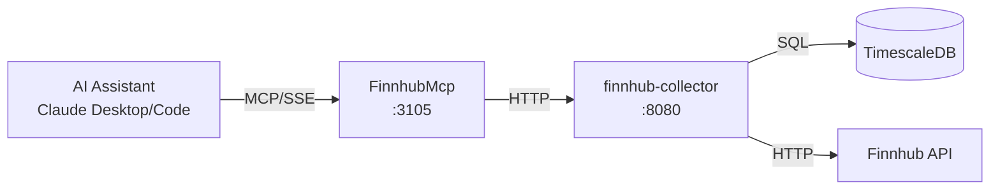

# FinnhubMcp

MCP server providing AI assistants direct access to ATLAS stock market data and economic calendar events from Finnhub.

## Overview

Exposes FinnhubCollector REST API as MCP tools, enabling Claude Desktop and Claude Code to query real-time stock quotes, economic calendar events (FOMC, CPI, etc.), earnings calendars, news sentiment, and analyst data. Includes both tracked series and live API pass-through for ad-hoc queries on any stock symbol.

## Architecture



AI assistants connect via MCP protocol (SSE transport) to query stored market data or pass through to live Finnhub API.

## Features

- **Data Query Tools**: 15 tools for quotes, calendars, sentiment, recommendations, and price targets
- **Live Data Tools**: 7 tools querying Finnhub API directly for any symbol (not limited to tracked series)
- **Admin Tools**: 5 tools for managing tracked series and triggering collections
- **Economic Calendar**: High-impact events (FOMC, CPI, NFP) with filtering
- **Symbol Search**: Find symbols across exchanges

## Configuration

| Variable | Description | Default |
|----------|-------------|---------|
| `FINNHUB_API_URL` | Backend service URL | `http://finnhub-collector:8080` |
| `FINNHUB_MCP_LOG_LEVEL` | Logging level | `Warning` |
| `FINNHUB_MCP_TIMEOUT_SECONDS` | HTTP request timeout | `30` |

## MCP Tools

### Data Query Tools (15 tools)

| Tool | Description | Parameters |
|------|-------------|------------|
| `health` | Service health status | - |
| `get_series` | List configured series | `type` (optional) |
| `get_quote` | Latest quote for tracked symbol | `symbol` |
| `get_quote_history` | Historical quotes | `symbol`, `from`, `to` |
| `get_economic_calendar` | Upcoming economic events | `days` |
| `get_high_impact_events` | High-impact events only | `from`, `to` |
| `get_earnings_calendar` | Earnings announcements | `days` |
| `get_ipo_calendar` | Upcoming IPOs | `days` |
| `get_news_sentiment` | News sentiment analysis | `symbol` |
| `get_insider_sentiment` | Insider buying/selling | `symbol` |
| `get_recommendations` | Analyst recommendations | `symbol` |
| `get_price_target` | Analyst price targets | `symbol` |
| `get_company_profile` | Company information | `symbol` |
| `get_market_status` | Market open/closed | `exchange` |
| `search_symbols` | Search for symbols | `query` |

### Live Data Tools (7 tools)

Query any symbol directly from Finnhub API (not limited to tracked series):

| Tool | Description | Parameters |
|------|-------------|------------|
| `get_live_quote` | Live quote for any symbol | `symbol` |
| `get_live_candles` | Historical price candles | `symbol`, `resolution`, `days` |
| `get_live_profile` | Company profile | `symbol` |
| `get_live_recommendation` | Analyst recommendations | `symbol` |
| `get_live_price_target` | Analyst price target | `symbol` |
| `get_live_news_sentiment` | News sentiment | `symbol` |
| `get_live_peers` | Company peers | `symbol` |

### Admin Tools (5 tools)

| Tool | Description | Parameters |
|------|-------------|------------|
| `get_all_series_admin` | All series including inactive | - |
| `add_series` | Add new series | `symbol`, `type`, `category`, `poll_interval_seconds` |
| `toggle_series` | Enable/disable collection | `series_id` |
| `delete_series` | Delete series | `series_id` |
| `trigger_collection` | Immediate data collection | `series_id` |

## Project Structure

```
FinnhubCollector/mcp/
├── Client/
│   └── FinnhubCollectorClient.cs   # HTTP client for collector API
├── Tools/
│   └── FinnhubTools.cs             # MCP tool definitions (27 tools)
├── Program.cs                       # Entry point, MCP server setup
└── Containerfile                    # Container image definition
```

## Development

### Prerequisites

- VS Code with Dev Containers extension
- Access to finnhub-collector service

### Build

```bash
FinnhubCollector/.devcontainer/compile.sh
```

### Build Container

```bash
FinnhubCollector/.devcontainer/build.sh
```

## Deployment

```bash
ansible-playbook playbooks/deploy.yml --tags finnhub-mcp
```

## Ports

| Port | Description |
|------|-------------|
| 8080 | HTTP API (internal) |
| 3105 | Host-mapped SSE endpoint |

SSE endpoint: `http://mercury:3105/sse`

## Claude Desktop Integration

Add to `~/.config/Claude/claude_desktop_config.json` (Linux) or `~/Library/Application Support/Claude/claude_desktop_config.json` (macOS):

```json
{
  "mcpServers": {
    "finnhub": {
      "command": "uvx",
      "args": ["mcp-proxy", "http://mercury:3105/sse"]
    }
  }
}
```

Claude Desktop uses stdio transport, so `mcp-proxy` bridges stdio to SSE.

## See Also

- [FinnhubCollector](../README.md) - Backend service
- [SecMaster MCP](../../SecMaster/mcp/README.md) - Instrument metadata and search
- [Model Context Protocol](https://modelcontextprotocol.io/) - MCP specification
