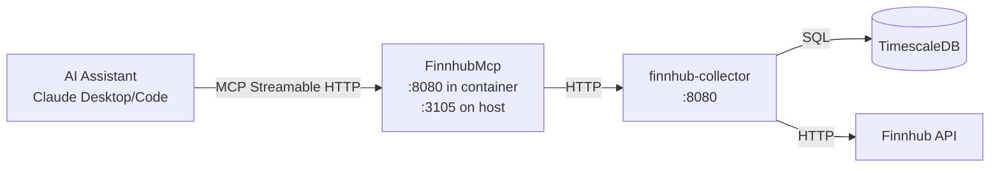

# FinnhubMcp

MCP server exposing FinnhubCollector data and live Finnhub API pass-through tools to AI assistants.

## Overview

Thin MCP front-end over the FinnhubCollector REST API. Lets Claude Desktop / Claude Code query stored market data (tracked quotes, candles, sentiment, calendars) and pass-through live Finnhub API calls for any symbol. Runs as a sidecar to `finnhub-collector` and reaches it over the internal Docker network.

## Architecture


```mermaid
flowchart LR
    AI[AI Assistant<br/>Claude Desktop/Code] -->|MCP Streamable HTTP| MCP[FinnhubMcp<br/>:8080 in container<br/>:3105 on host]
    MCP -->|HTTP| API[finnhub-collector<br/>:8080]
    API -->|SQL| DB[(TimescaleDB)]
    API -->|HTTP| Finnhub[Finnhub API]
```

Transport is MCP Streamable HTTP (`ModelContextProtocol.AspNetCore` 1.2.0) at path `/mcp`. The collector reads from TimescaleDB for tracked series and proxies the Finnhub HTTP API for live calls.

## Features

- **Data Query Tools** (15): tracked-series quotes, calendars, sentiment, recommendations, price targets, profiles
- **Live Data Tools** (7): pass-through to Finnhub API for any symbol, no tracking required
- **Admin Tools** (5): list/add/toggle/delete series, trigger collection
- **Economic Calendar**: high-impact filtering (Fed, CPI, employment)
- **Symbol Search**: company-name / symbol lookup

## Configuration

| Variable | Description | Default |
|----------|-------------|---------|
| `FINNHUB_API_URL` | Upstream `finnhub-collector` base URL | `http://finnhub-collector:8080` |
| `FINNHUB_MCP_TIMEOUT_SECONDS` | HTTP client timeout (seconds) | `30` |
| `ASPNETCORE_URLS` | Kestrel listen URL | `http://+:8080` |

Note: `FINNHUB_MCP_LOG_LEVEL` is set in the Containerfile and compose file but is **not read by the application** — Serilog minimum level is hardcoded to `Warning` in `Program.cs`. Setting the variable has no effect.

## API Endpoints

| Path | Method | Description |
|------|--------|-------------|
| `/mcp` | POST/GET | MCP Streamable HTTP transport (tool invocation) |
| `/health` | GET | Liveness probe — returns `{ "status": "healthy" }` |

The 27 MCP tools below are invoked through `/mcp`.

### Data Query Tools (15)

| Tool | Description | Parameters |
|------|-------------|------------|
| `health` | FinnhubCollector backend health | - |
| `get_series` | List configured series | `type?` (Quote, Candle, EconomicCalendar, EarningsCalendar, IpoCalendar) |
| `get_quote` | Latest quote for tracked symbol | `symbol` |
| `get_quote_history` | Historical quotes | `symbol`, `from?`, `to?` |
| `get_economic_calendar` | Upcoming economic events | `days=7` |
| `get_high_impact_events` | High-impact events only | `from?`, `to?` |
| `get_earnings_calendar` | Earnings announcements | `days=7` |
| `get_ipo_calendar` | Upcoming IPOs | `days=30` |
| `get_news_sentiment` | News sentiment analysis | `symbol` |
| `get_insider_sentiment` | Insider buying/selling | `symbol` |
| `get_recommendations` | Analyst recommendations | `symbol` |
| `get_price_target` | Analyst price targets | `symbol` |
| `get_company_profile` | Company information | `symbol` |
| `get_market_status` | Market open/closed | `exchange="US"` |
| `search_symbols` | Symbol search | `query` |

### Live Data Tools (7)

Direct pass-through to the Finnhub API; works for any symbol, not just tracked series.

| Tool | Description | Parameters |
|------|-------------|------------|
| `get_live_quote` | Live quote for any symbol | `symbol` |
| `get_live_candles` | Historical price candles | `symbol`, `resolution="D"`, `days=30` |
| `get_live_profile` | Company profile | `symbol` |
| `get_live_recommendation` | Analyst recommendations | `symbol` |
| `get_live_price_target` | Analyst price target | `symbol` |
| `get_live_news_sentiment` | News sentiment | `symbol` |
| `get_live_peers` | Company peers | `symbol` |

### Admin Tools (5)

Marked `Destructive` (except the read-only listing).

| Tool | Description | Parameters |
|------|-------------|------------|
| `get_all_series_admin` | All series incl. inactive (read-only) | - |
| `add_series` | Add new series | `symbol`, `type`, `category?`, `poll_interval_seconds?` |
| `toggle_series` | Enable/disable collection | `series_id` |
| `delete_series` | Delete series | `series_id` |
| `trigger_collection` | Trigger immediate collection | `series_id` |
| `register_series_secmaster` | (Re-)register an existing series with SecMaster | `series_id` |

## Project Structure

```
FinnhubCollector/mcp/
├── Client/
│   ├── IFinnhubCollectorClient.cs   # HTTP client contract
│   └── FinnhubCollectorClient.cs    # Typed HTTP client implementation
├── Tools/
│   └── FinnhubTools.cs              # 27 MCP tool definitions
├── Program.cs                        # Entry point, MCP server setup
├── FinnhubMcp.csproj                 # Project; references ../src/FinnhubCollector.csproj
└── Containerfile                     # Multi-stage build, runs as appuser (uid 1001)
```

## Development

### Prerequisites

- VS Code with Dev Containers extension
- Running `finnhub-collector` reachable at `FINNHUB_API_URL`

### Build (host)

The collector's devcontainer script compiles both `src/` and `mcp/` in one pass:

```bash
FinnhubCollector/.devcontainer/compile.sh            # build + unit tests
FinnhubCollector/.devcontainer/compile.sh --no-test  # build only
```

### Build Container Image

The standalone `build.sh` script builds the **collector** image (`finnhub-collector:latest`), not this MCP image. Build the MCP image directly via the Containerfile or let Ansible do it:

```bash
# Direct build (from monorepo root):
sudo nerdctl build -t finnhub-mcp:latest -f FinnhubCollector/mcp/Containerfile .

# Or rebuild via deploy (preferred):
ansible-playbook playbooks/deploy.yml --tags finnhub-mcp
```

## Deployment

```bash
cd deployment/ansible
ansible-playbook -i inventory/hosts.yml playbooks/deploy.yml --tags finnhub-mcp
```

Compose declares: image `finnhub-mcp:latest`, container `finnhub-mcp`, `depends_on: finnhub-collector (healthy)`, log volume `/opt/ai-inference/logs/finnhub-mcp:/app/logs`, resource limits 256M / 0.5 CPU, healthcheck on `/health` every 30s.

## Ports

| Port | Description |
|------|-------------|
| 8080 | HTTP (Kestrel, in-container) — serves `/mcp` and `/health` |
| 3105 | Host mapping → container 8080 |

Endpoints from the host: `http://mercury:3105/mcp` and `http://mercury:3105/health`.

## Claude Desktop Integration

Add to `~/.config/Claude/claude_desktop_config.json` (Linux) or `~/Library/Application Support/Claude/claude_desktop_config.json` (macOS):

```json
{
  "mcpServers": {
    "finnhub": {
      "command": "uvx",
      "args": ["mcp-proxy", "http://mercury:3105/mcp"]
    }
  }
}
```

Claude Desktop speaks stdio MCP; `mcp-proxy` bridges stdio to the Streamable HTTP transport.

## See Also

- [FinnhubCollector](../README.md) — backend collector service
- [SecMaster MCP](../../SecMaster/mcp/README.md) — instrument metadata and search
- [Model Context Protocol](https://modelcontextprotocol.io/) — protocol specification
