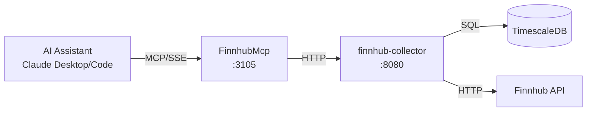

# Finnhub MCP Server

MCP server providing Claude Desktop and Claude Code direct access to ATLAS stock market data and economic calendar events from Finnhub.

## Overview

Exposes FinnhubCollector REST API as MCP tools, enabling AI assistants to query real-time stock quotes, economic calendar events (FOMC, CPI, etc.), earnings calendars, news sentiment, and analyst data. Includes both tracked series and live API pass-through for ad-hoc queries.

## Architecture



## MCP Tools

### Data Query Tools (14 tools)

| Tool Name | Description | Key Parameters |
|-----------|-------------|----------------|
| `health` | Get FinnhubCollector service health status | None |
| `get_series` | List all configured Finnhub series | `type` (optional): Filter by type |
| `get_quote` | Get latest quote for a tracked stock symbol | `symbol` |
| `get_quote_history` | Get historical quotes for a tracked symbol | `symbol`, `start_date`, `end_date` |
| `get_economic_calendar` | Get upcoming economic calendar events | `from_date`, `to_date` |
| `get_high_impact_events` | Get high-impact economic events only | `from_date`, `to_date` |
| `get_earnings_calendar` | Get upcoming earnings announcements | `from_date`, `to_date`, `symbol` |
| `get_ipo_calendar` | Get upcoming IPOs | `from_date`, `to_date` |
| `get_news_sentiment` | Get news sentiment analysis for a stock | `symbol` |
| `get_insider_sentiment` | Get insider buying/selling activity | `symbol`, `from_date`, `to_date` |
| `get_recommendations` | Get analyst recommendations | `symbol` |
| `get_price_target` | Get analyst price targets | `symbol` |
| `get_company_profile` | Get company profile information | `symbol` |
| `search_symbols` | Search for stock symbols by company name | `query` |

### Live Data Tools (7 tools)

Query any stock symbol directly from Finnhub API (not limited to tracked series):

| Tool Name | Description | Key Parameters |
|-----------|-------------|----------------|
| `get_live_quote` | Get live quote for any symbol | `symbol` |
| `get_live_candles` | Get historical price candles | `symbol`, `resolution` (1m, 5m, D, W, M), `from`, `to` |
| `get_live_profile` | Get company profile for any symbol | `symbol` |
| `get_live_recommendation` | Get analyst recommendations for any symbol | `symbol` |
| `get_live_price_target` | Get analyst price target for any symbol | `symbol` |
| `get_live_news_sentiment` | Get news sentiment for any symbol | `symbol` |
| `get_live_peers` | Get company peers for any symbol | `symbol` |

### Admin Tools (5 tools)

| Tool Name | Description | Key Parameters |
|-----------|-------------|----------------|
| `get_all_series_admin` | Get all configured series including inactive | None |
| `add_series` | Add new series to track | `symbol`, `type` (Quote/Candle/etc.), `priority` |
| `toggle_series` | Enable or disable series for collection | `series_id` |
| `delete_series` | Delete series (use with caution) | `series_id` |
| `trigger_collection` | Trigger immediate data collection | `series_id` |

### Series Types

- `Quote` - Real-time stock quotes
- `Candle` - Historical price candles
- `NewsSentiment` - News sentiment analysis
- `Recommendation` - Analyst recommendations
- `PriceTarget` - Analyst price targets
- `CompanyProfile` - Company information
- `EconomicCalendar` - Economic calendar events
- `EarningsCalendar` - Earnings announcements
- `IpoCalendar` - IPO events

## Configuration

### Environment Variables

| Variable | Default | Description |
|----------|---------|-------------|
| `FINNHUB_API_URL` | `http://finnhub-collector:8080` | Backend service URL |
| `FINNHUB_MCP_LOG_LEVEL` | `Warning` | Logging level |
| `FINNHUB_MCP_TIMEOUT_SECONDS` | `30` | HTTP request timeout |

### Port Mapping

- Internal: 8080
- External (host): 3105
- SSE endpoint: `http://mercury:3105/sse`

## Development

### Build
```bash
.devcontainer/compile.sh
```

### Build Container
```bash
.devcontainer/build.sh
```

## Deployment

```bash
ansible-playbook playbooks/deploy.yml --tags finnhub-mcp
```

## Claude Desktop Integration

Add to `~/.config/Claude/claude_desktop_config.json` (Linux) or `~/Library/Application Support/Claude/claude_desktop_config.json` (macOS):

```json
{
  "mcpServers": {
    "finnhub": {
      "command": "uvx",
      "args": ["mcp-proxy", "http://mercury:3105/sse"]
    }
  }
}
```

Claude Desktop uses stdio transport, so `mcp-proxy` bridges stdio to SSE.

## Usage Examples

**Check stock price:**
```
User: "What's Apple trading at?"
Claude calls: get_live_quote("AAPL")
Response: "AAPL: $175.23 (+1.2%)"
```

**Economic calendar:**
```
User: "When's the next FOMC meeting?"
Claude calls: get_high_impact_events()
Response: "Next FOMC meeting: Jan 31-Feb 1, 2025"
```

**Earnings schedule:**
```
User: "Who reports earnings this week?"
Claude calls: get_earnings_calendar(from_date="2025-01-15", to_date="2025-01-19")
Response: "Major earnings: NFLX (Jan 16), TSLA (Jan 18)"
```

## See Also

- [FinnhubCollector](../FinnhubCollector/README.md) - Backend service documentation
- [SecMasterMcp](../SecMasterMcp/README.md) - Instrument metadata and search
