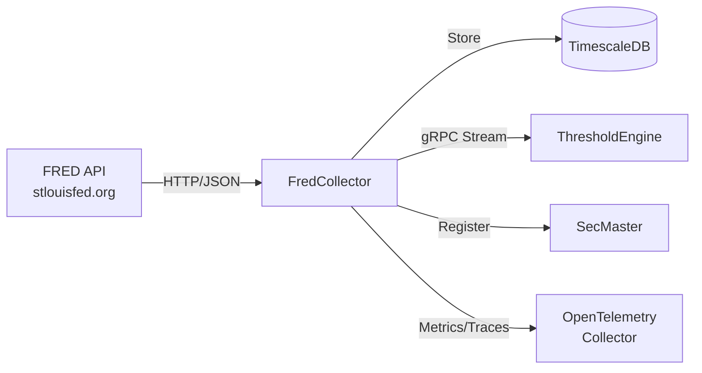

# FredCollector

Automated FRED economic data collection service for ATLAS.

## Overview

FredCollector retrieves economic indicators from the Federal Reserve Economic Data (FRED) API and stores them in TimescaleDB. It handles scheduling, rate limiting, backfill, and exposes data via REST API and gRPC event streams for downstream consumption by ThresholdEngine.

## Architecture



## Features

- Scheduled Collection: Automates data retrieval using Quartz cron schedules with Federal Reserve holiday exclusions
- Rate Limiting: Token bucket rate limiter respects FRED API limits (120 requests/minute)
- Smart Backfill: Automatically fills gaps in historical data on startup and on-demand
- Event Streaming: Real-time gRPC streams for downstream consumers
- Admin API: Add, enable/disable, delete series; trigger manual collection/backfill
- Series Search: Search FRED API for new series with filtering and sorting
- SecMaster Integration: Automatic instrument registration via gRPC
- Full Observability: OpenTelemetry instrumentation (metrics, traces, logs to OTLP)

## Configuration

| Variable | Description | Default |
|----------|-------------|---------|
| `ConnectionStrings__AtlasDb` | PostgreSQL connection string | **Required** |
| `FRED_API_KEY` | FRED API key | **Required** |
| `FRED_API_BASE_URL` | FRED API URL | `https://api.stlouisfed.org/fred/` |
| `RATE_LIMITER_CAPACITY` | Token bucket capacity | `120` |
| `RATE_LIMITER_REFILL_RATE` | Tokens per second | `2.0` |
| `OpenTelemetry__OtlpEndpoint` | OTLP collector endpoint | `http://otel-collector:4317` |
| `OpenTelemetry__ServiceName` | Service name | `fred-collector` |
| `SECMASTER_GRPC_ENDPOINT` | SecMaster gRPC endpoint | `http://secmaster:8080` |
| `X_API_KEY` | API key for REST endpoints | **Required for API access** |

## API Endpoints

### REST API

Requires `X-API-Key` header for authentication.

| Endpoint | Method | Description |
|----------|--------|-------------|
| `/api/series` | GET | List active series |
| `/api/series/{seriesId}/observations` | GET | Get observations (query: startDate, endDate, limit) |
| `/api/series/{seriesId}/latest` | GET | Get latest observation |
| `/api/series/search` | GET | Search FRED API (query: query, limit, frequency, minPopularity, activeOnly, orderBy) |
| `/health` | GET | Health check (anonymous) |
| `/health/ready` | GET | Readiness check (anonymous) |
| `/health/live` | GET | Liveness check (anonymous) |

### Admin API

| Endpoint | Method | Description |
|----------|--------|-------------|
| `/api/admin/series` | POST | Add series (body: {seriesId, category, backfill}) |
| `/api/admin/series` | GET | Get all series (including inactive) |
| `/api/admin/series/{seriesId}/toggle` | PUT | Enable/disable series |
| `/api/admin/series/{seriesId}` | DELETE | Delete series |
| `/api/admin/series/{seriesId}/collect` | POST | Trigger immediate collection |
| `/api/admin/series/{seriesId}/backfill` | POST | Trigger backfill (query: months) |

### gRPC API

**Service**: `ObservationEventStream`

| Method | Description |
|--------|-------------|
| `SubscribeToEvents` | Stream events in real-time (supports filtering by type, series) |
| `GetEventsSince` | Replay events from timestamp (supports limit) |
| `GetEventsBetween` | Get events in time range |
| `GetLatestEventTime` | Get timestamp of latest event |
| `GetHealth` | Health check with event statistics |

## Project Structure

```
FredCollector/
├── src/
│   ├── Api/                    # FRED API client
│   ├── Data/                   # EF Core DbContext, repositories
│   ├── Dto/                    # REST API data transfer objects
│   ├── Endpoints/              # Minimal API endpoints (ApiEndpoints, AdminEndpoints)
│   ├── Entities/               # Domain models (SeriesConfig, FredObservation, EventEntity)
│   ├── Events/                 # Event channels
│   ├── Grpc/                   # gRPC service and repositories
│   ├── HealthChecks/           # Database health check
│   ├── Middleware/             # API key authentication
│   ├── Publishers/             # Event publisher
│   ├── RateLimiting/           # Token bucket rate limiter
│   ├── Services/               # Business logic (DataCollection, Backfill, SeriesManagement, SeriesSearch)
│   ├── Telemetry/              # OpenTelemetry meters and activity sources
│   ├── Workers/                # Background workers (DataCollectionScheduler, MarketStatusWorker, InitialDataBackfillWorker)
│   ├── Program.cs              # Application entry point
│   ├── DependencyInjection.cs  # Service registration
│   └── Containerfile           # Multi-stage container build
├── config/
│   └── series.yaml             # Initial series configuration
└── .devcontainer/              # VS Code dev container
```

## Development

### Using Dev Container

```bash
# Open in VS Code and select "Reopen in Container"
cd /workspace/FredCollector/src
dotnet run
```

### Compile

```bash
.devcontainer/compile.sh
```

### Build Container Image

```bash
.devcontainer/build.sh
```

## Deployment

```bash
ansible-playbook playbooks/deploy.yml --tags fred-collector
```

## Ports

| Port | Type | Description |
|------|------|-------------|
| 8080 | HTTP (container) | REST API, health checks |
| 5001 | HTTP/2 (container) | gRPC event stream |
| 5001 | Host | Mapped to container port 8080 |

## See Also

- [ThresholdEngine](../ThresholdEngine/README.md) - Consumes FRED observation events
- [SecMaster](../SecMaster/README.md) - Instrument registration
- [Events](../Events/README.md) - Shared gRPC event contracts
- [FredCollectorMcp](../FredCollectorMcp/README.md) - MCP server for AI assistants
