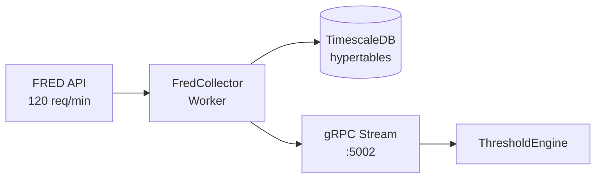

# FredCollector

Automated FRED economic data collection service for ATLAS.

## Overview

FredCollector retrieves economic indicators from the Federal Reserve Economic Data (FRED) API and stores them in TimescaleDB. It handles scheduling, rate limiting, backfill, and exposes both REST and gRPC APIs.

**Scope**: Data collection only. Threshold evaluation and alerting are handled by ThresholdEngine and AlertService respectively.

## Architecture



## Quick Start

### Development (devcontainer)

```bash
cd FredCollector/.devcontainer
docker compose up -d
docker exec -it devcontainer-fred-collector-dev-1 bash

# Inside container
dotnet restore
dotnet build
dotnet test
```

### Configuration

Copy `.env.example` to `.env` and set:

```bash
FRED_API_KEY=your_api_key_here
DB_PASSWORD=your_db_password
```

## API Endpoints

### REST API (port 5001)

| Endpoint | Method | Description |
|----------|--------|-------------|
| `/api/series` | GET | List all configured series |
| `/api/series/{id}/observations` | GET | Get observations for a series |
| `/api/series/search` | GET | Search FRED for series |
| `/api/admin/series` | POST | Add new series (requires API key) |
| `/api/admin/series/{id}/toggle` | PUT | Enable/disable series |
| `/health` | GET | Health check |

### gRPC (port 5002)

- `SubscribeToEvents` - Real-time event stream
- `GetEventsSince` - Historical events from timestamp
- `Health` - gRPC health check

See [FredCollectorClient](../FredCollectorClient/) for consumer library.

## Project Structure

```
FredCollector/
├── src/
│   ├── FredCollector.Service/    # Host, workers, configuration
│   ├── FredCollector.Api/        # REST endpoints
│   ├── FredCollector.Application/# Business logic, services
│   ├── FredCollector.Infrastructure/ # Data access, FRED client
│   ├── FredCollector.Core/       # Domain models
│   └── FredCollector.Grpc/       # gRPC server
├── tests/
│   └── FredCollector.UnitTests/  # 378 tests (287 unit + 91 integration)
├── protos/
│   └── events.proto              # gRPC contract
└── .devcontainer/                # Development environment
```

## Series Configuration

39 economic indicators across categories:
- **Recession**: ICSA, UNRATE, UMCSENT, etc.
- **Liquidity**: VIX, DXY, credit spreads
- **Growth**: GDP, industrial production, housing
- **Valuation**: Market cap, corporate profits

## See Also

- [gRPC Architecture](../docs/GRPC-ARCHITECTURE.md)
- [ThresholdEngine](../ThresholdEngine/) - Pattern evaluation
- [AlertService](../AlertService/) - Notifications
