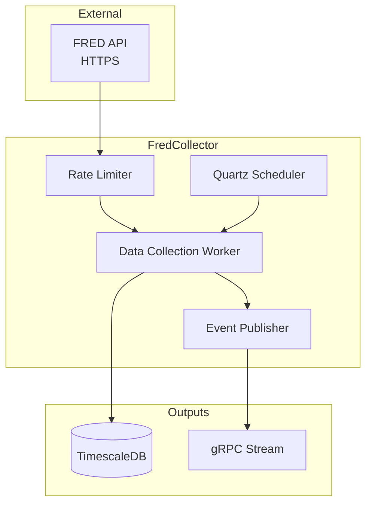

# FredCollector

Automated FRED economic data collection service for ATLAS.

## Overview

FredCollector retrieves economic indicators from the Federal Reserve Economic Data (FRED) API and stores them in TimescaleDB. It handles scheduling, rate limiting (120 req/min), backfill, and exposes real-time data via gRPC streams.

**Scope**: Data collection only. Threshold evaluation and alerting are handled by ThresholdEngine and AlertService respectively.

## Architecture



## Key Features

- **Scheduled Collection**: Automates daily/weekly retrieval of economic series.
- **Rate Limiting**: Respects FRED API limits (120 requests/minute) with retry logic.
- **Smart Backfill**: Automatically fills gaps in historical data.
- **Event Streaming**: Pushes real-time updates to downstream consumers (ThresholdEngine) via gRPC.
- **Observability**: Full OpenTelemetry instrumentation (metrics, traces, logs).

## Supported Indicators

Tracks 39+ key economic indicators including:
- **Recession**: Initial Claims (ICSA), Unemployment (UNRATE), Sentiment (UMCSENT)
- **Liquidity**: 10Y-2Y Spread (T10Y2Y), High Yield Spread (BAMLH0A0HYM2)
- **Growth**: GDP, Industrial Production (INDPRO), Retail Sales (RSAFS)
- **Inflation**: CPI (CPIAUCSL), PCE, PPI

## Configuration

Environment variables:

| Variable | Description | Default |
|----------|-------------|---------|
| `ConnectionStrings__DefaultConnection` | PostgreSQL connection | `Host=postgres;...` |
| `FredApiClient__ApiKey` | FRED API Key | **Required** |
| `FredApiClient__BaseUrl` | FRED API URL | `https://api.stlouisfed.org/fred/` |

## Getting Started

**Note**: This service is designed to run as part of the larger ATLAS microservices architecture. It relies on shared infrastructure (TimescaleDB) and other services to function correctly.

### Development (Dev Containers)

The most robust way to develop is using the provided Dev Container, which includes the .NET SDK and tooling.

1. **Open in VS Code**: Open this folder and select "Reopen in Container".
2. **Configure Secrets**: Create a `.env` file in the root of the service with your API key:
   ```bash
   FredApiClient__ApiKey=your_api_key_here
   ```
3. **Start Infrastructure**: Ensure the shared database is running:
   ```bash
   docker compose up -d postgres
   ```
4. **Run Service**:
   ```bash
   cd src/FredCollector.Service
   dotnet run
   ```

### Running with Docker (Standalone)

If you just want to run the service image without a dev environment:

```bash
export FRED_API_KEY=your_key_here
docker compose up -d fred-collector
```

### Running the Full Stack

To run the entire ATLAS system:

```bash
cd ../ansible
ansible-playbook playbooks/site.yml
```

## API Endpoints

### REST API (Port 8080)

| Endpoint | Method | Description |
|----------|--------|-------------|
| `/api/series` | GET | List configured series |
| `/api/series/{id}/backfill` | POST | Trigger manual backfill for a specific series |
| `/health` | GET | Liveness check (returns 200 if service is running) |
| `/health/ready` | GET | Readiness check (returns 200 if DB is connected) |

### gRPC API (Port 5001)

**Service Definition**: `events.proto`

- `SubscribeToEvents`: Streams `SeriesCollectedEvent` messages in real-time.
- `GetEventsSince`: Replays historical events for state reconstruction.

## Project Structure

```
FredCollector/
├── src/
│   ├── FredCollector.Core/           # Domain entities (FredSeries, Observation)
│   ├── FredCollector.Application/    # Business logic (Collection, Backfill)
│   ├── FredCollector.Infrastructure/ # FRED client, EF Core repositories
│   ├── FredCollector.Grpc/           # gRPC service implementation
│   ├── FredCollector.Api/            # REST endpoints (Minimal API)
│   └── FredCollector.Service/        # Worker host entry point
├── tests/
│   └── FredCollector.UnitTests/      # xUnit test suite (>300 tests)
└── .devcontainer/                    # VS Code development container
```

## See Also

- [ThresholdEngine](../ThresholdEngine/README.md) - Consumes data from this service
- [Events](../Events/README.md) - Shared event definitions
- [gRPC Architecture](../docs/GRPC-ARCHITECTURE.md)
