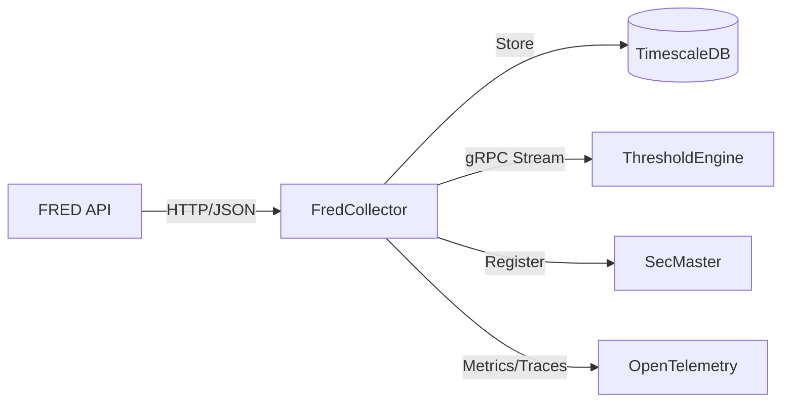

# FredCollector

Automated FRED economic data collection service for ATLAS.

## Overview

FredCollector retrieves economic indicators from the Federal Reserve Economic Data (FRED) API and stores them in TimescaleDB. It handles scheduling, rate limiting, backfill, and exposes data via REST API and gRPC event streams for downstream consumption by ThresholdEngine.

## Architecture



## Features

- **Scheduled Collection**: Automates data retrieval using Quartz cron schedules with Federal Reserve holiday exclusions
- **Rate Limiting**: Token bucket rate limiter respects FRED API limits (120 requests/minute)
- **Smart Backfill**: Automatically fills gaps in historical data on startup and on-demand
- **Event Streaming**: Real-time gRPC streams for downstream consumers (ThresholdEngine)
- **Admin API**: Add, enable/disable, delete series; trigger manual collection/backfill
- **Series Search**: Search FRED API for new series with filtering and sorting
- **SecMaster Integration**: Automatic instrument registration via gRPC
- **Full Observability**: OpenTelemetry instrumentation (metrics, traces, logs to OTLP)

## Configuration

| Variable | Description | Default |
|----------|-------------|---------|
| `ConnectionStrings__AtlasDb` | PostgreSQL connection string | Required |
| `FRED_API_KEY` | FRED API key | Required |
| `FredApi__BaseUrl` | FRED API URL | `https://api.stlouisfed.org/fred/` |
| `FredApi__RateLimitPerMinute` | Rate limit (requests/min) | `120` |
| `OpenTelemetry__OtlpEndpoint` | OTLP collector endpoint | `http://otel-collector:4317` |
| `OpenTelemetry__ServiceName` | Service name | `fred-collector` |
| `SECMASTER_GRPC_ENDPOINT` | SecMaster gRPC endpoint | `http://secmaster:8080` |
| `X_API_KEY` | API key for REST endpoints | Required for API access |

## API Endpoints

### REST API

Requires `X-API-Key` header for authentication (except health endpoints).

| Endpoint | Method | Description |
|----------|--------|-------------|
| `/api/series` | GET | List active series |
| `/api/series/{seriesId}` | GET | Get specific series by ID |
| `/api/series/{seriesId}/observations` | GET | Get observations (query: startDate, endDate, limit) |
| `/api/series/{seriesId}/latest` | GET | Get latest observation |
| `/api/series/search` | GET | Search FRED API (query: query, limit, frequency, minPopularity, activeOnly, orderBy) |
| `/api/search` | GET | Unified search for SecMaster gateway (query: q, limit) |
| `/api/discover` | GET | Upstream discovery for SecMaster catalog (query: q, limit) |
| `/health` | GET | Health check (anonymous) |
| `/health/ready` | GET | Readiness check (anonymous) |
| `/health/live` | GET | Liveness check (anonymous) |

### Admin API

| Endpoint | Method | Description |
|----------|--------|-------------|
| `/api/admin/series` | POST | Add series (body: {seriesId, category, backfill}) |
| `/api/admin/series` | GET | Get all series (including inactive) |
| `/api/admin/series/{seriesId}/toggle` | PUT | Enable/disable series |
| `/api/admin/series/{seriesId}` | DELETE | Delete series |
| `/api/admin/series/{seriesId}/collect` | POST | Trigger immediate collection |
| `/api/admin/series/{seriesId}/backfill` | POST | Trigger backfill (query: months) |

### gRPC API

**Service**: `ObservationEventStream` (port 5001)

| Method | Description |
|--------|-------------|
| `SubscribeToEvents` | Stream events in real-time (supports filtering by type, series) |
| `GetEventsSince` | Replay events from timestamp (supports limit) |
| `GetEventsBetween` | Get events in time range |
| `GetLatestEventTime` | Get timestamp of latest event |
| `GetHealth` | Health check with event statistics |

## Project Structure

```
FredCollector/
├── src/
│   ├── Api/              # FRED API client
│   ├── Data/             # EF Core DbContext, repositories
│   ├── Endpoints/        # Minimal API endpoints
│   ├── Grpc/             # gRPC service implementation
│   ├── Jobs/             # Quartz scheduled jobs
│   ├── Services/         # Business logic
│   ├── Workers/          # Background workers
│   └── Program.cs
├── mcp/                  # MCP server for AI assistants
├── tests/                # Unit tests
└── .devcontainer/        # Dev container config
```

## Development

### Prerequisites

- VS Code with Dev Containers extension
- Access to shared infrastructure (PostgreSQL, observability stack)

### Getting Started

1. Open in VS Code: `code FredCollector/`
2. Reopen in Container (Cmd/Ctrl+Shift+P -> "Dev Containers: Reopen in Container")
3. Build: `.devcontainer/compile.sh`
4. Run: `dotnet run --project src`

### Build Container

```bash
.devcontainer/build.sh
```

## Deployment

```bash
ansible-playbook playbooks/deploy.yml --tags fred-collector
```

## Ports

| Port | Type | Description |
|------|------|-------------|
| 8080 | HTTP (internal) | REST API, health checks |
| 5001 | HTTP/2 (internal) | gRPC event stream |

## See Also

- [ThresholdEngine](../ThresholdEngine/README.md) - Consumes FRED observation events
- [SecMaster](../SecMaster/README.md) - Instrument registration
- [Events](../Events/README.md) - Shared gRPC event contracts
- [FredCollector MCP](mcp/README.md) - MCP server for AI assistants
