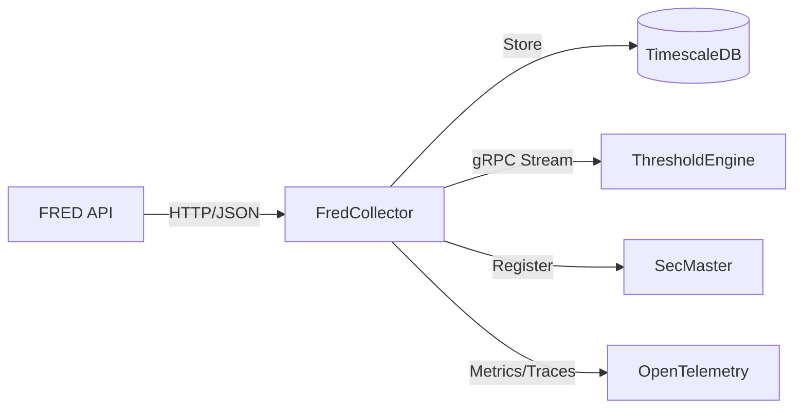

# FredCollector

Automated FRED economic data collection service for ATLAS.

## Overview

FredCollector retrieves economic indicators from the Federal Reserve Economic Data (FRED) API and stores them in TimescaleDB. It handles scheduling, rate limiting, backfill, and exposes data via REST API and gRPC event streams for downstream consumption by ThresholdEngine.

## Architecture



Data flows from the FRED API into FredCollector on a cron schedule. New observations are persisted to TimescaleDB, published as gRPC events for ThresholdEngine, and registered with SecMaster as instruments.

## Features

- **Scheduled Collection**: Quartz cron schedules with Federal Reserve holiday awareness
- **Rate Limiting**: Token bucket limiter respects FRED API limits (120 req/min)
- **Smart Backfill**: Automatic gap-fill on startup and on-demand via admin API
- **Event Streaming**: Real-time gRPC streams for downstream consumers (ThresholdEngine)
- **Admin API**: Add, enable/disable, delete series; trigger manual collection/backfill
- **Series Search**: Search FRED API with filtering by frequency, popularity, and sort order
- **SecMaster Integration**: Automatic instrument registration via gRPC
- **Resilience**: Polly retry (3x exponential backoff) and circuit breaker (5 failures / 60s)
- **Full Observability**: OpenTelemetry metrics, traces, and structured logs to OTLP

## Configuration

| Variable | Description | Default |
|----------|-------------|---------|
| `ConnectionStrings__AtlasDb` | PostgreSQL connection string | Required |
| `FRED_API_KEY` | FRED API key | Required |
| `FredApi__BaseUrl` | FRED API URL | `https://api.stlouisfed.org/fred/` |
| `FredApi__RateLimitPerMinute` | Rate limit (requests/min) | `120` |
| `RATE_LIMITER_CAPACITY` | Token bucket capacity | `120` |
| `RATE_LIMITER_REFILL_RATE` | Token bucket refill rate (tokens/sec) | `2.0` |
| `ENABLE_INITIAL_BACKFILL` | Run backfill on startup | `true` |
| `BACKFILL_MONTHS` | Default backfill depth in months | `24` |
| `BACKFILL_STARTUP_DELAY_SECONDS` | Delay before startup backfill begins | `5` |
| `OpenTelemetry__OtlpEndpoint` | OTLP collector endpoint | `http://otel-collector:4317` |
| `OpenTelemetry__ServiceName` | Service name for telemetry | `fred-collector` |
| `SECMASTER_GRPC_ENDPOINT` | SecMaster gRPC endpoint | `http://secmaster:5001` |
| `ApiKey__Enabled` | Enable API key authentication | `false` |
| `ApiKey__Key` | API key value (when enabled) | - |

## API Endpoints

### REST API

Requires `X-API-Key` header when `ApiKey__Enabled=true` (except health endpoints).

| Endpoint | Method | Description |
|----------|--------|-------------|
| `/api/series` | GET | List active series |
| `/api/series/{seriesId}` | GET | Get specific series by ID |
| `/api/series/{seriesId}/observations` | GET | Get observations (query: startDate, endDate, limit) |
| `/api/series/{seriesId}/latest` | GET | Get latest observation |
| `/api/series/search` | GET | Search FRED API (query: query, limit, frequency, minPopularity, activeOnly, orderBy) |
| `/api/search` | GET | Unified search for SecMaster gateway (query: q, limit) |
| `/api/discover` | GET | Upstream discovery for SecMaster catalog (query: q, limit) |
| `/health` | GET | Health check (anonymous) |
| `/health/ready` | GET | Readiness check (anonymous) |
| `/health/live` | GET | Liveness check (anonymous) |

### Admin API

| Endpoint | Method | Description |
|----------|--------|-------------|
| `/api/admin/series` | POST | Add series (body: {seriesId, category, backfill}) |
| `/api/admin/series` | GET | Get all series (including inactive) |
| `/api/admin/series/{seriesId}/toggle` | PUT | Enable/disable series |
| `/api/admin/series/{seriesId}` | DELETE | Delete series |
| `/api/admin/series/{seriesId}/collect` | POST | Trigger immediate collection |
| `/api/admin/series/{seriesId}/backfill` | POST | Trigger backfill (query: months) |

### gRPC API

**Service**: `ObservationEventStream` (port 5001)

| Method | Description |
|--------|-------------|
| `SubscribeToEvents` | Stream events in real-time (supports filtering by type, series) |
| `GetEventsSince` | Replay events from timestamp (supports limit) |
| `GetEventsBetween` | Get events in time range |
| `GetLatestEventTime` | Get timestamp of latest event |
| `GetHealth` | Health check with event statistics |

## Project Structure

```
FredCollector/
├── src/
│   ├── Api/              # FRED API client
│   ├── Data/             # EF Core DbContext, migrations, repositories
│   ├── Endpoints/        # Minimal API endpoint definitions
│   ├── Grpc/             # gRPC event stream service
│   ├── Jobs/             # Quartz scheduled jobs
│   ├── Publishers/       # Event publishing to gRPC streams
│   ├── RateLimiting/     # Token bucket rate limiter
│   ├── Services/         # Business logic (collection, backfill, search)
│   ├── Workers/          # Background workers (scheduler, backfill, market status)
│   └── Program.cs
├── mcp/                  # MCP server for AI assistants
├── tests/                # Unit and integration tests
└── .devcontainer/        # Dev container config
```

## Development

### Prerequisites

- VS Code with Dev Containers extension
- Access to shared infrastructure (PostgreSQL, observability stack)

### Getting Started

1. Open in VS Code: `code FredCollector/`
2. Reopen in Container (Cmd/Ctrl+Shift+P -> "Dev Containers: Reopen in Container")
3. Build: `.devcontainer/compile.sh`
4. Run: `dotnet run --project src`

### Build Container

```bash
.devcontainer/build.sh
```

## Deployment

```bash
ansible-playbook playbooks/deploy.yml --tags fred-collector
```

## Ports

| Port | Type | Description |
|------|------|-------------|
| 8080 | HTTP (internal) | REST API, health checks |
| 5001 | HTTP/2 (internal) | gRPC event stream |

## See Also

- [ThresholdEngine](../ThresholdEngine/README.md) - Consumes FRED observation events
- [SecMaster](../SecMaster/README.md) - Instrument registration
- [Events](../Events/README.md) - Shared gRPC event contracts
- [FredCollector MCP](mcp/README.md) - MCP server for AI assistants
