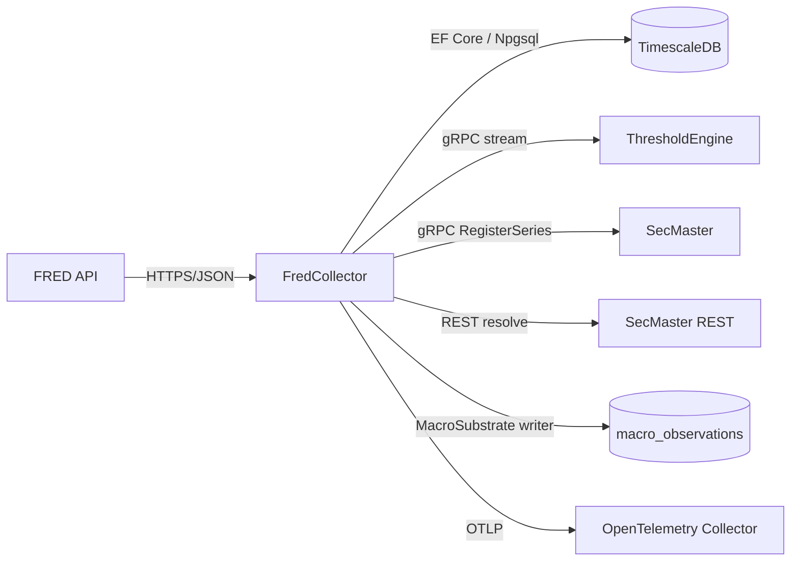

# FredCollector

Automated FRED economic data collection service for ATLAS.

## Overview

FredCollector retrieves economic indicators from the Federal Reserve Economic Data (FRED) API and stores them in TimescaleDB. It schedules collection via Quartz, respects FRED API rate limits via a token bucket, backfills history on startup, exposes a REST surface for ThresholdEngine and the SecMaster catalog gateway, and streams observation events over gRPC for downstream consumers.

## Architecture


```mermaid
flowchart LR
    FRED[FRED API] -->|HTTPS/JSON| FC[FredCollector]
    FC -->|EF Core / Npgsql| DB[(TimescaleDB)]
    FC -->|gRPC stream| TE[ThresholdEngine]
    FC -->|gRPC RegisterSeries| SM[SecMaster]
    FC -->|REST resolve| SMR[SecMaster REST]
    FC -->|MacroSubstrate writer| MS[(macro_observations)]
    FC -->|OTLP| OTEL[OpenTelemetry Collector]
```

Quartz cron schedules trigger `SeriesCollectionJob`, which calls `DataCollectionService` to fetch observations from FRED through a Polly-protected typed `HttpClient` (token-bucket throttled). New observations are persisted via `ObservationRepository`, published over the `ObservationChannel` to gRPC subscribers, and — when `series_configs.IsMacro = true` — dual-written to the shared `macro_observations` substrate (`MacroSubstrate`). On startup, `InitialDataBackfillWorker` backfills any series with zero observations; the optional `FredSeriesSectorTagBackgroundService` and `FredSeriesSignalIdentityTagBackgroundService` periodically re-tag series against SecMaster's REST taxonomy.

Schema is owned by EF Core migrations under `src/Data/Migrations/`. `series_configs` carries the SecMaster ATLAS-sector tag (`AtlasSectorCode`, EF-converted enum), the signal-identity tag (`SignalIdentityId`), and the `IsMacro` routing predicate. A check constraint (`ck_series_config_sector_xor_signal`) enforces that sector and signal-identity are mutually exclusive — a series is either macro-rolled by sector or instrument-attributed by signal-identity, never both.

### Series classification: macro vs. instrument-attributed

`series_configs.IsMacro` controls whether a series dual-writes observations into the shared `macro_observations` substrate (owned by `MacroSubstrate/`). When the flag is `true`, every collected observation is also written to `macro_observations` with provenance `(source_collector="fred", source_id=<series mnemonic>, observation_time)`; the write is idempotent on that triple, so re-running a collection cycle does not double-write. The legacy `fred_observations` write path is unchanged — the substrate write is additive.

Series default to `IsMacro = false`. Pure macro series (e.g. `UNRATE`, `CPIAUCSL`) opt in:

```sql
UPDATE series_configs SET "IsMacro" = true WHERE "SeriesId" = 'UNRATE';
```

Instrument-attributed series (those resolved to a SecMaster signal-identity that represents a specific instrument rather than a macro indicator) stay `IsMacro = false`; the per-series sector tag and signal-identity remain authoritative for that path.

## Features

- **Scheduled collection** — Quartz cron jobs (`SeriesCollectionJob`) with Federal Reserve holiday awareness via `CalendarService.Core` (`MarketStatusWorker` exposes the open/holiday status as a metric).
- **Rate limiting** — Token bucket (`TokenBucketRateLimiter`) throttling FRED API calls (default 120 capacity, 2.0 tokens/sec refill).
- **Resilient HTTP** — Polly retry (3× exponential backoff), circuit breaker (5 failures / 60s break), 30s request timeout.
- **Startup backfill** — `InitialDataBackfillWorker` backfills history for series with no observations (configurable depth and toggle).
- **On-demand admin** — Add / toggle / delete series, trigger collection or backfill (fire-and-forget background tasks).
- **Series search** — Search FRED catalog with filters (frequency, popularity, active-only, sort order) plus two SecMaster-gateway aliases (`/api/search`, `/api/discover`).
- **SecMaster integration** — gRPC `RegisterSeries`, plus optional REST-based periodic re-tagging for ATLAS sectors and signal-identities.
- **MacroSubstrate dual-write** — When `IsMacro=true`, observations are additionally written to `macro_observations` for cross-collector substrate queries.
- **gRPC event stream** — `ObservationEventStream` proto (port 5001) for ThresholdEngine subscription, replay, and time-range queries.
- **Observability** — OpenTelemetry traces, metrics, and Serilog structured logs exported via OTLP gRPC; ActivitySources include the shared `MacroSubstrate` source.
- **RFC 9457 problem details** — Errors return `application/problem+json` with `traceId` extension.

## Configuration

Runtime configuration is provided via environment variables (`__` maps to `:` for `IConfiguration` keys).

| Variable | Description | Default |
|----------|-------------|---------|
| `ConnectionStrings__AtlasDb` | PostgreSQL connection string (required at runtime; `MacroSubstrate` falls back to this when `ConnectionStrings:AtlasData` is unset) | **Required** |
| `FRED_API_KEY` | FRED API key. When unset, the FRED HTTP client and rate limiter are not registered (search/collection paths will fail). | **Required** |
| `FRED_API_BASE_URL` | FRED REST base URL | `https://api.stlouisfed.org/fred/` |
| `RATE_LIMITER_CAPACITY` | Token bucket capacity | `120` |
| `RATE_LIMITER_REFILL_RATE` | Token bucket refill rate (tokens/sec) | `2.0` |
| `ENABLE_INITIAL_BACKFILL` | Run startup backfill for series with no observations | `true` |
| `BACKFILL_MONTHS` | Default backfill depth in months | `24` |
| `BACKFILL_STARTUP_DELAY_SECONDS` | Delay before startup backfill begins | `5` |
| `OpenTelemetry__OtlpEndpoint` | OTLP collector endpoint (gRPC) | `http://otel-collector:4317` |
| `OpenTelemetry__ServiceName` | Service name resource attribute | `fred-collector` |
| `OpenTelemetry__ServiceVersion` | Service version resource attribute | `1.0.0` |
| `SECMASTER_GRPC_ENDPOINT` | SecMaster gRPC endpoint (registration). When unset, `SecMasterRegistryClient` is not registered. | unset → no-op |
| `SECMASTER_REST_ENDPOINT` | SecMaster REST endpoint (used by both sector and signal-identity taggers). When unset, both tagger workers no-op. | unset → no-op |
| `ApiKey__Enabled` | Enable `X-API-Key` / `?api_key=` authentication on `/api/*` (health endpoints stay anonymous) | `false` |
| `ApiKey__Key` | Expected API key value (only checked when enabled) | unset |
| `Kestrel__HttpPort` | REST / health-check listen port | `8080` |
| `Kestrel__GrpcPort` | gRPC listen port (HTTP/2 only) | `5001` |
| `SectorTagging__Enabled` | Master switch for periodic ATLAS-sector re-tag worker | `true` |
| `SectorTagging__EnabledOnStartup` | Run an immediate pass at startup | `true` |
| `SectorTagging__RefreshIntervalHours` | Periodic interval between sector re-tag passes | `24` |
| `SectorTagging__MaxBatchSize` | Cap per-pass batch size | `100` |
| `SignalIdentityTagging__Enabled` | Master switch for periodic signal-identity re-tag worker | `true` |
| `SignalIdentityTagging__EnabledOnStartup` | Run an immediate pass at startup | `true` |
| `SignalIdentityTagging__RefreshIntervalHours` | Periodic interval between signal-identity re-tag passes | `24` |
| `SignalIdentityTagging__MaxBatchSize` | Cap per-pass batch size | `200` |

> **Note** — `appsettings.json` contains a `FredApi:*` section (`BaseUrl`, `RateLimitPerMinute`, etc.). These keys are **not** read at runtime; only the env vars above are honored.
>
> **Design-time only** — `DB_HOST` / `DB_PORT` / `DB_NAME` / `DB_USER` / `DB_PASSWORD` are read **only** by `FredCollectorDbContextFactory` for `dotnet ef migrations` at design time, with defaults `localhost` / `5432` / `atlas_data` / `atlas_user` / *(required)*. They have no effect on the running container, which always uses `ConnectionStrings__AtlasDb`.

## API Endpoints

### REST API (port 8080, internal)

All `/api/*` routes require authentication when `ApiKey__Enabled=true` (`X-API-Key` header or `?api_key=` query). When disabled, all requests are admitted. The root-level health endpoints are always anonymous. Source: `src/Endpoints/ApiEndpoints.cs`.

| Endpoint | Method | Auth | Description |
|----------|--------|------|-------------|
| `/api/series` | GET | api | List active configured series |
| `/api/series/{seriesId}` | GET | api | Get one series by ID (404 if not found) |
| `/api/series/{seriesId}/observations` | GET | api | Get observations (query: `startDate`, `endDate`, `limit`) |
| `/api/series/{seriesId}/latest` | GET | api | Get latest observation for a series |
| `/api/series/search` | GET | api | Search FRED upstream (query: `query` (1–200 chars, required), `limit` (1–100), `frequency`, `minPopularity`, `activeOnly`, `orderBy`) |
| `/api/search` | GET | api | SecMaster-gateway unified search (query: `q` (required), `limit` (default 20)) |
| `/api/discover` | GET | api | SecMaster-catalog upstream discovery (query: `q` (required), `limit` (default 20)) |
| `/api/health` | GET | anonymous | Lightweight static health payload (under api group, explicitly anonymous) |
| `/health` | GET | anonymous | Full health check (database `ready` check) |
| `/health/ready` | GET | anonymous | Readiness probe (filters checks tagged `ready`) |
| `/health/live` | GET | anonymous | Liveness probe (always healthy) |
| `/swagger` | GET | anonymous | Swagger UI (Development environment only) |

### Admin API (port 8080, internal)

All `/api/admin/*` routes use the same `ApiKey__Enabled` gate. Source: `src/Endpoints/AdminEndpoints.cs`.

| Endpoint | Method | Description |
|----------|--------|-------------|
| `/api/admin/series` | POST | Add a series (body: `{seriesId, category, backfill?}`; auto-fetches metadata from FRED; 409 on duplicate) |
| `/api/admin/series` | GET | List all series including inactive |
| `/api/admin/series/{seriesId}/toggle` | PUT | Flip `IsActive` |
| `/api/admin/series/{seriesId}` | DELETE | Delete a series (204) |
| `/api/admin/series/{seriesId}/collect` | POST | Fire-and-forget immediate collection (`ToUpperInvariant` series id) |
| `/api/admin/series/{seriesId}/backfill` | POST | Fire-and-forget backfill (query: `months`, default `1`) |

### gRPC services (port 5001, internal, HTTP/2 only)

`ObservationEventStream` (`Events/src/Events/Protos/observation_events.proto`). Reflection enabled.

| Method | Description |
|--------|-------------|
| `SubscribeToEvents(SubscriptionRequest) → stream Event` | Live event subscription (supports type/series filtering) |
| `GetEventsSince(TimeRangeRequest) → stream Event` | Replay events from timestamp |
| `GetEventsBetween(TimeRangeRequest) → stream Event` | Events in a closed time range |
| `GetLatestEventTime(Empty) → Timestamp` | Latest event timestamp |
| `GetHealth(Empty) → HealthResponse` | gRPC health + event-store statistics |

## Project Structure

```
FredCollector/
├── src/
│   ├── Api/                 # Typed FRED HTTP client + API key handler
│   ├── Data/                # EF Core DbContext, Configurations, Migrations, Repositories
│   ├── Dto/                 # Public REST DTOs
│   ├── Endpoints/           # Minimal-API endpoint mappings (ApiEndpoints, AdminEndpoints)
│   ├── Entities/            # EF entities (SeriesConfig, FredObservation, …)
│   ├── Enums/               # Domain enums
│   ├── Events/              # Domain events (publish surface)
│   ├── Exceptions/          # FredApiException et al.
│   ├── Grpc/
│   │   ├── Repositories/    # EventRepository (gRPC read path)
│   │   └── Services/        # EventStreamService (ObservationEventStream impl)
│   ├── HealthChecks/        # DatabaseHealthCheck
│   ├── Interfaces/          # Service / repository contracts
│   ├── Jobs/                # Quartz jobs (SeriesCollectionJob)
│   ├── Middleware/          # ApiKeyAuthenticationHandler
│   ├── Models/              # Request / response models + *Options classes
│   ├── Publishers/          # EventPublisher → ObservationChannel
│   ├── RateLimiting/        # TokenBucketRateLimiter
│   ├── Services/            # Collection, backfill, search, sector/signal-identity tag + resolve
│   ├── Telemetry/           # ActivitySource + Meter definitions
│   ├── Workers/             # Hosted services (scheduler, backfill, market status, tag workers)
│   ├── Containerfile        # Multi-stage build (sdk → publish → aspnet runtime)
│   ├── DependencyInjection.cs
│   ├── Program.cs
│   ├── ProblemTypes.cs
│   ├── appsettings.json
│   └── FredCollector.csproj
├── mcp/                     # MCP sidecar server (see mcp/README.md)
├── tests/
│   ├── FredCollector.UnitTests/
│   └── FredCollector.IntegrationTests/
└── .devcontainer/           # build.sh, compile.sh, compose.yaml, devcontainer.json
```

## Development

### Prerequisites

- VS Code with the Dev Containers extension
- Access to the shared infrastructure (TimescaleDB, OTEL collector, SecMaster)

### Getting started

1. Open in VS Code: `code FredCollector/`
2. Reopen in Container (Command Palette → "Dev Containers: Reopen in Container")
3. Compile and run tests: `FredCollector/.devcontainer/compile.sh`
4. Build the runtime image: `FredCollector/.devcontainer/build.sh` (add `--no-cache` for a clean rebuild)

## Deployment

```bash
cd deployment/ansible
ansible-playbook -i inventory/hosts.yml playbooks/deploy.yml --tags fred-collector
```

The image (`fred-collector:latest`) is built and the container restarted by the ansible role. **Never** edit `/opt/ai-inference/compose.yaml` directly — it is ansible-managed.

## Ports

| Port | Protocol | Visibility | Description |
|------|----------|------------|-------------|
| 8080 | HTTP/1.1+HTTP/2 | container-internal | REST API, health checks, Swagger (dev) |
| 5001 | HTTP/2 only | container-internal | `ObservationEventStream` gRPC + reflection |

No host port is mapped in `/opt/ai-inference/compose.yaml`; consumers reach the service via Docker DNS (`http://fred-collector:8080`, `http://fred-collector:5001`).

## See Also

- [ThresholdEngine](../ThresholdEngine/README.md) — Consumes the `ObservationEventStream` gRPC for pattern evaluation
- [SecMaster](../SecMaster/README.md) — Instrument registration (gRPC) and sector / signal-identity REST taxonomy
- [MacroSubstrate](../MacroSubstrate/src/MacroSubstrate/README.md) — Shared substrate consumed by the `IsMacro=true` dual-write path
- [CalendarService](../CalendarService/README.md) — Federal Reserve holiday calendar provider
- [Events](../Events/README.md) — Shared `.proto` contracts (`observation_events.proto`, `secmaster.proto`)
- [FredCollector MCP](mcp/README.md) — MCP sidecar exposing FredCollector REST surface to AI assistants
