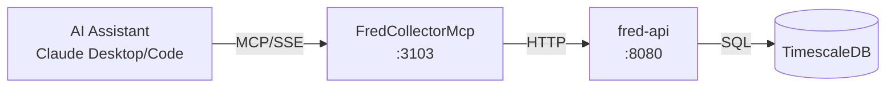

# FredCollectorMcp

MCP server exposing ATLAS economic data from FRED to AI assistants.

## Overview

Exposes FredCollector REST API as MCP tools, enabling Claude Desktop and Claude Code to query FRED economic data collected locally in TimescaleDB with sub-second response times. No FRED API key required - all data is already collected and served from the ATLAS platform.

## Architecture



## MCP Tools

### Data Query Tools

| Tool | Description | Parameters |
|------|-------------|------------|
| `list_series` | List all configured FRED series in ATLAS | `category` (optional) |
| `get_latest` | Get most recent observation for a series | `series_id` |
| `get_observations` | Get historical observations for a series | `series_id`, `start_date`, `end_date`, `limit` |
| `search` | Search FRED for series by keyword | `query`, `limit` |
| `categories` | List all available data categories and series counts | None |
| `health` | Get FredCollector service health and data freshness | None |
| `api_schema` | Get OpenAPI specification for FredCollector API | `format` |

### Admin Tools

| Tool | Description | Parameters |
|------|-------------|------------|
| `add_series` | Add new FRED series to collect | `seriesId`, `category`, `backfill` |
| `get_all_series_admin` | Get all configured series including inactive | None |
| `toggle_series` | Enable or disable series for collection | `seriesId` |
| `delete_series` | Delete series and all observations | `seriesId` |
| `trigger_collection` | Trigger immediate data collection | `seriesId` |
| `trigger_backfill` | Trigger historical data backfill | `seriesId`, `months` |

## Configuration

| Variable | Default | Description |
|----------|---------|-------------|
| `FREDCOLLECTOR_API_URL` | `http://fred-collector:8080` | Backend service URL |
| `FREDCOLLECTOR_MCP_LOG_LEVEL` | `Warning` | Logging level |
| `FREDCOLLECTOR_MCP_TIMEOUT_SECONDS` | `30` | HTTP request timeout |

### Port Mapping

| Port | Purpose |
|------|---------|
| 8080 | Internal container port |
| 3103 | External host port |
| `http://mercury:3103/sse` | SSE endpoint |

## Project Structure

```
FredCollector/mcp/
├── Client/
│   ├── FredCollectorClient.cs   # HTTP client implementation
│   ├── IFredCollectorClient.cs  # Client interface
│   └── Models/
│       └── ClientModels.cs      # DTO models
├── Tools/
│   └── FredCollectorTools.cs    # MCP tool definitions
├── Containerfile                # Container build
├── FredCollectorMcp.csproj      # Project file
├── Program.cs                   # Entry point
└── README.md
```

## Development

### Prerequisites

- .NET 9.0 SDK (via devcontainer)
- FredCollector backend running

### Build

```bash
.devcontainer/compile.sh
```

### Build Container

```bash
sudo nerdctl build -t fred-collector-mcp:latest -f src/Containerfile .
```

Run from monorepo root (`/home/james/ATLAS`).

## Deployment

```bash
ansible-playbook playbooks/deploy.yml --tags fred-collector-mcp
```

## Claude Desktop Integration

Add to `~/.config/Claude/claude_desktop_config.json` (Linux) or `~/Library/Application Support/Claude/claude_desktop_config.json` (macOS):

```json
{
  "mcpServers": {
    "fred-collector": {
      "command": "uvx",
      "args": ["mcp-proxy", "http://mercury:3103/sse"]
    }
  }
}
```

Claude Desktop uses stdio transport, so `mcp-proxy` bridges stdio to SSE.

## Usage Examples

**Check current VIX:**
```
User: "What's VIX at?"
Claude calls: get_latest("VIXCLS")
Response: "VIX closed at 14.23 yesterday."
```

**Review unemployment trend:**
```
User: "Show me unemployment for the past year"
Claude calls: get_observations("UNRATE", limit=12)
Response: "Unemployment rate over past 12 months: Nov: 4.1%, Oct: 4.1%..."
```

**Find housing series:**
```
User: "What series do you have for housing?"
Claude calls: search("housing")
Response: "ATLAS is tracking 2 housing series: HOUST, PERMIT"
```

## See Also

- [FredCollector](../README.md) - Backend service documentation
- [ThresholdEngine MCP](../../ThresholdEngine/mcp/README.md) - Pattern evaluation and macro scoring
- [Model Context Protocol](https://modelcontextprotocol.io/) - MCP specification
