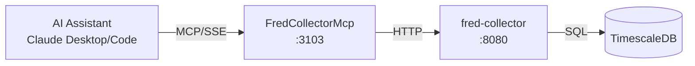

# FredCollectorMcp

MCP server exposing ATLAS economic data from FRED to AI assistants.

## Overview

Exposes FredCollector REST API as MCP tools, enabling Claude Desktop and Claude Code to query FRED economic data collected locally in TimescaleDB with sub-second response times. No FRED API key required - all data is already collected and served from the ATLAS platform.

## Architecture



AI assistants connect via SSE transport. The MCP server translates tool calls to FredCollector REST API requests, returning formatted responses.

## Features

- **Data Query Tools**: Get latest values, historical observations, search series
- **Admin Tools**: Add/remove series, trigger collection and backfill
- **SSE Transport**: HTTP-based transport for remote access
- **Claude Desktop Integration**: Works with mcp-proxy for stdio bridging

## Configuration

| Variable | Default | Description |
|----------|---------|-------------|
| `FREDCOLLECTOR_API_URL` | `http://fred-collector:8080` | Backend service URL |
| `FREDCOLLECTOR_MCP_LOG_LEVEL` | `Warning` | Logging level |
| `FREDCOLLECTOR_MCP_TIMEOUT_SECONDS` | `30` | HTTP request timeout |

## MCP Tools

### Data Query Tools

| Tool | Description | Parameters |
|------|-------------|------------|
| `list_series` | List all configured FRED series | `category` (optional) |
| `get_latest` | Get most recent observation | `series_id` |
| `get_observations` | Get historical observations | `series_id`, `start_date`, `end_date`, `limit` |
| `search` | Search FRED for series | `query`, `limit` |
| `categories` | List categories and series counts | None |
| `health` | Service health and data freshness | None |
| `api_schema` | OpenAPI specification | `format` |

### Admin Tools

| Tool | Description | Parameters |
|------|-------------|------------|
| `add_series` | Add new series to collect | `seriesId`, `category`, `backfill` |
| `get_all_series_admin` | Get all series including inactive | None |
| `toggle_series` | Enable/disable series collection | `seriesId` |
| `delete_series` | Delete series and observations | `seriesId` |
| `trigger_collection` | Trigger immediate collection | `seriesId` |
| `trigger_backfill` | Trigger historical backfill | `seriesId`, `months` |

## Project Structure

```
FredCollector/mcp/
├── Client/
│   ├── FredCollectorClient.cs   # HTTP client implementation
│   ├── IFredCollectorClient.cs  # Client interface
│   └── Models/
│       └── ClientModels.cs      # DTO models
├── Tools/
│   └── FredCollectorTools.cs    # MCP tool definitions
├── Containerfile                # Container build
├── FredCollectorMcp.csproj      # Project file
└── Program.cs                   # Entry point
```

## Development

### Prerequisites

- VS Code with Dev Containers extension
- FredCollector backend running

### Build

```bash
.devcontainer/compile.sh
```

### Build Container

```bash
.devcontainer/build.sh
```

## Deployment

```bash
ansible-playbook playbooks/deploy.yml --tags fred-collector-mcp
```

## Ports

| Port | Description |
|------|-------------|
| 8080 | REST API (internal) |
| 3103 | Host-mapped SSE endpoint |

SSE endpoint: `http://mercury:3103/sse`

## Claude Desktop Integration

Add to `~/.config/Claude/claude_desktop_config.json`:

```json
{
  "mcpServers": {
    "fred-collector": {
      "command": "uvx",
      "args": ["mcp-proxy", "http://mercury:3103/sse"]
    }
  }
}
```

Claude Desktop uses stdio transport, so `mcp-proxy` bridges stdio to SSE.

## See Also

- [FredCollector](../README.md) - Backend service documentation
- [ThresholdEngine MCP](../../ThresholdEngine/mcp/README.md) - Pattern evaluation and macro scoring
- [Model Context Protocol](https://modelcontextprotocol.io/) - MCP specification
