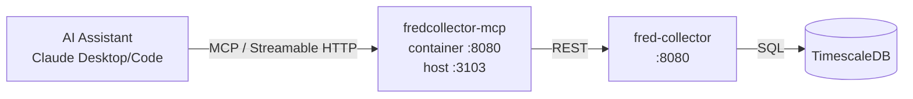

# FredCollectorMcp

MCP server exposing ATLAS FRED economic data to AI assistants over Streamable HTTP.

## Overview

Translates Model Context Protocol tool calls into REST requests against the sibling `fred-collector` service (which serves FRED data from TimescaleDB). No FRED API key is required in the MCP layer — all credentials and data live in the parent collector. The server hosts the MCP endpoint over HTTP using the official `ModelContextProtocol.AspNetCore` package.

## Architecture


```mermaid
flowchart LR
    AI[AI Assistant<br/>Claude Desktop/Code] -->|MCP / Streamable HTTP| MCP[fredcollector-mcp<br/>container :8080<br/>host :3103]
    MCP -->|REST| API[fred-collector<br/>:8080]
    API -->|SQL| DB[(TimescaleDB)]
```

The MCP server listens on container port `8080` (path `/mcp`) and is published to host port `3103`. It depends on `fred-collector` being healthy before starting.

## Features

- **Data Query Tools**: list/search series, latest value, historical observations, categories, health, OpenAPI introspection
- **Admin Tools**: add/toggle/delete series, trigger collection or backfill
- **Streamable HTTP Transport**: `ModelContextProtocol.AspNetCore` `MapMcp("/mcp")` — no SSE endpoint is mounted
- **Plain HTTP Health**: `GET /health` returns `{"status":"healthy"}` for container healthchecks

## Configuration

| Variable | Default | Description |
|----------|---------|-------------|
| `ASPNETCORE_URLS` | `http://+:8080` | Kestrel bind address (set in Containerfile) |
| `FREDCOLLECTOR_API_URL` | `http://fred-collector:8080` | Backend `fred-collector` REST base URL |
| `FREDCOLLECTOR_MCP_TIMEOUT_SECONDS` | `30` | HTTP client timeout for backend calls |
| `FREDCOLLECTOR_MCP_LOG_LEVEL` | `Warning` | Declared in Containerfile/compose; **not currently read by `Program.cs`** (Serilog minimum level is hardcoded to `Warning`) |

## MCP Tools

All tools are served over Streamable HTTP at `POST /mcp`. There is no separate REST API surface — tool invocations are MCP requests, not query-string GETs.

### Data Query Tools (read-only)

| Tool | Description | Parameters |
|------|-------------|------------|
| `list_series` | List all configured FRED series | `category` (optional: Recession, Liquidity, Growth, NBFI, Commodity, Valuation, Inflation) |
| `get_latest` | Most recent observation for a series | `series_id` |
| `get_observations` | Historical observations | `series_id`, `start_date?`, `end_date?`, `limit?` |
| `search` | Search FRED by keyword | `query`, `limit?` |
| `categories` | Categories and their series counts | _none_ |
| `health` | Backend health + per-frequency data freshness | _none_ |
| `api_schema` | Introspect backend OpenAPI spec | `format?` (`summary` default, or `full`) |

### Admin Tools (destructive)

| Tool | Description | Parameters |
|------|-------------|------------|
| `add_series` | Add new series and (optionally) backfill | `seriesId`, `category`, `backfill=true` |
| `get_all_series_admin` | All series incl. inactive | _none_ |
| `toggle_series` | Flip `IsActive` for a series | `seriesId` |
| `delete_series` | Delete series + all observations | `seriesId` |
| `trigger_collection` | Force immediate collection | `seriesId` |
| `trigger_backfill` | Trigger historical backfill | `seriesId`, `months=1` (clamped 1-120) |

## HTTP Endpoints

| Path | Method | Purpose |
|------|--------|---------|
| `/mcp` | POST | MCP Streamable HTTP transport |
| `/health` | GET | Liveness probe (container healthcheck) |

## Project Structure

```
FredCollector/mcp/
├── Client/
│   ├── FredCollectorClient.cs   # Typed HttpClient against fred-collector REST API
│   └── IFredCollectorClient.cs  # Client contract (DTOs from FredCollector.Dto)
├── Tools/
│   └── FredCollectorTools.cs    # [McpServerToolType] — all MCP tools
├── Containerfile                # Multi-stage build (sdk:10.0 → aspnet:10.0)
├── FredCollectorMcp.csproj      # Refs FredCollector/src/FredCollector.csproj
└── Program.cs                   # Web host, Serilog, MapMcp("/mcp"), MapGet("/health")
```

DTOs are imported from the parent `FredCollector.Dto` namespace — there is no local `Models/` directory.

## Development

### Prerequisites

- .NET 10 SDK (or use the parent `FredCollector/.devcontainer/`)
- `fred-collector` backend reachable at `FREDCOLLECTOR_API_URL`

### Build & Test

This subproject has no dedicated `.devcontainer/`. Use the parent FredCollector dev container scripts, which compile the whole solution including `mcp/`:

```bash
FredCollector/.devcontainer/compile.sh          # restore + build + test
FredCollector/.devcontainer/build.sh            # nerdctl build of container image
```

## Deployment

Image is built from the monorepo root and tagged `fredcollector-mcp:latest`. The compose service name and container name are both `fredcollector-mcp`.

```bash
ansible-playbook playbooks/deploy.yml --tags fredcollector-mcp
```

## Ports

| Port | Scope | Description |
|------|-------|-------------|
| `8080` | Container | Kestrel HTTP (MCP `/mcp` + `/health`) |
| `3103` | Host | Published from container `8080` (see `ports_mcp.fred_collector` in `deployment/ansible/group_vars/all.yml`) |

MCP endpoint: `http://mercury:3103/mcp`

## Claude Desktop Integration

The server uses Streamable HTTP, not SSE. For clients that only speak stdio, bridge via a Streamable-HTTP-capable proxy:

```json
{
  "mcpServers": {
    "fred-collector": {
      "command": "uvx",
      "args": ["mcp-proxy", "http://mercury:3103/mcp"]
    }
  }
}
```

Clients that natively support Streamable HTTP can point directly at `http://mercury:3103/mcp`.

## See Also

- [FredCollector](../README.md) — backend collector service (FRED API → TimescaleDB)
- [ThresholdEngine MCP](../../ThresholdEngine/mcp/README.md) — pattern evaluation MCP server
- [Model Context Protocol](https://modelcontextprotocol.io/) — protocol specification
