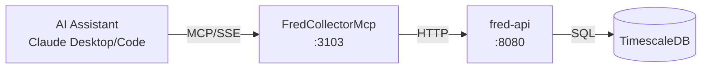

# FredCollector MCP Server

MCP server providing Claude Desktop and Claude Code direct access to ATLAS economic data from FRED.

## Overview

Exposes FredCollector REST API as MCP tools, enabling AI assistants to query FRED economic data collected locally in TimescaleDB with sub-second response times. No FRED API key required - all data is already collected and served from the ATLAS platform.

## Architecture



## MCP Tools

### Data Query Tools

| Tool Name | Description | Key Parameters |
|-----------|-------------|----------------|
| `list_series` | List all configured FRED series in ATLAS | `category` (optional): Filter by category |
| `get_latest` | Get most recent observation for a series | `series_id` (required): FRED series ID |
| `get_observations` | Get historical observations for a series | `series_id`, `start_date`, `end_date`, `limit` |
| `search` | Search FRED for series by keyword | `query`, `limit`, `frequency`, `active_only` |
| `categories` | List all available data categories and series counts | None |
| `health` | Get FredCollector service health and data freshness | None |
| `api_schema` | Get OpenAPI specification for FredCollector API | `format`: "full" or "summary" |

### Admin Tools

| Tool Name | Description | Key Parameters |
|-----------|-------------|----------------|
| `add_series` | Add new FRED series to collect | `seriesId`, `category`, `backfill` |
| `get_all_series_admin` | Get all configured series including inactive | None |
| `toggle_series` | Enable or disable series for collection | `seriesId` |
| `delete_series` | Delete series and all observations | `seriesId` |
| `trigger_collection` | Trigger immediate data collection | `seriesId` |
| `trigger_backfill` | Trigger historical data backfill | `seriesId`, `months` |

## Configuration

### Environment Variables

| Variable | Default | Description |
|----------|---------|-------------|
| `FREDCOLLECTOR_API_URL` | `http://fred-api:8080` | Backend service URL |
| `FREDCOLLECTOR_MCP_LOG_LEVEL` | `Warning` | Logging level |
| `FREDCOLLECTOR_MCP_TIMEOUT_SECONDS` | `30` | HTTP request timeout |

### Port Mapping

- Internal: 8080
- External (host): 3103
- SSE endpoint: `http://mercury:3103/sse`

## Development

### Build
```bash
.devcontainer/compile.sh
```

### Build Container
```bash
.devcontainer/build.sh
```

## Deployment

```bash
ansible-playbook playbooks/deploy.yml --tags fred-collector-mcp
```

## Claude Desktop Integration

Add to `~/.config/Claude/claude_desktop_config.json` (Linux) or `~/Library/Application Support/Claude/claude_desktop_config.json` (macOS):

```json
{
  "mcpServers": {
    "fred-collector": {
      "command": "uvx",
      "args": ["mcp-proxy", "http://mercury:3103/sse"]
    }
  }
}
```

Claude Desktop uses stdio transport, so `mcp-proxy` bridges stdio to SSE.

## Usage Examples

**Check current VIX:**
```
User: "What's VIX at?"
Claude calls: get_latest("VIXCLS")
Response: "VIX closed at 14.23 yesterday."
```

**Review unemployment trend:**
```
User: "Show me unemployment for the past year"
Claude calls: get_observations("UNRATE", limit=12)
Response: "Unemployment rate over past 12 months: Nov: 4.1%, Oct: 4.1%..."
```

**Find housing series:**
```
User: "What series do you have for housing?"
Claude calls: search("housing", active_only=true)
Response: "ATLAS is tracking 2 housing series: HOUST, PERMIT"
```

## See Also

- [FredCollector](../FredCollector/README.md) - Backend service documentation
- [ThresholdEngineMcp](../ThresholdEngineMcp/README.md) - Pattern evaluation and macro scoring
