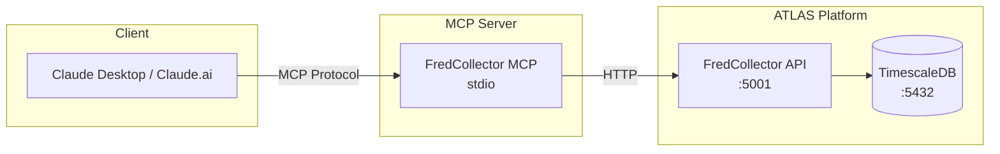

# FredCollector MCP Server

MCP server providing Claude direct access to ATLAS economic data collection.

## Overview

Wraps the FredCollector REST API, providing:
- **Local FRED Data**: Sub-second responses from TimescaleDB
- **Series Discovery**: Search and filter FRED series
- **Historical Data**: Observations with date filtering
- **Threshold Alerts**: Series-level alert history
- **Self-Documentation**: OpenAPI schema access
- **No API Keys**: Data already collected locally

## Architecture



## Technology Stack

- **.NET 9 / C# 13** - Consistent with ATLAS platform
- **MCP Transport**: stdio (stdin/stdout JSON-RPC)
- **HTTP Client**: `HttpClient` with Polly resilience

---

## MCP Tools (10 Tools)

### Data Tools

#### `fred_list_series`
List all configured FRED series in ATLAS.

**Parameters:**
| Name | Type | Required | Description |
|------|------|----------|-------------|
| `category` | string | No | Filter by category (Recession, Liquidity, Growth, etc.) |

**Returns:**
```json
{
  "series": [
    {
      "seriesId": "VIXCLS",
      "title": "CBOE Volatility Index: VIX",
      "category": "Liquidity",
      "frequency": "Daily",
      "isActive": true,
      "lastCollectedAt": "2025-11-25T23:00:00Z"
    }
  ],
  "count": 39
}
```

**Wraps:** `GET http://mercury:5001/api/series`

---

#### `fred_get_series`
Get detailed metadata for a specific series.

**Parameters:**
| Name | Type | Required | Description |
|------|------|----------|-------------|
| `series_id` | string | Yes | FRED series ID |

**Returns:**
```json
{
  "seriesId": "VIXCLS",
  "title": "CBOE Volatility Index: VIX",
  "description": "VIX measures market expectation of near term volatility...",
  "category": "Liquidity",
  "frequency": "Daily",
  "units": "Index",
  "seasonalAdjustment": "Not Seasonally Adjusted",
  "cronExpression": "0 0 18 * * ?",
  "isActive": true,
  "lastCollectedAt": "2025-11-25T23:00:00Z",
  "alertThreshold": 22.0,
  "thresholdDirection": "Above",
  "observationCount": 8547,
  "earliestObservation": "1990-01-02",
  "latestObservation": "2025-11-25"
}
```

**Wraps:** `GET http://mercury:5001/api/series/{id}` (needs endpoint addition)

---

#### `fred_get_latest`
Get the most recent observation for a series.

**Parameters:**
| Name | Type | Required | Description |
|------|------|----------|-------------|
| `series_id` | string | Yes | FRED series ID (e.g., "VIXCLS", "UNRATE") |

**Returns:**
```json
{
  "seriesId": "VIXCLS",
  "title": "CBOE Volatility Index: VIX",
  "date": "2025-11-25",
  "value": 14.23,
  "collectedAt": "2025-11-25T23:00:00Z"
}
```

**Wraps:** `GET http://mercury:5001/api/series/{id}/latest`

---

#### `fred_get_observations`
Get historical observations for a series.

**Parameters:**
| Name | Type | Required | Description |
|------|------|----------|-------------|
| `series_id` | string | Yes | FRED series ID |
| `start_date` | string | No | Start date (ISO format, default: 1 year ago) |
| `end_date` | string | No | End date (ISO format, default: today) |
| `limit` | integer | No | Max observations (default: 100) |

**Returns:**
```json
{
  "seriesId": "UNRATE",
  "observations": [
    { "date": "2025-11-01", "value": 4.1 },
    { "date": "2025-10-01", "value": 4.1 },
    { "date": "2025-09-01", "value": 4.2 }
  ],
  "count": 12
}
```

**Wraps:** `GET http://mercury:5001/api/series/{id}/observations`

---

#### `fred_search`
Search FRED for series by keyword.

**Parameters:**
| Name | Type | Required | Description |
|------|------|----------|-------------|
| `query` | string | Yes | Search term (1-200 chars) |
| `limit` | integer | No | Max results (default: 10, max: 100) |
| `frequency` | string | No | Filter: daily, weekly, monthly, quarterly, annual |
| `active_only` | boolean | No | Only show series configured in ATLAS |

**Returns:**
```json
{
  "query": "unemployment",
  "results": [
    {
      "seriesId": "UNRATE",
      "title": "Unemployment Rate",
      "frequency": "Monthly",
      "popularity": 95,
      "isConfigured": true
    }
  ],
  "totalResults": 42
}
```

**Wraps:** `GET http://mercury:5001/api/series/search`

---

#### `fred_recent_alerts`
Get recent threshold alerts.

**Parameters:**
| Name | Type | Required | Description |
|------|------|----------|-------------|
| `days` | integer | No | Lookback period (default: 7) |
| `series_id` | string | No | Filter by series |

**Returns:**
```json
{
  "alerts": [
    {
      "seriesId": "VIXCLS",
      "observedValue": 25.5,
      "threshold": 22.0,
      "direction": "Above",
      "alertedAt": "2025-11-20T18:05:00Z"
    }
  ],
  "count": 3
}
```

**Wraps:** `GET http://mercury:5001/api/alerts/recent`

---

#### `fred_macro_score`
Get the FredCollector macro score calculation.

**Parameters:** None

**Returns:**
```json
{
  "score": -4.4,
  "indicatorValues": {
    "ICSA": { "value": 215.0, "contribution": -0.5 },
    "UMCSENT": { "value": 68.2, "contribution": -1.0 },
    "VIXCLS": { "value": 14.2, "contribution": 0.0 }
  },
  "calculatedAt": "2025-11-26T12:00:00Z"
}
```

**Wraps:** `GET http://mercury:5001/api/macro-score`

---

### Discovery & Diagnostics Tools

#### `fred_categories`
List all available data categories and series counts.

**Parameters:** None

**Returns:**
```json
{
  "categories": [
    { "name": "Recession", "seriesCount": 11, "description": "Recession and employment indicators" },
    { "name": "Liquidity", "seriesCount": 7, "description": "Credit spreads, Fed policy, money supply" },
    { "name": "Growth", "seriesCount": 5, "description": "GDP, production, housing" },
    { "name": "NBFI", "seriesCount": 8, "description": "Shadow banking and financial stress" },
    { "name": "Commodity", "seriesCount": 3, "description": "Copper, gold, oil" },
    { "name": "Valuation", "seriesCount": 5, "description": "Market valuation metrics" }
  ],
  "totalSeries": 39
}
```

**Wraps:** Aggregation of `GET http://mercury:5001/api/series`

---

#### `fred_health`
Get FredCollector service health and data freshness.

**Parameters:** None

**Returns:**
```json
{
  "status": "healthy",
  "database": "connected",
  "fredApi": "reachable",
  "dataFreshness": {
    "dailySeries": {
      "count": 15,
      "oldestUpdate": "2025-11-25T18:00:00Z",
      "staleCount": 0
    },
    "weeklySeries": {
      "count": 8,
      "oldestUpdate": "2025-11-21T12:00:00Z",
      "staleCount": 0
    },
    "monthlySeries": {
      "count": 16,
      "oldestUpdate": "2025-11-01T08:00:00Z",
      "staleCount": 2
    }
  },
  "uptime": "14d 6h 32m",
  "version": "1.0.0"
}
```

**Wraps:** `GET http://mercury:5001/health` + aggregations

---

#### `fred_api_schema`
Get the OpenAPI specification for FredCollector API.

**Parameters:**
| Name | Type | Required | Description |
|------|------|----------|-------------|
| `format` | string | No | "full" (complete spec) or "summary" (endpoints only, default) |

**Returns (summary):**
```json
{
  "title": "FredCollector API",
  "version": "1.0.0",
  "endpoints": [
    { "path": "/api/series", "method": "GET", "summary": "List all configured series" },
    { "path": "/api/series/{id}/latest", "method": "GET", "summary": "Get latest observation" },
    { "path": "/api/series/{id}/observations", "method": "GET", "summary": "Get historical data" },
    { "path": "/api/series/search", "method": "GET", "summary": "Search FRED series" },
    { "path": "/api/alerts/recent", "method": "GET", "summary": "Get recent alerts" },
    { "path": "/api/macro-score", "method": "GET", "summary": "Calculate macro score" }
  ],
  "authentication": "X-API-Key header"
}
```

**Wraps:** `GET http://mercury:5001/swagger/v1/swagger.json`

---

## Comparison: FRED MCP Server vs FredCollector MCP

| Feature | FRED MCP Server | FredCollector MCP |
|---------|-----------------|-------------------|
| Raw observations | ✅ | ✅ |
| Data transformations (pch, log) | ✅ | ❌ |
| Frequency aggregation | ✅ | ❌ |
| Vintage/revision data | ✅ | ❌ |
| Series discovery | ❌ | ✅ |
| Configured series list | ❌ | ✅ |
| Threshold alerts | ❌ | ✅ |
| Macro score | ❌ | ✅ |
| Data freshness check | ❌ | ✅ |
| API schema access | ❌ | ✅ |
| Response latency | 500-2000ms | <100ms |
| Requires API key | ✅ | ❌ |

**Trade-off:** Lose FRED's transformation features, gain local speed + ATLAS-specific features.

---

## Configuration

### Environment Variables

```bash
FREDCOLLECTOR_API_URL=http://mercury:5001
FREDCOLLECTOR_MCP_LOG_LEVEL=Information
FREDCOLLECTOR_MCP_TIMEOUT_SECONDS=30
```

### Claude Desktop Configuration

```json
{
  "mcpServers": {
    "fred-collector": {
      "command": "dotnet",
      "args": ["run", "--project", "/path/to/FredCollectorMcp"],
      "env": {
        "FREDCOLLECTOR_API_URL": "http://mercury:5001"
      }
    }
  }
}
```

---

## Usage Examples

### Check Current VIX
```
User: "What's VIX at?"

Claude calls: fred_get_latest("VIXCLS")

Response: "VIX closed at 14.23 yesterday. Well below the L1 deployment 
threshold of 22."
```

### Review Unemployment Trend
```
User: "Show me unemployment for the past year"

Claude calls: fred_get_observations("UNRATE", limit=12)

Response: "Unemployment rate over past 12 months:
Nov: 4.1%, Oct: 4.1%, Sep: 4.2%, Aug: 4.2%...
Relatively stable in the 4.1-4.3% range."
```

### Find Related Series
```
User: "What series do you have for housing?"

Claude calls: fred_search("housing", active_only=true)

Response: "ATLAS is tracking 2 housing series:
- HOUST: Housing Starts (Monthly)
- PERMIT: Building Permits (Monthly)"
```

### Understand Available Data
```
User: "What economic data categories does ATLAS track?"

Claude calls: fred_categories

Response: "ATLAS tracks 39 series across 6 categories:
- Recession (11): Employment, sentiment, yield curve
- Liquidity (7): Credit spreads, Fed policy, money supply
- Growth (5): GDP, production, housing
- NBFI (8): Shadow banking, financial stress
- Commodity (3): Copper, gold, oil
- Valuation (5): Market metrics"
```

### Check System Health
```
User: "Is the data up to date?"

Claude calls: fred_health

Response: "FredCollector is healthy. All 15 daily series updated today.
2 monthly series awaiting November data (normal - released next week)."
```

---

## MCP Resources

In addition to tools, expose static resources for context:

| Resource URI | Description |
|--------------|-------------|
| `fred://series/all` | Complete series inventory with metadata |
| `fred://categories` | Category definitions and weights |
| `fred://thresholds` | All configured alert thresholds |

---

## API Reference

See `/swagger/v1/swagger.json` on running service, or use `fred_api_schema` tool.
