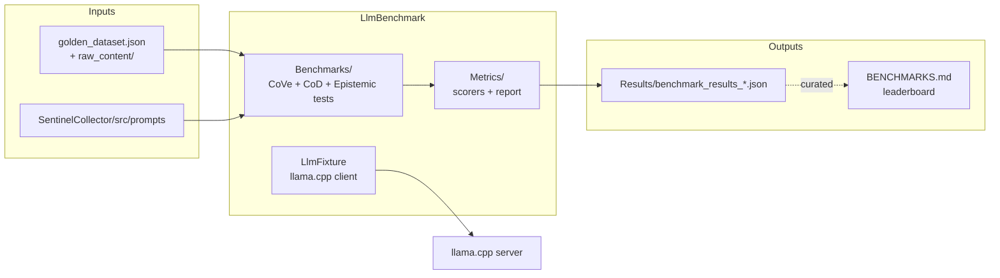

# LlmBenchmark

C# xUnit harness that measures Sentinel LLM extraction quality (CoVe / CoD / epistemic markers) against a golden dataset, using a llama.cpp server as the inference backend.

## Overview

LlmBenchmark is the GPU-extraction track's accuracy gate for ATLAS Sentinel. It exercises the exact production code paths in `SentinelCollector` (`ChainOfVerification`, `ChainOfDensity`, the same `src/prompts` directory) against a pinned golden dataset and emits per-entry + aggregate scores (precision / recall / F1, timing, epistemic-marker recall). It is **not** a service: no container, no ports, no deployment — it runs inside the `SentinelCollector` devcontainer via `dotnet test`. The current leaderboard lives in `BENCHMARKS.md`; the Python LoRA-acceptance harness for vLLM-served Sentinel models lives in `scripts/` (separately documented).

## Architecture



`LlmFixture` health-checks the llama.cpp server and constructs `ChainOfVerification` / `ChainOfDensity` against the production prompt directory. The served model is pinned at the llama.cpp server's start, so the fixture's `LoadModelAsync` / `UnloadModelAsync` are no-ops kept only for test bookkeeping. Each test runs all golden entries, scores them, and writes a per-run JSON report.

## Features

- **Three benchmark tracks**: CoVe extraction (`ExtractionAccuracyTests`), CoD summarization (`CoDAccuracyTests`), epistemic-marker JSON extraction (`EpistemicMarkerTests`)
- **Quick-screen mode**: 2-entry / 5-min-per-entry / F1 ≥ 40% gate before committing to a full run
- **Single backend**: llama.cpp server — model pinned at server start, no in-process swapping
- **Production prompts**: reads from `SentinelCollector/src/prompts` — no test-local copies to drift
- **Per-entry JSON reports**: written to `Results/` with full score breakdown + timing stats
- **Convenience scripts**: single run, sequential full run, quick screen, tokens/sec validator

## Test Categories

xUnit traits used to filter runs via `--filter`:

| Trait | Value | Tests included |
|---|---|---|
| `Category` | `LlmBenchmark` | All extraction + CoD tests (full run) |
| `Category` | `QuickBenchmark` | `QuickBenchmark_ScreenModel` only |
| `Category` | `EpistemicBenchmark` | `EpistemicMarkerTests` only |
| `Strategy` | `CoVe` | `ExtractionAccuracyTests` |
| `Strategy` | `CoD` | `CoDAccuracyTests` |

## Configuration

Driven by environment variables read by `BenchmarkConfiguration.Default`:

| Variable | Description | Default |
|----------|-------------|---------|
| `LLAMA_SERVER_ENDPOINT` | llama.cpp server base URL (the only backend) | `http://localhost:8080` |
| `LLAMA_CHAT_TEMPLATE` | Chat template applied client-side; `{0}`/`{prompt}` placeholder. Empty string → prompt sent raw | Qwen2.5 ChatML (`<\|im_start\|>user\n{0}<\|im_end\|>\n<\|im_start\|>assistant\n`) |
| `LLAMA_STOP_TOKENS` | Comma-separated stop tokens | `<\|im_end\|>,<\|endoftext\|>` |

JSON-schema-constrained decoding is disabled by default (`BenchmarkConfiguration.UseLlamaCppJsonSchema = false`) because strict grammar constraints lower extraction accuracy; it is a code-level flag, not env-driven.

### Thresholds (hard-coded in test classes)

| Track | Metric | Threshold |
|---|---|---|
| Full CoVe (`FullPipeline_MeetsAccuracyThreshold`) | Overall precision | ≥ 85% |
| Full CoVe | Overall recall | ≥ 80% |
| Full CoVe | Avg value-exact-match | ≥ 90% |
| Quick (`QuickBenchmark_ScreenModel`) | F1 | ≥ 40% |
| Quick | Mean seconds per entry | ≤ 300s |
| CoD (`CoD_MeetsSummaryQualityThreshold`) | Entity coverage | ≥ 80% |
| CoD | Value coverage | ≥ 75% |
| CoD | Overall CoD score | ≥ 75% |
| Epistemic | JSON parse success rate | ≥ 90% |

Per-entry extraction timeout: 10 min (`LlmFixture.PerEntryTimeout`); HTTP client timeout: 10 min (`LlmFixture.HttpTimeout`).

## Project Structure

```
LlmBenchmark/
├── Benchmarks/                 # xUnit test classes
│   ├── ExtractionAccuracyTests.cs   # CoVe: full + quick + debug
│   ├── CoDAccuracyTests.cs          # CoD summarization tests
│   ├── EpistemicMarkerTests.cs      # JSON marker-parse tests
│   └── LlmFixture.cs                # Backend health-check + client factory
├── Infrastructure/             # Config + client adapters
│   ├── BenchmarkConfiguration.cs    # Env-var driven config
│   ├── BenchmarkLlamaServerClient.cs
│   ├── BenchmarkLlmClientAdapter.cs
│   ├── TestPromptProvider.cs
│   └── TestDensityPromptProvider.cs
├── GoldenDataset/              # Dataset loader + entry record
├── Metrics/                    # Scorers + BenchmarkReport JSON writer
│   ├── ExtractionAccuracyScorer.cs
│   ├── CoDAccuracyScorer.cs
│   ├── TextQuoteMatcher.cs
│   └── BenchmarkReport.cs
├── Results/                    # Historical benchmark JSON outputs (committed)
├── TestData/                   # golden_dataset.json + raw_content/ (copied to build output)
├── eval-substrate/             # vLLM-acceptance criteria + scorecard sidecars
├── scripts/                    # Python harness for vLLM LoRA acceptance (see scripts/README.md)
├── run-benchmarks.sh           # Single run against the llama.cpp server, with --filter flags
├── run-all-benchmarks.sh       # Sequential full-extraction run, timestamped log (in-container)
├── run-top5-benchmark.sh       # QuickBenchmark screen against the llama.cpp server, timestamped log
├── validate-models.sh          # Tokens/sec smoke test via llama.cpp /completion (pass: ≥ 20 tok/s)
├── BENCHMARKS.md               # Current leaderboard + key findings
└── LlmBenchmark.csproj         # net10.0 xUnit test project; refs SentinelCollector
```

## Running Benchmarks

The harness builds against `SentinelCollector`, so it runs inside the `SentinelCollector` devcontainer. The `run-benchmarks.sh` wrapper brings the devcontainer up/down and runs the tests against an already-running llama.cpp server (it does **not** start an inference backend). Point it at your server with `LLAMA_SERVER_ENDPOINT` (default: the `llama-server` container). The served model is whatever the llama.cpp server was started with.

### Quick benchmark (2-entry screen)

```bash
cd LlmBenchmark
./run-benchmarks.sh
```

### Alternate llama.cpp endpoint

```bash
LLAMA_SERVER_ENDPOINT=http://my-llama-host:8080 ./run-benchmarks.sh
```

### Custom filter (full extraction run)

```bash
./run-benchmarks.sh --filter "Category=LlmBenchmark"
```

### Debug shortcut

```bash
./run-benchmarks.sh --debug          # equivalent to --filter "Category=Debug"
```

### Other scripts

| Script | Use |
|---|---|
| `./run-all-benchmarks.sh` | Sequential full-extraction run against the running llama.cpp server, writes a timestamped log. Must already be inside the devcontainer (`/workspace` paths). |
| `./run-top5-benchmark.sh` | QuickBenchmark screen against the running llama.cpp server, writes a timestamped log. (The model is pinned at server start; to compare models, restart llama-server per GGUF and re-run.) |
| `./validate-models.sh [results.json]` | Sends a representative extraction prompt to the llama.cpp `/completion` endpoint, reports tokens/sec, pass gate = 20 tok/s. |

### Building / compiling separately

The benchmark is a normal C# test project — same `compile.sh` flow as any ATLAS service:

```bash
SentinelCollector/.devcontainer/compile.sh           # build + tests (no benchmarks run unless filtered in)
SentinelCollector/.devcontainer/compile.sh --no-test # build only
```

## Outputs

- **xUnit console output**: per-entry precision/recall/F1, timing, aggregate, pass/fail vs threshold.
- **JSON reports**: `Results/benchmark_results_<model>_<UTC-timestamp>.json` (full CoVe runs only) — schema in `Metrics/BenchmarkReport.cs` (`BenchmarkRun` record).
- **Leaderboard**: hand-curated into `BENCHMARKS.md` after notable runs.
- **Convenience-script logs**: `benchmark_run_<ts>.log`, `benchmark_top5_<ts>.log`, `results_<ts>/<model>.log`.

## See Also

- [BENCHMARKS.md](./BENCHMARKS.md) — current leaderboard, key findings, hardware notes
- [scripts/README.md](./scripts/README.md) — Python LoRA-acceptance harness (vLLM-served Sentinel models)
- [SentinelCollector](../SentinelCollector/README.md) — owner of `ChainOfVerification`, `ChainOfDensity`, and the prompt directory under test
- [SentinelCollector/scripts](../SentinelCollector/scripts/README.md) — training-data generation and QLoRA fine-tuning
