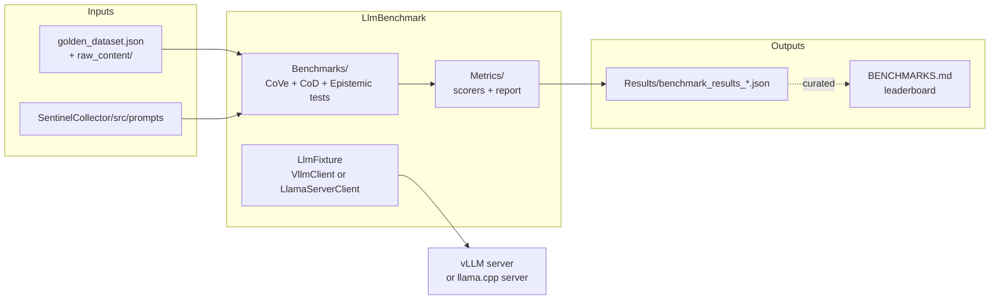

# LlmBenchmark

Two harnesses for measuring Sentinel LLM extraction quality:

- **C# xUnit** (this directory) — CoVe / CoD / epistemic-marker tracks against a golden dataset, driven through **vLLM or llama.cpp** using SentinelCollector's own clients. Produces `BENCHMARKS.md`.
- **Python** (`scripts/`) — the 18 pinned acceptance-criteria metrics against an eval substrate, driven through any **OpenAI-compatible** engine (vLLM, SGLang, llama.cpp `/v1`) by `run_model.py`. Every run records the engine build, so a number can be told to be stale.

## Overview

LlmBenchmark is the GPU-extraction track's accuracy gate for ATLAS Sentinel. It exercises the exact production code paths in `SentinelCollector` (`ChainOfVerification`, `ChainOfDensity`, the same `src/prompts` directory) against a pinned golden dataset and emits per-entry + aggregate scores (precision / recall / F1, timing, epistemic-marker recall). It is **not** a service: no container, no ports, no deployment — it runs inside the `SentinelCollector` devcontainer via `dotnet test`. The current leaderboard lives in `BENCHMARKS.md`.

> **The C# track drives production's own LLM clients.** `LlmFixture` builds `VllmClient` or
> `LlamaServerClient` — the two `ILlmClient` implementations SentinelCollector's DI builds — from a
> real `ExtractionOptions`, selected on the same `InferenceBackend` value production selects on. So
> engine choice, seed, completion budget, stop tokens and client-side chat templating are identical
> to production by construction. It previously carried a third `ILlmClient` behind an adapter that
> dropped `seed`, `maxTokensOverride`, `keepAlive` and `timeout`; that client posted to llama.cpp's
> `/completion` for plain generation and to `/v1/chat/completions` for structured output, where it
> hardcoded `model: "default"` and `max_tokens: -1`.
>
> Use the Python track in [`scripts/`](scripts/README.md) for SGLang, for any other
> OpenAI-compatible engine, or when you need a scorecard that records the engine build.

## Architecture


```mermaid
flowchart LR
    subgraph Inputs
        GD[golden_dataset.json<br/>+ raw_content/]
        PR[SentinelCollector/src/prompts]
    end

    subgraph LlmBenchmark
        FX[LlmFixture<br/>VllmClient or LlamaServerClient]
        BM[Benchmarks/<br/>CoVe + CoD + Epistemic tests]
        SC[Metrics/<br/>scorers + report]
    end

    EN[vLLM server<br/>or llama.cpp server]

    subgraph Outputs
        RJ[Results/benchmark_results_*.json]
        LD[BENCHMARKS.md<br/>leaderboard]
    end

    GD --> BM
    PR --> BM
    FX --> EN
    BM --> SC
    SC --> RJ
    RJ -.curated.-> LD
```

`LlmFixture` health-checks the configured backend through that backend's own client and constructs `ChainOfVerification` / `ChainOfDensity` against the production prompt directory, sharing one `ExtractionOptions` instance between client and pipeline. Both engines pin their model at server start, so the fixture's `LoadModelAsync` / `UnloadModelAsync` are no-ops kept only for test bookkeeping. Each test runs all golden entries, scores them, and writes a per-run JSON report.

## Features

- **Three benchmark tracks**: CoVe extraction (`ExtractionAccuracyTests`), CoD summarization (`CoDAccuracyTests`), epistemic-marker JSON extraction (`EpistemicMarkerTests`)
- **Quick-screen mode**: 2-entry / 5-min-per-entry / F1 ≥ 40% gate before committing to a full run
- **Production clients, both engines**: `VllmClient` / `LlamaServerClient` chosen by `BENCHMARK_BACKEND` — model pinned at server start, no in-process swapping
- **Production prompts**: reads from `SentinelCollector/src/prompts` — no test-local copies to drift
- **Per-entry JSON reports**: written to `Results/` with full score breakdown + timing stats
- **Convenience scripts**: single run, sequential full run, quick screen, tokens/sec validator

## Test Categories

xUnit traits used to filter runs via `--filter`:

| Trait | Value | Tests included |
|---|---|---|
| `Category` | `LlmBenchmark` | All extraction + CoD tests (full run) |
| `Category` | `QuickBenchmark` | `QuickBenchmark_ScreenModel` only |
| `Category` | `EpistemicBenchmark` | `EpistemicMarkerTests` only |
| `Category` | `Offline` | `LlmFixtureClientTests` — needs no inference backend; run by `compile.sh` |
| `Strategy` | `CoVe` | `ExtractionAccuracyTests` |
| `Strategy` | `CoD` | `CoDAccuracyTests` |

## Configuration

Driven by environment variables read by `BenchmarkConfiguration.Default`:

| Variable | Description | Default |
|----------|-------------|---------|
| `BENCHMARK_BACKEND` | `InferenceBackend` value — `VllmServer`/`VllmJson` drive vLLM, `LlamaServer`/`LlamaServerDsl` drive llama.cpp. Same enum and same split as `Extraction:Backend` | `VllmServer` |
| `VLLM_ENDPOINT` | vLLM base URL, used when the backend is a vLLM one | `http://localhost:8000` |
| `LLAMA_SERVER_ENDPOINT` | llama.cpp base URL, used when the backend is a llama.cpp one | `http://localhost:8080` |
| `BENCHMARK_MODEL` | Model name sent in the request body. vLLM rejects a name it is not serving; llama.cpp ignores it | `Qwen/Qwen2.5-32B-Instruct-AWQ` (what compose serves) |
| `BENCHMARK_CHAT_TEMPLATE` | Chat template applied client-side, `{0}` placeholder. Empty → prompt sent raw | Qwen2.5 ChatML (`<\|im_start\|>user\n{0}<\|im_end\|>\n<\|im_start\|>assistant\n`) |
| `BENCHMARK_STOP_TOKENS` | Comma-separated stop tokens | `<\|im_end\|>,<\|endoftext\|>` |
| `BENCHMARK_THINKING` | `Disabled` or `Enabled` — whether the served model may emit a reasoning block | `Disabled` |
| `BENCHMARK_THINKING_SUFFIX` | Text appended after the chat template when thinking is `Disabled`. Model-family specific; set it only for a model that actually reasons | empty |

The three `run-*.sh` wrappers pin `BENCHMARK_BACKEND=LlamaServer`: they health-check `llama-server`, so an unpinned run would pass that check and then benchmark whatever answers the vLLM endpoint. All three also REFUSE a contradicting `BENCHMARK_BACKEND` rather than overriding it in silence — the gate and its known-bad control live in `benchmark-result.sh`, sourced by each.

Structured decoding is not a benchmark flag any more. Both production clients constrain structured calls (vLLM `response_format=json_schema`, llama.cpp `json_schema`), and completion budget is `ExtractionOptions.MaxCompletionTokens` (16384) against a 32K context — the same guard production enforces, where the replaced client sent `max_tokens: -1`.

### Thresholds (hard-coded in test classes)

| Track | Metric | Threshold |
|---|---|---|
| Full CoVe (`FullPipeline_MeetsAccuracyThreshold`) | Overall precision | ≥ 85% |
| Full CoVe | Overall recall | ≥ 80% |
| Full CoVe | Avg value-exact-match | ≥ 90% |
| Quick (`QuickBenchmark_ScreenModel`) | F1 | ≥ 40% |
| Quick | Mean seconds per entry | ≤ 300s |
| CoD (`CoD_MeetsSummaryQualityThreshold`) | Entity coverage | ≥ 80% |
| CoD | Value coverage | ≥ 75% |
| CoD | Overall CoD score | ≥ 75% |
| Epistemic | JSON parse success rate | ≥ 90% |

Per-entry extraction timeout: 10 min (`LlmFixture.PerEntryTimeout`); HTTP client timeout: 10 min (`LlmFixture.HttpTimeout`).

## Project Structure

```
LlmBenchmark/
├── Benchmarks/                 # xUnit test classes
│   ├── ExtractionAccuracyTests.cs   # CoVe: full + quick + debug
│   ├── CoDAccuracyTests.cs          # CoD summarization tests
│   ├── EpistemicMarkerTests.cs      # JSON marker-parse tests
│   ├── LlmFixtureClientTests.cs     # Category=Offline: seed/backend/model wire guards
│   └── LlmFixture.cs                # Backend health-check + production-client factory
├── Infrastructure/             # Config + prompt providers
│   ├── BenchmarkConfiguration.cs    # Env-var driven config -> ExtractionOptions
│   ├── TestPromptProvider.cs
│   └── TestDensityPromptProvider.cs
├── GoldenDataset/              # Dataset loader + entry record
├── Metrics/                    # Scorers + BenchmarkReport JSON writer
│   ├── ExtractionAccuracyScorer.cs
│   ├── CoDAccuracyScorer.cs
│   ├── TextQuoteMatcher.cs
│   └── BenchmarkReport.cs
├── Results/                    # Historical benchmark JSON outputs (committed)
├── TestData/                   # golden_dataset.json + raw_content/ (copied to build output)
├── eval-substrate/             # vLLM-acceptance criteria + scorecard sidecars
├── scripts/                    # Python harness for vLLM LoRA acceptance (see scripts/README.md)
├── run-benchmarks.sh           # Single run against the llama.cpp server, with --filter flags
├── run-all-benchmarks.sh       # Sequential full-extraction run, timestamped log (in-container)
├── run-top5-benchmark.sh       # QuickBenchmark screen against the llama.cpp server, timestamped log
├── validate-models.sh          # Tokens/sec smoke test via llama.cpp /completion (pass: ≥ 20 tok/s)
├── BENCHMARKS.md               # Current leaderboard + key findings
└── LlmBenchmark.csproj         # net10.0 xUnit test project; refs SentinelCollector
```

## Running Benchmarks

The harness builds against `SentinelCollector`, so it runs inside the `SentinelCollector` devcontainer. No script starts an inference backend — point the harness at one that is already running.

The three `run-*.sh` wrappers are llama.cpp runners: they check `llama-server`'s health, pin `BENCHMARK_BACKEND=LlamaServer`, and refuse a `BENCHMARK_BACKEND` naming any other engine (case-insensitively, matching `ParseEnumOrThrow`). For a vLLM run, set the environment yourself and invoke `dotnet test` in the devcontainer (see **vLLM run** below). The served model is whatever the engine was started with, and `BENCHMARK_MODEL` must name it for vLLM.

### Quick benchmark (2-entry screen)

```bash
cd LlmBenchmark
./run-benchmarks.sh
```

### Alternate llama.cpp endpoint

```bash
LLAMA_SERVER_ENDPOINT=http://my-llama-host:8080 ./run-benchmarks.sh
```

### Custom filter (full extraction run)

```bash
./run-benchmarks.sh --filter "Category=LlmBenchmark"
```

### vLLM run

All three `run-*.sh` wrappers are the llama.cpp arm: they health-check `llama-server`, pin
`BENCHMARK_BACKEND=LlamaServer` for the run and forward no host variable, so they refuse a
contradicting `BENCHMARK_BACKEND` rather than filing a llama.cpp number under another engine.
The vLLM arm sets the variable on the container the tests run in:

```bash
cd ../SentinelCollector/.devcontainer   # from LlmBenchmark/, where "Quick benchmark" above leaves you
sudo nerdctl compose up -d
sudo nerdctl compose exec -T \
    -e BENCHMARK_BACKEND=VllmServer \
    -e VLLM_ENDPOINT=http://vllm-server:8000 \
    -e BENCHMARK_MODEL=Qwen/Qwen2.5-32B-Instruct-AWQ \
    sentinel-collector-dev \
    dotnet test /workspace/LlmBenchmark/LlmBenchmark.csproj --filter "Category=QuickBenchmark"
```

`BENCHMARK_MODEL` must be a name the vLLM server is serving; it answers an unknown one with HTTP 400.

### Other scripts

| Script | Use |
|---|---|
| `./run-all-benchmarks.sh` | Sequential full-extraction run against the running llama.cpp server, writes a timestamped log. Must already be inside the devcontainer (`/workspace` paths). |
| `./run-top5-benchmark.sh` | QuickBenchmark screen against the running llama.cpp server, writes a timestamped log. (The model is pinned at server start; to compare models, restart llama-server per GGUF and re-run.) |
| `./validate-models.sh [results.json]` | Sends a representative extraction prompt to the llama.cpp `/completion` endpoint, reports tokens/sec, pass gate = 20 tok/s. |

### Building / compiling separately

The benchmark is a normal C# test project — same `compile.sh` flow as any ATLAS service:

```bash
SentinelCollector/.devcontainer/compile.sh           # build + tests, incl. this project's Category=Offline tests
SentinelCollector/.devcontainer/compile.sh --no-test # build only
```

`compile.sh` runs `--filter Category=Offline` here — the `LlmFixtureClientTests` wire guards, which need no inference backend. The scored benchmark tracks still need an engine and are never run by `compile.sh`.

## Outputs

- **xUnit console output**: per-entry precision/recall/F1, timing, aggregate, pass/fail vs threshold.
- **JSON reports**: `Results/benchmark_results_<model>_<UTC-timestamp>.json` (full CoVe runs only) — schema in `Metrics/BenchmarkReport.cs` (`BenchmarkRun` record).
- **Leaderboard**: hand-curated into `BENCHMARKS.md` after notable runs.
- **Convenience-script logs**: `benchmark_run_<ts>.log`, `benchmark_top5_<ts>.log`, `results_<ts>/<model>.log`.

## See Also

- [BENCHMARKS.md](./BENCHMARKS.md) — current leaderboard, key findings, hardware notes
- [scripts/README.md](./scripts/README.md) — Python LoRA-acceptance harness (vLLM-served Sentinel models)
- [SentinelCollector](../SentinelCollector/README.md) — owner of `ChainOfVerification`, `ChainOfDensity`, and the prompt directory under test
- [SentinelCollector/scripts](../SentinelCollector/scripts/README.md) — training-data generation and QLoRA fine-tuning
