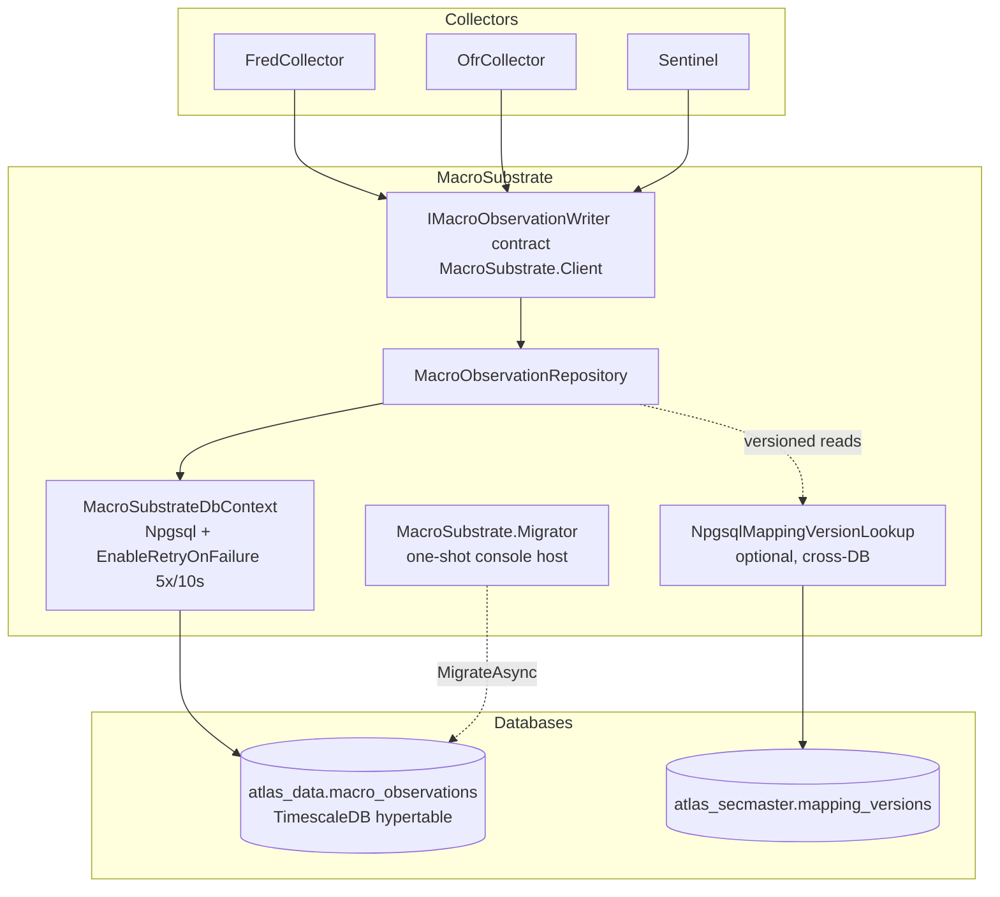

# MacroSubstrate

EF-backed substrate for the `macro_observations` hypertable — the canonical write target for every ATLAS collector that emits macro data.

> **Agents:** read **[AGENT_README.md](AGENT_README.md)** first — the dense architecture card.

## Overview

`MacroSubstrate` is the shared write+read library for `atlas_data.macro_observations`. Collectors take an `IMacroObservationWriter` via DI and stay independent of the shared schema; the EF-backed implementation here owns the `DbContext`, repository, and (optional) cross-DB `IMappingVersionLookup` against `atlas_secmaster`. Schema deployment is handled by the sibling one-shot `MacroSubstrate.Migrator` console host wired into `compose.yaml` as `migrate-macro-substrate`, so no single collector owns the table.

This monorepo project ships three .NET 10 projects: `MacroSubstrate.Client` (contract + DTO), `MacroSubstrate` (EF implementation), and `MacroSubstrate.Migrator` (one-shot migrator binary).

## Architecture



Write path: collectors call `IMacroObservationWriter.WriteAsync` / `WriteBatchAsync`; the EF repository performs INSERT with `ON CONFLICT DO NOTHING` against the `ux_macro_obs_idem` unique index (`source_collector`, `source_id`, `observation_time`). Read path (versioned as-of): the repository asks `IMappingVersionLookup` for the active rollup label at the requested instant, then filters `macro_observations` by `mapping_version_label =` that label.

## Features

- **EF writer with idempotency dedup** — `MacroObservationRepository` implements `IMacroObservationWriter` with single + bulk paths and `ON CONFLICT DO NOTHING` on (`source_collector`, `source_id`, `observation_time`); duplicates are a successful no-op.
- **EF-free contract** — `MacroSubstrate.Client` carries only `IMacroObservationWriter`, `MacroObservation` DTO, and the read-failure exception type; collectors that prefer raw INSERT can implement the interface themselves.
- **D4 invariants** — exactly-one-of numeric/qualitative, `trust` non-null iff qualitative, UTC observation time; enforced both client-side (`MacroObservation.EnsureValid()`) and via DB `CHECK` constraints (`ck_macro_obs_value_xor`, `ck_macro_obs_trust_only_qualitative`).
- **Versioned as-of reads** — `IMappingVersionLookup` resolves the rollup label active at any UTC instant against `atlas_secmaster.mapping_versions`; pre-history returns empty (contract).
- **Retry envelopes** — runtime DbContext uses `EnableRetryOnFailure(5x / 10s)`; the migrator uses `(10x / 15s)` to absorb TimescaleDB cold-start.
- **Read query surface** — `IMacroObservationRepository.QueryAsync` with bounded filters (signal id, collector, sector, kind, time range, min trust, version label or as-of) and a hard 1000-row ceiling.
- **OpenTelemetry contract** — `ActivitySource` + `Meter` exposed as constants on `MacroSubstrateTelemetry`; consumers MUST register both or telemetry is silently dropped.
- **Single-owner schema migration** — the `migrate-macro-substrate` one-shot service blocks dependent collectors via `depends_on: service_completed_successfully`; loud-fails (exit 1) on missing connection string or migration error.

## Configuration

### `MacroSubstrate` library (consumer wires via `AddMacroSubstrate(config)`)

| Variable | Description | Default |
|----------|-------------|---------|
| `ConnectionStrings:AtlasData` | Connection string for `atlas_data` (the `macro_observations` host). Falls back to `ConnectionStrings:AtlasDb` for collectors already using that key. | Required |
| `ConnectionStrings:SecMaster` | Cross-DB connection to `atlas_secmaster` for versioned-mapping lookups. Falls back to `ConnectionStrings:AtlasSecMaster`. | Optional — logs a structured warning at startup if absent; versioned read paths then throw `MappingVersionLookupUnavailableException` |

### `MacroSubstrate.Migrator` (one-shot binary)

| Variable | Description | Default |
|----------|-------------|---------|
| `ConnectionStrings__AtlasData` | Connection string for `atlas_data`. Falls back to `ConnectionStrings__AtlasDb`. | Required (loud-fail on missing) |
| `DOTNET_ENVIRONMENT` | Standard .NET host environment. | `Production` (per compose) |

Compose default for the migrator: `Host=timescaledb;Port=5432;Database=atlas_data;Username=atlas_user;...;Pooling=true;Minimum Pool Size=1;Maximum Pool Size=3`.

## API Endpoints

N/A — `MacroSubstrate` and `MacroSubstrate.Client` are libraries. `MacroSubstrate.Migrator` is a one-shot console process with no listener; health is the process exit code (`0` success, `1` failure with full exception logged).

## Contract

`IMacroObservationWriter` (in `MacroSubstrate.Client`):

```csharp
Task<bool> WriteAsync(MacroObservation observation, CancellationToken ct = default);
Task<int>  WriteBatchAsync(IEnumerable<MacroObservation> observations, CancellationToken ct = default);
```

- `WriteAsync` returns `true` if inserted, `false` if the idempotency key collided.
- `WriteBatchAsync` returns the count actually inserted; the EF implementation iterates single writes so an idempotency conflict on one row doesn't poison siblings.
- Idempotency key: `(source_collector, source_id, observation_time)`.

`MacroObservation` (DTO) carries: `ObservationTime` (UTC, required), `SourceCollector`, `SourceId`, optional `SignalIdentityId` (kebab-case, ≤64 chars; soft FK to `atlas_secmaster.signal_identities.id`), optional `ExtractionJobId` (Sentinel), `ValueNumeric` XOR `ValueQualitative`, `Trust` (required iff qualitative), optional `AtlasSectorCode`, `MappingVersionLabel`, free-form JSONB `Payload`.

`IMacroObservationRepository` (in `MacroSubstrate`) extends the writer with `GetByIdempotencyKeyAsync`, `GetByIdRangeAsync`, `GetObservationsAtDateAsync` (versioned as-of), `GetObservationCoverageByVersionAsync` (audit projection), and `QueryAsync(MacroObservationQueryFilter)`.

## Schema

Table: `macro_observations` (TimescaleDB hypertable on `observation_time`).

| Column | Type | Notes |
|--------|------|-------|
| `id` | bigint identity | Surrogate; part of composite PK (TS requires partition col in unique indexes). |
| `observation_time` | timestamptz | Partition key; required. |
| `ingestion_time` | timestamptz | Default `NOW()` server-side; client-stamped by repository for engine portability. |
| `source_collector` | varchar(32) | e.g. `fred`, `ofr`, `sentinel`. |
| `source_id` | varchar(128) | Series id / mnemonic / extraction correlation id. |
| `signal_identity_id` | varchar(64) | Soft FK to `atlas_secmaster.signal_identities.id`. Nullable. |
| `extraction_job_id` | uuid | Sentinel only; null otherwise. |
| `value_numeric` | numeric(18,6) | XOR with `value_qualitative`. |
| `value_qualitative` | jsonb | XOR with `value_numeric`. |
| `trust` | real | Required iff qualitative; range `[0.0, 1.0]`. |
| `atlas_sector_code` | varchar(16) | Closed-set; from `AtlasSectorCode` enum. |
| `mapping_version_label` | varchar(16) | Stamped at write-time so historical reads resolve under original rollup. |
| `payload` | jsonb | Escape-hatch for fields not yet promoted to columns. |

Constraints:

- `ck_macro_obs_value_xor` — `(value_numeric IS NOT NULL) <> (value_qualitative IS NOT NULL)`.
- `ck_macro_obs_trust_only_qualitative` — `(value_qualitative IS NULL AND trust IS NULL) OR (value_qualitative IS NOT NULL AND trust IS NOT NULL)`.
- `ux_macro_obs_idem` — unique index on (`source_collector`, `source_id`, `observation_time`); idempotency target.

## Project Structure

```
MacroSubstrate/
  src/
    MacroSubstrate.Client/                — EF-free contract package
      IMacroObservationWriter.cs
      MacroObservation.cs                 — DTO + EnsureValid() (D4 invariants)
      MappingVersionLookupUnavailableException.cs
    MacroSubstrate/                       — EF-backed implementation
      DependencyInjection.cs              — AddMacroSubstrate() extension
      Data/
        MacroSubstrateDbContext.cs
        MacroSubstrateDbContextFactory.cs — design-time factory for dotnet-ef
        Entities/MacroObservationEntity.cs
        Configurations/MacroObservationConfiguration.cs
        Repositories/
          IMacroObservationRepository.cs  — reader interface + QueryFilter
          MacroObservationRepository.cs   — IMacroObservationWriter impl
        Migrations/                       — EF migrations (InitialCreate baseline)
      Versioning/
        IMappingVersionLookup.cs
        NpgsqlMappingVersionLookup.cs     — raw Npgsql; avoids 2nd DbContext
      Telemetry/MacroSubstrateTelemetry.cs — ActivitySource + Meter names
    MacroSubstrate.Migrator/              — one-shot migrator host
      Program.cs                          — top-level statements
      Containerfile                       — multi-stage → macro-substrate-migrator:latest
  tests/MacroSubstrate.UnitTests/         — xUnit + SQLite fixture
  .devcontainer/                          — dev container config
```

## Development

### Prerequisites
- VS Code with Dev Containers extension
- Access to the shared `ai-inference` external network (production TimescaleDB)

### Getting Started

1. Open in VS Code: `code MacroSubstrate/`
2. Reopen in Container (Cmd/Ctrl+Shift+P → "Dev Containers: Reopen in Container")
3. Build + test: `MacroSubstrate/.devcontainer/compile.sh`
4. Build only: `MacroSubstrate/.devcontainer/compile.sh --no-test`

### Build Migrator Container

```bash
MacroSubstrate/.devcontainer/build.sh                 # with cache
MacroSubstrate/.devcontainer/build.sh --no-cache      # clean rebuild
```

Produces `macro-substrate-migrator:latest`.

### Adding Migrations

Per CLAUDE.md `MIGRATIONS [HARD_STOP]` — always use the EF CLI; never hand-write `.cs` migration files (missing `Designer.cs` causes silent migration failures).

```bash
sudo nerdctl compose exec -T macrosubstrate-dev dotnet ef migrations add {Name} \
  --project MacroSubstrate/src/MacroSubstrate \
  --startup-project MacroSubstrate/src/MacroSubstrate.Migrator
```

The migrator host applies them at deploy time.

## Deployment

```bash
cd deployment/ansible
ansible-playbook -i inventory/hosts.yml playbooks/deploy.yml --tags macro-substrate
```

- **Image:** `macro-substrate-migrator:latest`
- **Compose service:** `migrate-macro-substrate` (`restart: "no"` — one-shot; resource limits 128M / 0.25 CPU)
- **Dependency gate:** downstream collectors writing `macro_observations` declare `depends_on: { migrate-macro-substrate: { condition: service_completed_successfully } }`.

Per CLAUDE.md `DEPLOYMENT [HARD_STOP]`: never edit `/opt/ai-inference/compose.yaml` directly.

## Ports

N/A — no listener. All consumption is in-process via DI (`IMacroObservationWriter` / `IMacroObservationRepository`).

## OpenTelemetry Wiring (required for telemetry)

```csharp
.WithTracing(t => t.AddSource(MacroSubstrateTelemetry.ActivitySourceName))
.WithMetrics(m => m.AddMeter(MacroSubstrateTelemetry.MeterName))
```

`ActivitySourceName` and `MeterName` are both the constant `"ATLAS.MacroSubstrate"`. Without these calls, spans and the `macro_substrate.mapping_version_lookup_failures_total` counter are silently dropped.

## See Also

- [MacroSubstrate library README](src/MacroSubstrate/README.md) — internal implementation notes
- [MacroSubstrate.Client README](src/MacroSubstrate.Client/README.md) — contract + DTO details
- [MacroSubstrate.Migrator README](src/MacroSubstrate.Migrator/README.md) — one-shot migrator notes
- [SecMaster](../SecMaster/README.md) — owner of `mapping_versions` (cross-DB read target)
- [Reports.Substrate](../Reports/src/Reports.Substrate/README.md) — primary read-side consumer
- [.claude/skills/readme-consistency/TEMPLATE.md](../.claude/skills/readme-consistency/TEMPLATE.md) — service README template
