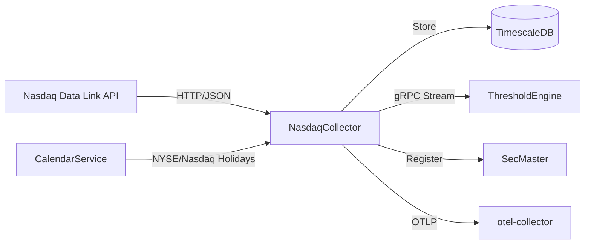

# NasdaqCollector

Collector service for financial time-series data from Nasdaq Data Link API.

## Overview

NasdaqCollector ingests daily financial data from Nasdaq Data Link (formerly Quandl). Configured series are collected automatically on a 6-hour schedule, respecting NYSE/Nasdaq market holidays via CalendarService integration. Data is stored in TimescaleDB and streamed in real-time via gRPC to downstream consumers.

**Deployment status**: Currently disabled in production. The Nasdaq Data Link WAF blocks datacenter IP addresses. Service is awaiting IP whitelist approval from Nasdaq support.

## Architecture



Nasdaq Data Link is polled every 6 hours. New observations are stored in TimescaleDB and emitted as gRPC events to ThresholdEngine. Instruments are registered with SecMaster on collection. Collection is skipped on market holidays using CalendarService.Core's computational holiday calendar.

## Features

- **Configurable Series**: Dynamically add/remove datasets via admin API
- **Market-Aware Scheduling**: Skips collection on NYSE/Nasdaq holidays via CalendarService
- **Resilient Collection**: Automatic retries with exponential backoff
- **Event Streaming**: Real-time gRPC stream of new observations to ThresholdEngine
- **SecMaster Integration**: Automatic instrument registration via gRPC (optional, graceful if unconfigured)
- **Upstream Discovery**: Search Nasdaq Data Link API directly for new datasets
- **Full Observability**: OpenTelemetry traces, metrics, and structured Serilog logs

## Configuration

| Variable | Description | Default |
|----------|-------------|---------|
| `ConnectionStrings__AtlasDb` | TimescaleDB connection string | **Required** |
| `Nasdaq__ApiKey` | Nasdaq Data Link API key | **Required** |
| `Nasdaq__BaseUrl` | Nasdaq Data Link base URL | `https://data.nasdaq.com/api/v3` |
| `OpenTelemetry__OtlpEndpoint` | OTLP collector endpoint | `http://otel-collector:4317` |
| `OpenTelemetry__ServiceName` | Service name for telemetry | `nasdaq-collector` |
| `OpenTelemetry__ServiceVersion` | Service version tag | `1.0.0` |
| `SECMASTER_GRPC_ENDPOINT` | SecMaster gRPC endpoint (optional) | _(none)_ |

## API Endpoints

### REST API

| Endpoint | Method | Description |
|----------|--------|-------------|
| `/api/series` | GET | List all active series |
| `/api/series/{seriesId}` | GET | Get specific series details |
| `/api/series/{seriesId}/observations` | GET | Get observations (query: startDate, endDate, limit) |
| `/api/series/{seriesId}/latest` | GET | Get latest observation |
| `/api/search` | GET | Search local series (query: q, limit) |
| `/api/discover` | GET | Search upstream Nasdaq Data Link API (query: q, limit) |
| `/api/health` | GET | Simple health check |

### Admin API

| Endpoint | Method | Description |
|----------|--------|-------------|
| `/api/admin/series` | GET | List all configured series |
| `/api/admin/series` | POST | Add new series |
| `/api/admin/series/{seriesId}/toggle` | PUT | Enable/disable series |
| `/api/admin/series/{seriesId}` | DELETE | Delete series |

### Health Checks

| Endpoint | Description |
|----------|-------------|
| `/health` | Full health check with database status |
| `/health/ready` | Readiness probe (DB connected) |
| `/health/live` | Liveness probe |

### gRPC Service: `ObservationEventStream`

| Method | Description |
|--------|-------------|
| `SubscribeToEvents` | Real-time server stream of events (long-lived) |
| `GetEventsSince` | Stream events since a timestamp |
| `GetEventsBetween` | Stream events in a time range |
| `GetLatestEventTime` | Get timestamp of most recent event |
| `GetHealth` | Health check with event statistics |

## Project Structure

```
NasdaqCollector/
├── src/
│   ├── Data/              # EF Core DbContext and entity configurations
│   ├── Grpc/              # gRPC event stream service and repository
│   ├── Interfaces/        # Service contracts
│   ├── Models/            # Domain models (NasdaqSeries, NasdaqObservation)
│   ├── Services/          # Collection and series management services
│   ├── Workers/           # Background collection worker (6h cycle)
│   ├── Telemetry/         # OpenTelemetry activity source and meters
│   ├── NasdaqApiClient.cs # Nasdaq Data Link HTTP client
│   ├── NasdaqRepository.cs# Data access layer
│   └── Program.cs         # Startup, DI, and minimal API endpoints
├── tests/
│   ├── NasdaqCollector.UnitTests/
│   └── NasdaqCollector.IntegrationTests/
├── .devcontainer/         # Dev container config and build scripts
└── Containerfile          # Multi-stage container build
```

## Development

### Prerequisites

- VS Code with Dev Containers extension
- Access to shared infrastructure (TimescaleDB, otel-collector)

### Getting Started

1. Open in VS Code: `code NasdaqCollector/`
2. Reopen in Container (Cmd/Ctrl+Shift+P -> "Dev Containers: Reopen in Container")
3. Build: `dotnet build`
4. Run: `dotnet run --project src/`

### Compile

```bash
.devcontainer/compile.sh
```

### Build Container Image

```bash
.devcontainer/build.sh
```

## Deployment

```bash
ansible-playbook playbooks/deploy.yml --tags nasdaq-collector
```

Service is currently commented out in compose.yaml. Uncomment when IP whitelist is approved.

## Ports

| Port | Protocol | Context | Description |
|------|----------|---------|-------------|
| 5004 | HTTP | Dev (Kestrel) | REST API and health checks |
| 5005 | HTTP/2 | Dev (Kestrel) | gRPC event streaming |
| 8080 | HTTP | Container | REST API and health checks |
| 5009 | HTTP/2 | Container | gRPC event streaming |
| 5008 | HTTP | Host-mapped | REST API (maps to container 5004) |
| 5009 | HTTP/2 | Host-mapped | gRPC (maps to container 5005) |

## See Also

- [ThresholdEngine](../ThresholdEngine/README.md) - Consumes observation events via gRPC
- [SecMaster](../SecMaster/README.md) - Instrument registration
- [CalendarService](../CalendarService/README.md) - Market holiday calendar
- [Events](../Events/README.md) - Shared gRPC event contracts
