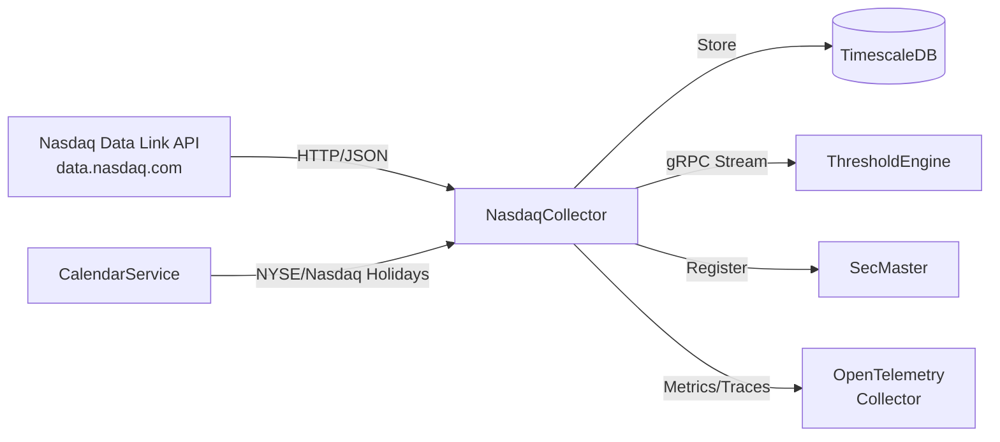

# NasdaqCollector

Collector service for financial time-series data from Nasdaq Data Link API.

## Overview

NasdaqCollector ingests daily financial data from Nasdaq Data Link (formerly Quandl). Configured series are collected automatically on a 6-hour schedule, respecting NYSE/Nasdaq market holidays via CalendarService integration. Data is stored in TimescaleDB and streamed in real-time via gRPC to downstream consumers.

**DEPLOYMENT STATUS**: Currently disabled in production. The Nasdaq Data Link WAF blocks datacenter IP addresses. Service is awaiting IP whitelist approval from Nasdaq support.

## Architecture



## Features

- **Configurable Series**: Dynamically add/remove datasets via admin API
- **Market-Aware Scheduling**: Skips collection on NYSE/Nasdaq holidays using CalendarService
- **Resilient Collection**: Automatic retries with exponential backoff
- **Event Streaming**: Real-time gRPC stream of new observations to ThresholdEngine
- **SecMaster Integration**: Automatic instrument registration via gRPC
- **Efficient Storage**: TimescaleDB hypertables for time-series data
- **Full Observability**: OpenTelemetry traces, metrics, and structured logs

## Configuration

| Variable | Description | Default |
|----------|-------------|---------|
| `ConnectionStrings__AtlasDb` | PostgreSQL/TimescaleDB connection | **Required** |
| `Nasdaq__ApiKey` | Nasdaq Data Link API key | **Required** |
| `OpenTelemetry__OtlpEndpoint` | OTLP collector endpoint | `http://otel-collector:4317` |
| `OpenTelemetry__ServiceName` | Service name for telemetry | `nasdaq-collector` |
| `SECMASTER_GRPC_ENDPOINT` | SecMaster gRPC endpoint | `http://secmaster:8080` |

## API Endpoints

### REST API

| Endpoint | Method | Description |
|----------|--------|-------------|
| `/api/series` | GET | List all active series |
| `/api/series/{seriesId}` | GET | Get specific series details |
| `/api/series/{seriesId}/observations` | GET | Get observations (query: startDate, endDate, limit) |
| `/api/series/{seriesId}/latest` | GET | Get latest observation |
| `/api/search` | GET | Search local series for SecMaster gateway (query: q, limit) |
| `/api/discover` | GET | Search upstream Nasdaq Data Link API (query: q, limit) |
| `/api/health` | GET | Health check |
| `/health` | GET | Full health check with database status |
| `/health/ready` | GET | Readiness check (DB connected) |
| `/health/live` | GET | Liveness probe |

### Admin API

| Endpoint | Method | Description |
|----------|--------|-------------|
| `/api/admin/series` | GET | List all configured series |
| `/api/admin/series` | POST | Add new series (body: {databaseCode, datasetCode, title, category, valueColumn, priority}) |
| `/api/admin/series/{seriesId}/toggle` | PUT | Enable/disable series |
| `/api/admin/series/{seriesId}` | DELETE | Delete series |

### gRPC API

**Service**: `ObservationEventStream`

| Method | Description |
|--------|-------------|
| `SubscribeToEvents` | Real-time stream of events (long-lived connection) |
| `GetEventsSince` | Retrieve events since a timestamp |
| `GetEventsBetween` | Retrieve events in a time range |
| `GetLatestEventTime` | Get timestamp of most recent event |
| `GetHealth` | Health check with event statistics |

## Project Structure

```
NasdaqCollector/
├── src/
│   ├── Data/                   # EF Core DbContext and configurations
│   ├── Grpc/                   # gRPC services and event repository
│   ├── Interfaces/             # Service interfaces
│   ├── Models/                 # Domain models (NasdaqSeries, NasdaqObservation)
│   ├── Services/               # Collection and management services
│   ├── Workers/                # Background collection worker
│   ├── Telemetry/              # OpenTelemetry metrics and activity sources
│   ├── NasdaqApiClient.cs      # Nasdaq Data Link API client
│   ├── NasdaqRepository.cs     # Data access layer
│   └── Program.cs              # Application startup
├── tests/
│   └── NasdaqCollector.UnitTests/
└── .devcontainer/              # VS Code dev container
```

## Development

### Using Dev Container

```bash
# Open in VS Code and select "Reopen in Container"
cd /workspace/NasdaqCollector/src
dotnet run
```

### Compile

```bash
.devcontainer/compile.sh
```

### Build Container Image

```bash
.devcontainer/build.sh
```

## Deployment

```bash
ansible-playbook playbooks/deploy.yml --tags nasdaq-collector
```

Note: Service is currently disabled in compose.yaml. Uncomment when IP whitelist is approved.

## Ports

| Port | Type | Description |
|------|------|-------------|
| 5004 | HTTP (container) | REST API, health checks |
| 5005 | HTTP/2 (container) | gRPC event stream |
| 5008 | Host | Mapped to container port 5004 |
| 5009 | Host | Mapped to container port 5005 |

## See Also

- [ThresholdEngine](../ThresholdEngine/README.md) - Consumes observation events
- [SecMaster](../SecMaster/README.md) - Instrument registration
- [CalendarService](../CalendarService/README.md) - Market calendar provider
- [Events](../Events/README.md) - Shared gRPC event contracts
