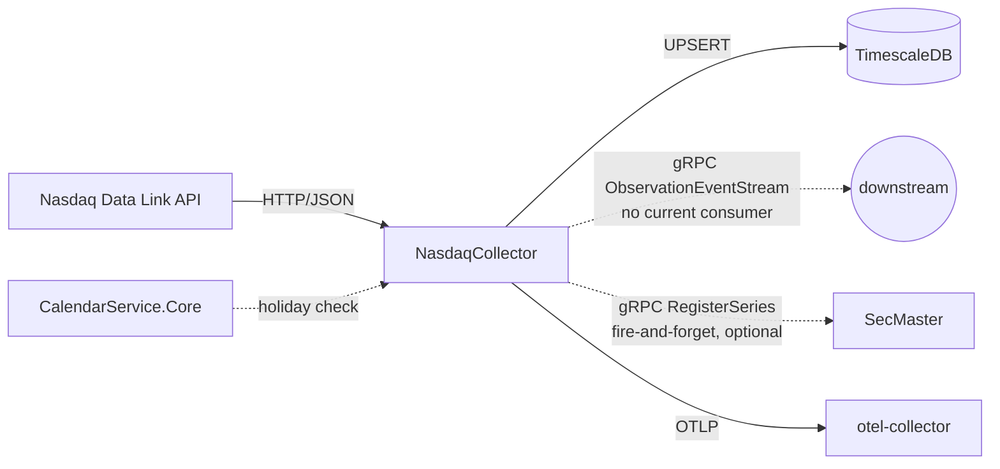

# NasdaqCollector

Collector service for financial time-series data from Nasdaq Data Link API.

> **Agents:** read **[AGENT_README.md](AGENT_README.md)** first — the dense architecture card.

## Overview

NasdaqCollector ingests daily financial data from Nasdaq Data Link (formerly Quandl). Configured series are collected on a 6-hour schedule, skipping NYSE/Nasdaq market holidays via `CalendarService.Core`. Observations are stored in TimescaleDB; an `ObservationEventStream` gRPC service is exposed for downstream consumers.

**Deployment status**: Disabled in production. The Nasdaq Data Link WAF blocks datacenter IP addresses; the service entry in `/opt/ai-inference/compose.yaml` is commented out pending IP whitelist approval. No production gRPC consumer is currently wired.

## Architecture


```mermaid
flowchart LR
    NDL[Nasdaq Data Link API] -->|HTTP/JSON| NC[NasdaqCollector]
    CAL[CalendarService.Core] -.->|holiday check| NC
    NC -->|UPSERT| DB[(TimescaleDB)]
    NC -.->|gRPC ObservationEventStream<br/>no current consumer| Consumer((downstream))
    NC -.->|gRPC RegisterSeries<br/>fire-and-forget, optional| SM[SecMaster]
    NC -->|OTLP| OTEL[otel-collector]
```

`CollectionWorker` (`src/Workers/CollectionWorker.cs`) runs once on startup then on a 6-hour `PeriodicTimer`. Each cycle calls `CalendarService.Core` to skip market holidays, then iterates active series, fetching observations via `NasdaqApiClient` and upserting through `NasdaqRepository`. SecMaster registration happens on series add (admin POST) only, never per-observation, and only if `SECMASTER_GRPC_ENDPOINT` is configured.

## Features

- **Configurable Series**: Add/remove/toggle datasets via admin REST API
- **Market-Aware Scheduling**: Skips collection on NYSE/Nasdaq holidays via `CalendarService.Core` (computational, no service call)
- **Resilient Collection**: `NasdaqApiClient` retries `HttpRequestException` up to `MaxRetries` times with `RetryDelay` between attempts (defaults: 3 retries, 2s delay)
- **Event Stream**: `ObservationEventStream` gRPC service exposes historical and live event streaming
- **SecMaster Registration**: Optional fire-and-forget registration on series add, only when `SECMASTER_GRPC_ENDPOINT` is set
- **Upstream Discovery**: `GET /api/discover` proxies the Nasdaq Data Link `/datasets.json` search endpoint
- **Observability**: OpenTelemetry traces + metrics (OTLP/gRPC), structured Serilog logs (compact JSON to stdout + OTLP)

## Configuration

Configuration binds from `appsettings.json` and environment variables (double-underscore separator for nested keys).

| Variable | Description | Default |
|----------|-------------|---------|
| `ConnectionStrings__AtlasDb` | TimescaleDB connection string | **Required** |
| `Nasdaq__ApiKey` | Nasdaq Data Link API key | **Required** |
| `Nasdaq__BaseUrl` | Nasdaq Data Link base URL | `https://data.nasdaq.com/api/v3` |
| `Nasdaq__MaxRetries` | Max HTTP retries on `HttpRequestException` | `3` |
| `Nasdaq__RetryDelay` | Delay between retries (TimeSpan) | `00:00:02` |
| `OpenTelemetry__OtlpEndpoint` | OTLP collector endpoint (gRPC) | `http://otel-collector:4317` |
| `OpenTelemetry__ServiceName` | Service name for telemetry | `nasdaq-collector` |
| `OpenTelemetry__ServiceVersion` | Service version tag | `1.0.0` |
| `SECMASTER_GRPC_ENDPOINT` | SecMaster gRPC endpoint (optional; enables registration on series add) | _(unset)_ |

## API Endpoints

### REST API

| Endpoint | Method | Description |
|----------|--------|-------------|
| `/api/search` | GET | Search local series (query: `q`, `limit` default 20) |
| `/api/discover` | GET | Search upstream Nasdaq Data Link API (query: `q`, `limit` default 20) |
| `/api/health` | GET | Simple health response (status, timestamp, version) |
| `/api/series` | GET | List active series |
| `/api/series/{seriesId}` | GET | Get a specific series |
| `/api/series/{seriesId}/observations` | GET | Get observations (query: `startDate`, `endDate`, `limit` default 100) |
| `/api/series/{seriesId}/latest` | GET | Get latest observation |

### Admin API

| Endpoint | Method | Description |
|----------|--------|-------------|
| `/api/admin/series` | GET | List all configured series (active and inactive) |
| `/api/admin/series` | POST | Add new series (body: `databaseCode`, `datasetCode`, optional `title`, `category`, `valueColumn`, `priority`) |
| `/api/admin/series/{seriesId}/toggle` | PUT | Toggle `IsActive` flag |
| `/api/admin/series/{seriesId}` | DELETE | Delete series |

### Health Checks

| Endpoint | Description |
|----------|-------------|
| `/health` | Full health check with `DbContext` check (JSON: status, timestamp, checks[]) |
| `/health/ready` | Readiness probe (filters checks tagged `ready`; currently DB only) |
| `/health/live` | Liveness probe (always healthy if process responds) |

### gRPC Service: `ATLAS.Events.Grpc.ObservationEventStream`

Defined in `Events/src/Events/Protos/observation_events.proto`, implemented by `src/Grpc/Services/EventStreamService.cs`.

| Method | Description |
|--------|-------------|
| `SubscribeToEvents` | Long-lived server stream; replays history from `StartFrom`, then polls (1s interval) for new events |
| `GetEventsSince` | Server stream of events since a timestamp (with optional `Limit`) |
| `GetEventsBetween` | Server stream of events in a time range (with optional `Limit`) |
| `GetLatestEventTime` | Returns timestamp of most recent event |
| `GetHealth` | Returns event totals, latest event time, per-type counts |

## Project Structure

```
NasdaqCollector/
├── Containerfile             # Multi-stage container build (build → development → runtime)
├── migrations/               # Initial SQL schema (legacy; EF migrations not yet wired)
├── src/
│   ├── Data/                 # NasdaqDbContext + EF entity configurations
│   ├── Grpc/
│   │   ├── Services/         # EventStreamService (ObservationEventStream impl)
│   │   └── Repositories/     # EventRepository for event hydration
│   ├── Interfaces/           # Service + repository contracts
│   ├── Models/               # NasdaqSeries, NasdaqObservation, DatasetSearchResult
│   ├── Services/             # NasdaqCollectionService, SeriesManagementService, MarketCalendarAdapter
│   ├── Workers/              # CollectionWorker (6h PeriodicTimer)
│   ├── Telemetry/            # NasdaqActivitySource, NasdaqMeter
│   ├── NasdaqApiClient.cs    # Nasdaq Data Link HTTP client (+ NasdaqApiClientOptions)
│   ├── NasdaqRepository.cs   # EF-based repository
│   ├── Worker.cs             # (unused legacy worker file)
│   └── Program.cs            # Startup, DI, minimal-API endpoints, gRPC mapping
├── tests/
│   ├── NasdaqCollector.UnitTests.csproj
│   └── NasdaqCollector.IntegrationTests/
└── .devcontainer/            # Dev container compose + compile.sh + build.sh
```

Note: REST endpoints are defined inline in `Program.cs` via `MapGroup("/api")` and `MapGroup("/api/admin")`; there is no `Endpoints/` directory.

## Development

### Prerequisites

- VS Code with Dev Containers extension
- Shared infrastructure on the `ai-inference` network (TimescaleDB, otel-collector)
- Valid `Nasdaq__ApiKey` (or accept that API calls will 401)

### Getting Started

1. Open in VS Code: `code NasdaqCollector/`
2. Reopen in Container (Cmd/Ctrl+Shift+P → "Dev Containers: Reopen in Container")
3. Build: `dotnet build src/`
4. Run: `dotnet run --project src/`

### Compile + Test

```bash
./.devcontainer/compile.sh                  # build + unit tests
./.devcontainer/compile.sh --no-test        # build only
./.devcontainer/compile.sh --integration    # build + unit + integration (requires DB)
```

### Build Container Image

```bash
./.devcontainer/build.sh                    # build with cache
./.devcontainer/build.sh --no-cache         # clean rebuild
```

Image tag: `nasdaq-collector:latest`. Build context is the monorepo root (`/home/james/ATLAS`); the Containerfile copies `NasdaqCollector/`, `Events/`, and `CalendarService/src/Core/`.

## Deployment

```bash
cd deployment/ansible
ansible-playbook -i inventory/hosts.yml playbooks/deploy.yml --tags nasdaq-collector
```

The service block in `/opt/ai-inference/compose.yaml` is commented out. Uncomment in `deployment/artifacts/compose.yaml.j2` and re-run the playbook when the upstream WAF whitelist is granted.

## Ports

| Port | Protocol | Context | Description |
|------|----------|---------|-------------|
| 5004 | HTTP | Dev (Kestrel) | REST API + health (per `appsettings.json` `Kestrel:Endpoints:Http`) |
| 5005 | HTTP/2 | Dev (Kestrel) | gRPC `ObservationEventStream` (per `appsettings.json` `Kestrel:Endpoints:Grpc`) |
| 8080 | HTTP | Container (prod) | REST API + health (per `Containerfile` `ASPNETCORE_URLS`) |
| 5009 | HTTP/2 | Container (prod) | gRPC `ObservationEventStream` (per `Containerfile` `ASPNETCORE_URLS` + `EXPOSE`) |

Note: the (currently commented-out) prod block in `/opt/ai-inference/compose.yaml` maps host `5008→container 5004` and `5009→container 5005`, which does not match the runtime image's `ASPNETCORE_URLS=http://+:8080;http://+:5009`. The mapping needs to be reconciled before the service is re-enabled.

## See Also

- [CalendarService](../CalendarService/README.md) - Market holiday calendar (`CalendarService.Core`, computational)
- [SecMaster](../SecMaster/README.md) - Optional instrument registry (registration on series add)
- [Events](../Events/README.md) - Shared gRPC event contracts (`ObservationEventStream`)
- [ThresholdEngine](../ThresholdEngine/README.md) - Potential downstream consumer (not currently wired to this collector)
