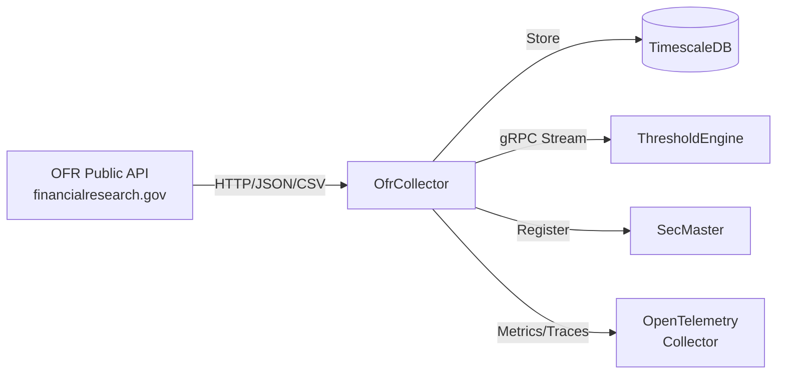

# OfrCollector

Data collector service for Office of Financial Research (OFR) public datasets.

## Overview

OfrCollector collects FSI, STFM, and HFM financial data from the OFR public APIs on scheduled intervals. Data is stored in TimescaleDB and exposed via REST and gRPC APIs for downstream consumption by ThresholdEngine and other services.

## Architecture



## Features

- Multi-source Collection: FSI, STFM, and HFM data from OFR public APIs
- Scheduled Collection: Automated collection with configurable intervals per dataset
- Admin API: Series management and manual collection triggers
- gRPC Streaming: Real-time observation events to downstream services
- SecMaster Integration: Automatic instrument registration via gRPC
- Full Observability: Distributed tracing and metrics with OTLP export

## Data Sources

### FSI - Financial Stress Index

Composite measure of stress in global financial markets. Single daily value with regional and category breakdowns.

- Collection: Daily at 10:00 UTC
- Frequency: Daily
- API: CSV-based

### STFM - Short-term Funding Monitor

Money market and repo rate data across multiple datasets:

- FNYR: NY Fed Reference Rates (SOFR, EFFR, OBFR)
- Repo: U.S. Repo Markets (DVP, GCF rates and volumes)
- MMF: U.S. Money Market Funds (N-MFP holdings)
- NYPD: Primary Dealer Statistics
- TYLD: Treasury Constant Maturity Rates

Collection: Varies by dataset (8h-24h intervals)
Frequency: Daily
API: JSON REST API

### HFM - Hedge Fund Monitor

Hedge fund leverage and risk metrics:

- FPF: Form PF Aggregates (leverage, liquidity, stress tests)
- FICC: FICC Sponsored Repo

Collection: Daily at 17:00 UTC
Frequency: Quarterly
API: JSON REST API

## Configuration

| Variable | Description | Default |
|----------|-------------|---------|
| `ConnectionStrings__AtlasDb` | PostgreSQL connection string | **Required** |
| `OpenTelemetry__OtlpEndpoint` | OTLP collector endpoint | `http://otel-collector:4317` |
| `OpenTelemetry__ServiceName` | Service name | `ofr-collector` |
| `OpenTelemetry__ServiceVersion` | Service version | `1.0.0` |
| `SECMASTER_GRPC_ENDPOINT` | SecMaster gRPC endpoint | `http://secmaster:8080` |

## API Endpoints

### REST API

**FSI**

| Endpoint | Method | Description |
|----------|--------|-------------|
| `/api/fsi/latest` | GET | Latest FSI value |
| `/api/fsi/history` | GET | Historical FSI data (query: startDate, endDate, limit) |

**STFM**

| Endpoint | Method | Description |
|----------|--------|-------------|
| `/api/stfm/series` | GET | List active STFM series |
| `/api/stfm/{mnemonic}/latest` | GET | Latest observation for series |
| `/api/stfm/{mnemonic}/observations` | GET | Series observations (query: startDate, endDate, limit) |

**HFM**

| Endpoint | Method | Description |
|----------|--------|-------------|
| `/api/hfm/series` | GET | List active HFM series |
| `/api/hfm/{mnemonic}/latest` | GET | Latest observation for series |
| `/api/hfm/{mnemonic}/observations` | GET | Series observations (query: startDate, endDate, limit) |

**Metadata**

| Endpoint | Method | Description |
|----------|--------|-------------|
| `/api/categories` | GET | List available data categories |
| `/api/health` | GET | Service health |

### Admin API

**Collection Triggers**

| Endpoint | Method | Description |
|----------|--------|-------------|
| `/api/admin/fsi/collect` | POST | Trigger FSI collection |
| `/api/admin/fsi/backfill` | POST | Backfill FSI history (query: months) |
| `/api/admin/stfm/{dataset}/collect` | POST | Trigger STFM dataset collection |
| `/api/admin/stfm/priority/collect` | POST | Collect priority STFM series |
| `/api/admin/hfm/{dataset}/collect` | POST | Trigger HFM dataset collection |
| `/api/admin/hfm/all/collect` | POST | Collect all HFM datasets |

**STFM Series Management**

| Endpoint | Method | Description |
|----------|--------|-------------|
| `/api/admin/stfm/series` | GET | List all STFM series |
| `/api/admin/stfm/series` | POST | Add new STFM series |
| `/api/admin/stfm/series/{mnemonic}/toggle` | PUT | Toggle series active status |
| `/api/admin/stfm/series/{mnemonic}` | DELETE | Delete series |
| `/api/admin/stfm/series/{mnemonic}/collect` | POST | Collect specific series |
| `/api/admin/stfm/series/{mnemonic}/backfill` | POST | Backfill series history |

**HFM Series Management**

| Endpoint | Method | Description |
|----------|--------|-------------|
| `/api/admin/hfm/series` | GET | List all HFM series |
| `/api/admin/hfm/series` | POST | Add new HFM series |
| `/api/admin/hfm/series/{mnemonic}/toggle` | PUT | Toggle series active status |
| `/api/admin/hfm/series/{mnemonic}` | DELETE | Delete series |
| `/api/admin/hfm/series/{mnemonic}/collect` | POST | Collect specific series |
| `/api/admin/hfm/series/{mnemonic}/backfill` | POST | Backfill series history |

### Health Checks

| Endpoint | Description |
|----------|-------------|
| `/health` | Full health check with database status |
| `/health/ready` | Readiness probe (includes database check) |
| `/health/live` | Liveness probe (always healthy) |

### gRPC API

**Service**: `ObservationEventStream`

| Method | Description |
|--------|-------------|
| `SubscribeToEvents` | Stream observation events to subscribers in real-time |

## Project Structure

```
OfrCollector/
├── src/
│   ├── Api/                    # OFR API clients (FSI, STFM, HFM)
│   ├── Data/                   # EF Core DbContext and configurations
│   ├── Endpoints/              # REST API endpoints
│   ├── Grpc/                   # gRPC services and repositories
│   ├── HealthChecks/           # Database health check
│   ├── Models/                 # Domain models
│   ├── Services/               # Collection and management services
│   ├── Telemetry/              # OpenTelemetry metrics and activity sources
│   ├── Workers/                # Background collection workers
│   └── Program.cs              # Application entry point
├── config/
│   └── stfm_series.json        # Priority STFM series configuration
└── .devcontainer/              # VS Code dev container
```

## Development

### Using Dev Container

```bash
# Open in VS Code and select "Reopen in Container"
cd /workspace/OfrCollector/src
dotnet run
```

### Compile

```bash
.devcontainer/compile.sh
```

### Build Container Image

```bash
.devcontainer/build.sh
```

## Deployment

```bash
ansible-playbook playbooks/deploy.yml --tags ofr-collector
```

## Ports

| Port | Type | Description |
|------|------|-------------|
| 8080 | HTTP (container) | REST API, health checks |
| 5001 | HTTP/2 (container) | gRPC event stream |
| 5016 | Host | Mapped to container port 8080 |

## See Also

- [ThresholdEngine](../ThresholdEngine/README.md) - Consumes observation events
- [SecMaster](../SecMaster/README.md) - Instrument registration
- [Events](../Events/README.md) - Shared gRPC event contracts
- [OfrCollectorMcp](../OfrCollectorMcp/README.md) - MCP server for AI assistants
