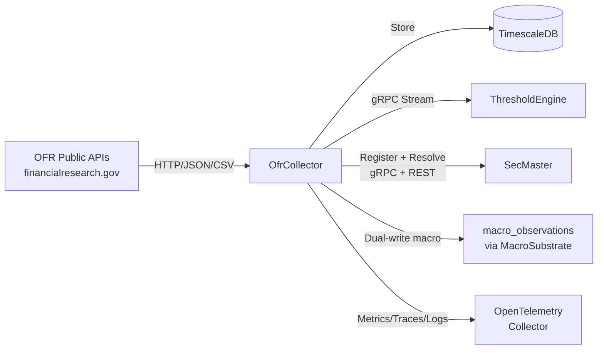

# OfrCollector

Data collector service for Office of Financial Research (OFR) public datasets.

> **Agents:** read **[AGENT_README.md](AGENT_README.md)** first — the dense architecture card.

## Overview

OfrCollector retrieves financial stress and funding market data from the OFR public APIs (FSI, STFM, HFM) and stores them in TimescaleDB. It handles scheduled collection, backfill, and exposes data via REST API and gRPC event streams for downstream consumption by ThresholdEngine.

## Architecture


```mermaid
flowchart LR
    OFR[OFR Public APIs<br/>financialresearch.gov] -->|HTTP/JSON/CSV| OC[OfrCollector]
    OC -->|Store| DB[(TimescaleDB)]
    OC -->|gRPC Stream| TE[ThresholdEngine]
    OC -->|Register + Resolve<br/>gRPC + REST| SM[SecMaster]
    OC -->|Dual-write macro| MS[macro_observations<br/>via MacroSubstrate]
    OC -->|Metrics/Traces/Logs| OTEL[OpenTelemetry<br/>Collector]
```

The service pulls data from three OFR sources (FSI via CSV, STFM and HFM via JSON API), persists observations in TimescaleDB, and streams events to ThresholdEngine over gRPC. New instruments are registered with SecMaster on discovery; the signal-identity tagger periodically resolves mnemonics against SecMaster's REST surface. Series flagged `is_macro` are dual-written to the shared `macro_observations` substrate.

Schema is owned by `src/Data/Migrations/` (EF Core) — backed by entities in `src/Data/Entities/`: `FsiEntity` (top-level FSI), `StfmSeriesEntity` / `StfmObservationEntity` (Short-term Funding Monitor), `HfmSeriesEntity` / `HfmObservationEntity` (Hedge Fund Monitor), and `CollectionLogEntity` (per-run audit trail). The current STFM and HFM series rows carry two tags from the Epic 1 / Epic 3 schema additions: `SignalIdentityId` (+ `SignalIdentityResolvedAt`) — the SecMaster signal-identity link populated when a mnemonic appears as an alias in the seeded catalog — and `IsMacro` — the routing predicate for the shared `macro_observations` substrate dual-write (see below). Both default null/false so the underlying migrations are additive.

### Series classification: macro vs. instrument-attributed

`ofr_hfm_series.is_macro` and `ofr_stfm_series.is_macro` control whether a series dual-writes observations into the shared `macro_observations` substrate (owned by `MacroSubstrate/`). When the flag is `true`, every collected observation is also written to `macro_observations` with provenance `(source_collector="ofr", source_id=<mnemonic>, observation_time)`; the write is idempotent on that triple, so re-running a collection cycle does not double-write. The legacy `ofr_hfm_observations` / `ofr_stfm_observations` write paths are unchanged — the substrate write is additive.

Series default to `is_macro = false`. Pure macro series (e.g. STFM's `repo-funding-volume`, HFM's `hf-aum-net-flow`) opt in:

```sql
UPDATE ofr_hfm_series SET is_macro = true WHERE mnemonic = 'hf-aum-net-flow';
UPDATE ofr_stfm_series SET is_macro = true WHERE mnemonic = 'repo-funding-volume';
```

Instrument-attributed series (those resolved to a SecMaster signal-identity that represents a specific instrument rather than a macro indicator) stay `is_macro = false`; the per-series signal-identity remains authoritative for that path. FSI is excluded from this slice — its top-level aggregate plus contribution columns don't fit the per-mnemonic observation shape `macro_observations` expects.

### Series seed catalog

The canonical STFM and HFM catalog ships as embedded JSON resources at `src/SeriesSeed/{stfm,hfm}-series.json` (`OfrCollector.csproj` declares `<EmbeddedResource Include="SeriesSeed\*.json" />`). On startup, `OfrSeriesDbSeeder` (invoked from `Program.cs` after `MigrateAsync`) upserts any missing mnemonics from those resources; operator-added rows and operator edits survive a restart. Startup fails fast if both series tables are still empty after the seed pass. There is no on-disk config directory and no `SeriesConfig__Directory` environment variable.

## Features

- **Multi-source Collection**: FSI (Financial Stress Index, CSV), STFM (Short-term Funding Monitor, JSON), HFM (Hedge Fund Monitor, JSON)
- **Scheduled Collection**: Background workers per dataset (`FsiCollectionWorker`, `StfmCollectionWorker`, `HfmCollectionWorker`)
- **Backfill**: Fill historical data gaps on-demand with date range control (FSI: months; per-series: start/end dates)
- **Event Streaming**: gRPC `ObservationEventStream` for downstream consumers (ThresholdEngine)
- **Series Management**: Admin API to add, list, delete, toggle, collect, and backfill individual STFM/HFM series
- **Search API**: Keyword search across STFM, HFM, and (heuristically) FSI
- **SecMaster Integration**: Instrument registration via gRPC (fire-and-forget) plus signal-identity tagging via SecMaster REST (`OfrSeriesSignalIdentityTagBackgroundService`, periodic)
- **MacroSubstrate Dual-Write**: Series tagged `is_macro = true` are also written to the shared `macro_observations` table via `MacroObservationDualWriter`
- **Resilience**: Polly retry (3x exponential), circuit breaker (5 failures / 60s break), and 30s timeout policies on all OFR HTTP clients
- **Observability**: OpenTelemetry traces + metrics (OTLP/gRPC), Serilog with span enrichment, OTLP log export

## Configuration

| Variable | Description | Default |
|----------|-------------|---------|
| `ConnectionStrings__AtlasDb` | PostgreSQL/TimescaleDB connection string | **Required** |
| `OpenTelemetry__OtlpEndpoint` | OTLP collector endpoint (gRPC) | `http://otel-collector:4317` |
| `OpenTelemetry__ServiceName` | Service name for telemetry | `ofr-collector-service` |
| `OpenTelemetry__ServiceVersion` | Service version for telemetry | `1.0.0` |
| `SECMASTER_GRPC_ENDPOINT` | SecMaster gRPC endpoint for instrument registration. Optional — registration disabled when unset. | _(unset)_ |
| `SECMASTER_REST_ENDPOINT` | SecMaster REST base URL for signal-identity tagging. Optional — `OfrSeriesSignalIdentityTagBackgroundService` is not registered when unset; resolver/tagger no-op. | _(unset)_ |
| `SignalIdentityTagging__Enabled` | Master switch for the periodic signal-identity tagging pass. | `true` |
| `SignalIdentityTagging__EnabledOnStartup` | Run an initial tagging pass on service startup. | `true` |
| `SignalIdentityTagging__RefreshIntervalHours` | Interval between periodic tagging passes. | `24` |
| `SignalIdentityTagging__MaxBatchSize` | Per-cycle cap on series tagged (HFM + STFM combined). | `200` |
| `Kestrel__HttpPort` | HTTP/1.1 listener port (REST + health) | `8080` |
| `Kestrel__GrpcPort` | HTTP/2 listener port (gRPC) | `5001` |

Configuration keys may also be expressed with `:` (e.g. `OpenTelemetry:OtlpEndpoint`) per standard .NET configuration binding; the production compose file uses the `__` form.

## API Endpoints

REST surface lives in `src/Endpoints/`:

- **ApiEndpoints** (`ApiEndpoints.cs`) — public read APIs (`/api/fsi/*`, `/api/stfm/*`, `/api/hfm/*`, `/api/categories`, `/api/search`, `/api/health`).
- **AdminEndpoints** (`AdminEndpoints.cs`) — collection / backfill / series-management surface (`/api/admin/*`).

### REST API (Port 8080)

| Endpoint | Method | Description |
|----------|--------|-------------|
| `/api/fsi/latest` | GET | Get latest FSI value (composite + all contribution columns) |
| `/api/fsi/history` | GET | Get FSI history (query: `startDate`, `endDate`, `limit`; defaults: last year, 100 rows) |
| `/api/stfm/series` | GET | List active STFM series |
| `/api/stfm/{mnemonic}/latest` | GET | Get latest STFM observation |
| `/api/stfm/{mnemonic}/observations` | GET | Get STFM observations (query: `startDate`, `endDate`, `limit`) |
| `/api/hfm/series` | GET | List active HFM series |
| `/api/hfm/{mnemonic}/latest` | GET | Get latest HFM observation |
| `/api/hfm/{mnemonic}/observations` | GET | Get HFM observations (query: `startDate`, `endDate`, `limit`) |
| `/api/categories` | GET | List available data categories (fsi, stfm, hfm) |
| `/api/search` | GET | Search across OFR series (query: `q`, optional `type` ∈ {`fsi`,`stfm`,`hfm`}, `limit`) |
| `/api/health` | GET | Lightweight health echo (no dependency probes) |

### Admin API (Port 8080)

| Endpoint | Method | Description |
|----------|--------|-------------|
| `/api/admin/fsi/collect` | POST | Trigger immediate FSI collection (queued; returns immediately) |
| `/api/admin/fsi/backfill` | POST | Backfill FSI history (query: `months`, clamped 1-120) |
| `/api/admin/stfm/{dataset}/collect` | POST | Trigger STFM dataset collection. `dataset` ∈ {`Fnyr`,`Repo`,`Mmf`,`Nypd`,`Tyld`} (case-insensitive) |
| `/api/admin/stfm/series` | GET | List all STFM series |
| `/api/admin/stfm/series` | POST | Add a new STFM series (body: `{mnemonic, backfill?}`) |
| `/api/admin/stfm/series/{mnemonic}` | DELETE | Delete an STFM series |
| `/api/admin/stfm/series/{mnemonic}/toggle` | PUT | Toggle STFM series active status |
| `/api/admin/stfm/series/{mnemonic}/collect` | POST | Trigger collection for a specific STFM series |
| `/api/admin/stfm/series/{mnemonic}/backfill` | POST | Backfill STFM series (body: `{startDate?, endDate?}`, ISO dates) |
| `/api/admin/hfm/{dataset}/collect` | POST | Trigger HFM dataset collection. `dataset` ∈ {`Fpf`,`Ficc`} (case-insensitive) |
| `/api/admin/hfm/all/collect` | POST | Trigger collection of all HFM datasets |
| `/api/admin/hfm/series` | GET | List all HFM series |
| `/api/admin/hfm/series` | POST | Add a new HFM series (body: `{mnemonic, backfill?}`) |
| `/api/admin/hfm/series/{mnemonic}` | DELETE | Delete an HFM series |
| `/api/admin/hfm/series/{mnemonic}/toggle` | PUT | Toggle HFM series active status |
| `/api/admin/hfm/series/{mnemonic}/collect` | POST | Trigger collection for a specific HFM series |
| `/api/admin/hfm/series/{mnemonic}/backfill` | POST | Backfill HFM series (body: `{startDate?, endDate?}`, ISO dates) |

All "trigger" admin endpoints are fire-and-forget — work is queued via `ThreadPool.QueueUserWorkItem` and the response returns immediately. Watch the structured logs for outcome.

### Health Checks

| Endpoint | Description |
|----------|-------------|
| `/health` | Full health report (JSON) including `database` check |
| `/health/ready` | Readiness probe — only checks marked `ready` (currently: `database`) |
| `/health/live` | Liveness probe — always healthy (process up) |

### gRPC Services (Port 5001)

Service: `atlas.events.ObservationEventStream` (defined in `Events/src/Events/Protos/observation_events.proto`).

| Method | Description |
|--------|-------------|
| `SubscribeToEvents` | Long-running server-stream: replays events since `start_from`, then polls for new events at 100 ms intervals |
| `GetEventsSince` | Bounded server-stream: events since `from` (defaults to 24h ago) |
| `GetEventsBetween` | Bounded server-stream: events in `[from, to]` (currently delegates to `GetEventsSince`) |
| `GetLatestEventTime` | Returns `now()` as the latest event timestamp (placeholder) |
| `GetHealth` | gRPC health response (`healthy=true`) |

gRPC reflection is enabled. FSI events are fanned out into one event per composite + per non-null contribution column (`OFR_FSI`, `OFR_FSI_CREDIT`, `OFR_FSI_FUNDING`, `OFR_FSI_VOLATILITY`, `OFR_FSI_EQUITY`, `OFR_FSI_SAFE_ASSETS`, `OFR_FSI_US`, `OFR_FSI_AE`, `OFR_FSI_EM`).

## Project Structure

```
OfrCollector/
├── src/
│   ├── Api/                    # OFR API clients (FsiCsvClient, StfmApiClient, HfmApiClient) + ResponseModels/
│   ├── Data/
│   │   ├── Entities/           # 6 entities: Fsi, Stfm{Series,Observation}, Hfm{Series,Observation}, CollectionLog
│   │   ├── Migrations/         # EF migrations (baseline + precision bumps + as-of column + SignalIdentity tag + IsMacro)
│   │   ├── Repositories/       # IOfrRepository + OfrRepository
│   │   ├── OfrCollectorDbContext.cs
│   │   ├── OfrCollectorDbContextFactory.cs
│   │   └── OfrSeriesDbSeeder.cs   # startup seeder, reads embedded SeriesSeed/*.json
│   ├── Endpoints/              # ApiEndpoints + AdminEndpoints (minimal APIs)
│   ├── Enums/                  # StfmDataset, HfmDataset, FsiCategory, FsiRegion, FsiAlertLevel, Periodicity
│   ├── Grpc/                   # EventStreamService + Repositories/ (IEventRepository, EventRepository)
│   ├── HealthChecks/           # DatabaseHealthCheck
│   ├── Interfaces/             # IOfrSeriesSignalIdentityResolver, IOfrSeriesSignalIdentityTagger
│   ├── Models/                 # Domain models (FSI, STFM, HFM, CollectionLog, SeriesConfiguration, options)
│   ├── SeriesSeed/             # Embedded series-seed JSON (stfm-series.json, hfm-series.json)
│   ├── Services/               # Fsi/Stfm/HfmCollectionService, SeriesManagementService, MacroObservationDualWriter, OfrSeriesSignalIdentityResolver, OfrSeriesSignalIdentityTagger
│   ├── Telemetry/              # OfrActivitySource, OfrMeter
│   ├── Workers/                # FsiCollectionWorker, StfmCollectionWorker, HfmCollectionWorker, OfrSeriesSignalIdentityTagBackgroundService
│   ├── appsettings.json
│   ├── Containerfile
│   ├── DependencyInjection.cs
│   ├── OfrCollector.csproj
│   └── Program.cs
├── tests/
│   ├── OfrCollector.UnitTests.csproj  # unit tests at tests/ root
│   └── OfrCollector.IntegrationTests/ # separate project (Infrastructure, Repositories, MacroSubstrate, Mcp...)
├── migrations/                 # 001_initial_schema.sql — legacy reference only; runtime uses EF migrations
├── mcp/                        # MCP server (separate project, deployed independently)
└── .devcontainer/              # build.sh, compile.sh, compose.yaml, devcontainer.json
```

The Containerfile pulls shared deps from the monorepo (`Events/`, `CalendarService/src/Core/`) at build time — the build context must be the ATLAS repo root.

## Development

### Prerequisites

- VS Code with Dev Containers extension
- Access to shared infrastructure (TimescaleDB, observability stack)

### Getting Started

1. Open in VS Code: `code OfrCollector/`
2. Reopen in Container (Cmd/Ctrl+Shift+P -> "Dev Containers: Reopen in Container")
3. Build: `dotnet build`
4. Run: `cd /workspace/OfrCollector/src && dotnet run`

### Compile

```bash
.devcontainer/compile.sh
```

### Build Container Image

```bash
.devcontainer/build.sh
```

## Deployment

```bash
ansible-playbook playbooks/deploy.yml --tags ofr-collector
```

## Ports

| Port | Type | Description |
|------|------|-------------|
| 8080 | HTTP/1.1 (container) | REST API, admin API, health checks |
| 5001 | HTTP/2 (container) | gRPC `ObservationEventStream` |

No external host port mapping — internal API only. The compose entry (`/opt/ai-inference/compose.yaml`, service `ofr-collector`) depends on `timescaledb` and `secmaster` health.

## See Also

- [ThresholdEngine](../ThresholdEngine/README.md) - Consumes observation events via gRPC
- [SecMaster](../SecMaster/README.md) - Instrument registration (gRPC) + signal-identity resolution (REST)
- `MacroSubstrate/` - Shared `macro_observations` substrate (dual-write target; no README yet)
- [Events](../Events/README.md) - Shared gRPC event contracts (`observation_events.proto`)
- [OfrMcp](./mcp/README.md) - MCP server for AI assistants
