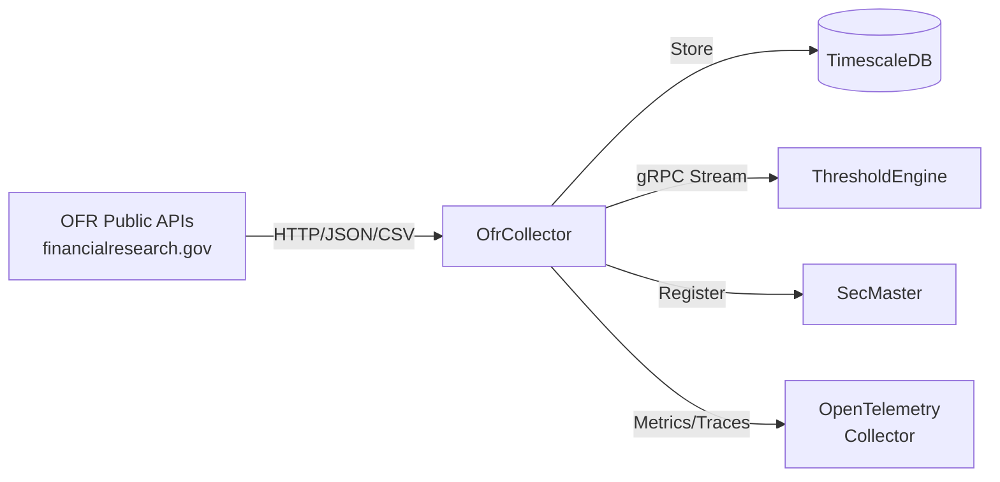

# OfrCollector

Data collector service for Office of Financial Research (OFR) public datasets.

## Overview

OfrCollector retrieves financial stress and funding market data from the OFR public APIs (FSI, STFM, HFM) and stores them in TimescaleDB. It handles scheduled collection, backfill, and exposes data via REST API and gRPC event streams for downstream consumption by ThresholdEngine.

## Architecture


```mermaid
flowchart LR
    OFR[OFR Public APIs<br/>financialresearch.gov] -->|HTTP/JSON/CSV| OC[OfrCollector]
    OC -->|Store| DB[(TimescaleDB)]
    OC -->|gRPC Stream| TE[ThresholdEngine]
    OC -->|Register| SM[SecMaster]
    OC -->|Metrics/Traces| OTEL[OpenTelemetry<br/>Collector]
```

The service pulls data from three OFR sources (FSI via CSV, STFM and HFM via JSON API), persists observations in TimescaleDB, and streams events to ThresholdEngine over gRPC. New instruments are registered with SecMaster on discovery.

Schema is owned by `src/Data/Migrations/` (EF Core) — backed by entities in `src/Data/Entities/`: `FsiEntity` (top-level FSI), `StfmSeriesEntity` / `StfmObservationEntity` (Short-term Funding Monitor), `HfmSeriesEntity` / `HfmObservationEntity` (Hedge Fund Monitor), and `CollectionLogEntity` (per-run audit trail). The most recent migration, `AddSeriesIsMacro`, adds a per-series routing predicate for the shared `macro_observations` substrate (see below).

### Series classification: macro vs. instrument-attributed

`ofr_hfm_series.is_macro` and `ofr_stfm_series.is_macro` control whether a series dual-writes observations into the shared `macro_observations` substrate (owned by `MacroSubstrate/`). When the flag is `true`, every collected observation is also written to `macro_observations` with provenance `(source_collector="ofr", source_id=<mnemonic>, observation_time)`; the write is idempotent on that triple, so re-running a collection cycle does not double-write. The legacy `ofr_hfm_observations` / `ofr_stfm_observations` write paths are unchanged — the substrate write is additive.

Series default to `is_macro = false`. Pure macro series (e.g. STFM's `repo-funding-volume`, HFM's `hf-aum-net-flow`) opt in:

```sql
UPDATE ofr_hfm_series SET is_macro = true WHERE mnemonic = 'hf-aum-net-flow';
UPDATE ofr_stfm_series SET is_macro = true WHERE mnemonic = 'repo-funding-volume';
```

Instrument-attributed series (those resolved to a SecMaster signal-identity that represents a specific instrument rather than a macro indicator) stay `is_macro = false`; the per-series signal-identity remains authoritative for that path. FSI is excluded from this slice — its top-level aggregate plus contribution columns don't fit the per-mnemonic observation shape `macro_observations` expects.

## Features

- **Multi-source Collection**: FSI (Financial Stress Index), STFM (Short-term Funding Monitor), HFM (Hedge Fund Monitor)
- **Scheduled Collection**: Background workers with configurable intervals per dataset
- **Smart Backfill**: Fill historical data gaps on-demand with date range control
- **Event Streaming**: Real-time gRPC streams for downstream consumers (ThresholdEngine)
- **Series Management**: Admin API to add, delete, toggle, and trigger collection per series
- **Search API**: Search across all OFR data types by keyword
- **SecMaster Integration**: Automatic instrument registration via gRPC (fire-and-forget)
- **Resilience**: Polly retry, circuit breaker, and timeout policies on all HTTP clients
- **Full Observability**: OpenTelemetry instrumentation (metrics, traces, logs via OTLP)

## Configuration

| Variable | Description | Default |
|----------|-------------|---------|
| `ConnectionStrings__AtlasDb` | PostgreSQL/TimescaleDB connection string | **Required** |
| `OpenTelemetry:OtlpEndpoint` (a.k.a. `OpenTelemetry__OtlpEndpoint`) | OTLP collector endpoint | `http://otel-collector:4317` |
| `OpenTelemetry:ServiceName` (a.k.a. `OpenTelemetry__ServiceName`) | Service name for telemetry | `ofr-collector-service` |
| `OpenTelemetry:ServiceVersion` (a.k.a. `OpenTelemetry__ServiceVersion`) | Service version for telemetry | `1.0.0` |
| `SECMASTER_GRPC_ENDPOINT` | SecMaster gRPC endpoint (optional) | - |
| `SeriesConfig__Directory` | Directory for series config files | `/app/config` |
| `Kestrel__HttpPort` | HTTP listener port | `8080` |
| `Kestrel__GrpcPort` | gRPC listener port | `5001` |

## API Endpoints

REST surface lives in `src/Endpoints/`:

- **ApiEndpoints** — public read APIs (`/api/fsi/*`, `/api/stfm/*`, `/api/hfm/*`, `/api/categories`, `/api/search`).
- **AdminEndpoints** — collection / backfill / series-management surface (`/api/admin/*`).

### REST API (Port 8080)

| Endpoint | Method | Description |
|----------|--------|-------------|
| `/api/fsi/latest` | GET | Get latest FSI value |
| `/api/fsi/history` | GET | Get FSI history (query: startDate, endDate, limit) |
| `/api/stfm/series` | GET | List active STFM series |
| `/api/stfm/{mnemonic}/latest` | GET | Get latest STFM observation |
| `/api/stfm/{mnemonic}/observations` | GET | Get STFM observations (query: startDate, endDate, limit) |
| `/api/hfm/series` | GET | List active HFM series |
| `/api/hfm/{mnemonic}/latest` | GET | Get latest HFM observation |
| `/api/hfm/{mnemonic}/observations` | GET | Get HFM observations (query: startDate, endDate, limit) |
| `/api/categories` | GET | List available data categories |
| `/api/search` | GET | Search all OFR data (query: q, type, limit) |
| `/api/health` | GET | Service health |

### Admin API (Port 8080)

| Endpoint | Method | Description |
|----------|--------|-------------|
| `/api/admin/fsi/collect` | POST | Trigger FSI collection |
| `/api/admin/fsi/backfill` | POST | Backfill FSI history (query: months) |
| `/api/admin/stfm/{dataset}/collect` | POST | Trigger STFM dataset collection |
| `/api/admin/stfm/priority/collect` | POST | Trigger priority STFM series collection |
| `/api/admin/stfm/series` | GET/POST | List or add STFM series |
| `/api/admin/stfm/series/{mnemonic}` | DELETE | Delete STFM series |
| `/api/admin/stfm/series/{mnemonic}/toggle` | PUT | Toggle STFM series active status |
| `/api/admin/stfm/series/{mnemonic}/collect` | POST | Collect specific STFM series |
| `/api/admin/stfm/series/{mnemonic}/backfill` | POST | Backfill STFM series history |
| `/api/admin/hfm/{dataset}/collect` | POST | Trigger HFM dataset collection |
| `/api/admin/hfm/all/collect` | POST | Trigger all HFM datasets collection |
| `/api/admin/hfm/series` | GET/POST | List or add HFM series |
| `/api/admin/hfm/series/{mnemonic}` | DELETE | Delete HFM series |
| `/api/admin/hfm/series/{mnemonic}/toggle` | PUT | Toggle HFM series active status |
| `/api/admin/hfm/series/{mnemonic}/collect` | POST | Collect specific HFM series |
| `/api/admin/hfm/series/{mnemonic}/backfill` | POST | Backfill HFM series history |

### Health Checks

| Endpoint | Description |
|----------|-------------|
| `/health` | Full health check with database status |
| `/health/ready` | Readiness probe (includes database check) |
| `/health/live` | Liveness probe (always healthy) |

### gRPC Services (Port 5001)

| Service | Method | Description |
|---------|--------|-------------|
| `ObservationEventStream` | `SubscribeToEvents` | Stream events in real-time (long-running) |
| `ObservationEventStream` | `GetEventsSince` | Replay events from timestamp |
| `ObservationEventStream` | `GetEventsBetween` | Get events in time range |
| `ObservationEventStream` | `GetLatestEventTime` | Get timestamp of latest event |
| `ObservationEventStream` | `GetHealth` | Health check with event statistics |

## Project Structure

```
OfrCollector/
├── src/
│   ├── Api/                    # OFR API clients (FSI CSV, STFM JSON, HFM JSON)
│   ├── Configuration/          # Series configuration provider
│   ├── Data/                   # EF Core DbContext, repositories
│   ├── Endpoints/              # REST API and Admin endpoints
│   ├── Enums/                  # Dataset and category enumerations
│   ├── Grpc/                   # gRPC EventStreamService and repositories
│   ├── HealthChecks/           # Database health check
│   ├── Models/                 # Domain models (FSI, STFM, HFM)
│   ├── Services/               # Collection and series management services
│   ├── Telemetry/              # OpenTelemetry meters and activity sources
│   └── Workers/                # Background collection workers (FSI, STFM, HFM)
├── tests/                      # Unit and integration tests
├── config/                     # Series configuration (stfm-series.json, hfm-series.json)
├── mcp/                        # MCP server for AI assistants
└── .devcontainer/              # Dev container config
```

## Development

### Prerequisites

- VS Code with Dev Containers extension
- Access to shared infrastructure (TimescaleDB, observability stack)

### Getting Started

1. Open in VS Code: `code OfrCollector/`
2. Reopen in Container (Cmd/Ctrl+Shift+P -> "Dev Containers: Reopen in Container")
3. Build: `dotnet build`
4. Run: `cd /workspace/OfrCollector/src && dotnet run`

### Compile

```bash
.devcontainer/compile.sh
```

### Build Container Image

```bash
.devcontainer/build.sh
```

## Deployment

```bash
ansible-playbook playbooks/deploy.yml --tags ofr-collector
```

## Ports

| Port | Type | Description |
|------|------|-------------|
| 8080 | HTTP (container) | REST API, health checks |
| 5001 | HTTP/2 (container) | gRPC event stream |

No external host port mapping -- internal API only.

## See Also

- [ThresholdEngine](../ThresholdEngine/README.md) - Consumes observation events via gRPC
- [SecMaster](../SecMaster/README.md) - Instrument registration
- [Events](../Events/README.md) - Shared gRPC event contracts
- [OfrMcp](./mcp/README.md) - MCP server for AI assistants
