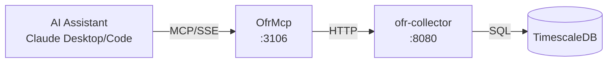

# OfrMcp

MCP server providing Claude Desktop and Claude Code access to OFR financial stress and funding market data.

## Overview

Exposes OfrCollector REST API as MCP tools, enabling AI assistants to query the Financial Stress Index (FSI), Short-term Funding Monitor (STFM), and Hedge Fund Monitor (HFM) data. All data is pre-collected in TimescaleDB for sub-second response times.

## Architecture



## MCP Tools

### FSI Tools (Financial Stress Index)

| Tool | Description | Parameters |
|------|-------------|------------|
| `get_fsi_latest` | Get latest FSI with category/regional breakdowns | None |
| `get_fsi_history` | Get historical FSI observations | `start_date`, `end_date`, `limit` |

FSI breakdowns: Credit, Equity Valuation, Funding, Safe Assets, Volatility (categories); US, Advanced Economies, Emerging Markets (regions).

### STFM Tools (Short-term Funding Monitor)

| Tool | Description | Parameters |
|------|-------------|------------|
| `list_stfm_series` | List all active STFM series | None |
| `get_stfm_latest` | Get latest observation for a series | `mnemonic` |
| `get_stfm_observations` | Get historical observations | `mnemonic`, `start_date`, `end_date`, `limit` |

STFM tracks: Repo rates (DVP, GCF, tri-party), SOFR, T-bill rates, money market fund rates, commercial paper rates.

### HFM Tools (Hedge Fund Monitor)

| Tool | Description | Parameters |
|------|-------------|------------|
| `list_hfm_series` | List all active HFM series | None |
| `get_hfm_latest` | Get latest observation for a series | `mnemonic` |
| `get_hfm_observations` | Get historical observations | `mnemonic`, `start_date`, `end_date`, `limit` |

HFM tracks hedge fund leverage and risk indicators from SEC filings.

### General Tools

| Tool | Description | Parameters |
|------|-------------|------------|
| `categories` | List all available OFR data categories | None |
| `health` | Get OfrCollector service health status | None |

### Admin Tools (Collection Management)

| Tool | Description | Parameters |
|------|-------------|------------|
| `trigger_fsi_collection` | Trigger immediate FSI collection | None |
| `trigger_fsi_backfill` | Trigger FSI historical backfill | `start_date`, `end_date` |
| `trigger_stfm_collection` | Trigger STFM collection | `dataset` (optional) |
| `trigger_hfm_collection` | Trigger HFM collection | `dataset` (optional) |

### Admin Tools (Series Management)

| Tool | Description | Parameters |
|------|-------------|------------|
| `list_stfm_series_admin` | List all STFM series (including inactive) | None |
| `add_stfm_series` | Add new STFM series | `mnemonic`, `backfill` |
| `toggle_stfm_series` | Enable/disable STFM series | `mnemonic` |
| `delete_stfm_series` | Delete STFM series and data | `mnemonic` |
| `trigger_stfm_series_collection` | Trigger collection for specific series | `mnemonic` |
| `trigger_stfm_series_backfill` | Trigger backfill for specific series | `mnemonic`, `start_date`, `end_date` |
| `list_hfm_series_admin` | List all HFM series (including inactive) | None |
| `add_hfm_series` | Add new HFM series | `mnemonic`, `backfill` |
| `toggle_hfm_series` | Enable/disable HFM series | `mnemonic` |
| `delete_hfm_series` | Delete HFM series and data | `mnemonic` |
| `trigger_hfm_series_collection` | Trigger collection for specific series | `mnemonic` |
| `trigger_hfm_series_backfill` | Trigger backfill for specific series | `mnemonic`, `start_date`, `end_date` |

## Configuration

| Variable | Default | Description |
|----------|---------|-------------|
| `OFRCOLLECTOR_API_URL` | `http://ofr-collector:8080` | Backend service URL |
| `OFRCOLLECTOR_MCP_TIMEOUT_SECONDS` | `30` | HTTP request timeout |

### Port Mapping

- Internal: 8080
- External (host): 3106
- SSE endpoint: `http://mercury:3106/sse`

## Project Structure

```
OfrCollector/
├── mcp/
│   ├── README.md
│   ├── Client/
│   │   ├── IOfrCollectorClient.cs    # HTTP client interface
│   │   ├── OfrCollectorClient.cs     # HTTP client implementation
│   │   └── Models/
│   │       └── OfrModels.cs          # API response models
│   ├── Tools/
│   │   └── OfrCollectorTools.cs      # MCP tool definitions
│   ├── Program.cs                    # Application entry point
│   ├── Containerfile                 # Container build definition
│   └── OfrMcp.csproj                 # Project configuration
├── src/                              # Main OfrCollector service
├── tests/                            # Unit tests
└── migrations/                       # Database migrations
```

## Development

### Build
```bash
cd /home/james/ATLAS/OfrCollector/mcp
dotnet build
```

### Build Container
```bash
cd /home/james/ATLAS
nerdctl build -t ofr-mcp:latest -f OfrCollector/mcp/Containerfile .
```

## Deployment

```bash
ansible-playbook playbooks/deploy.yml --tags ofr-mcp
```

## Claude Desktop Integration

Add to `~/.config/Claude/claude_desktop_config.json` (Linux) or `~/Library/Application Support/Claude/claude_desktop_config.json` (macOS):

```json
{
  "mcpServers": {
    "ofr-collector": {
      "command": "uvx",
      "args": ["mcp-proxy", "http://mercury:3106/sse"]
    }
  }
}
```

Claude Desktop uses stdio transport; `mcp-proxy` bridges stdio to SSE.

## Usage Examples

**Check financial stress:**
```
User: "What's the current financial stress level?"
Claude calls: get_fsi_latest()
Response: "FSI at 0.3 (elevated). Credit stress +0.4, driven by EM spreads."
```

**Review repo rates:**
```
User: "Show me repo rates"
Claude calls: get_stfm_latest("REPO-DVP-AR-TOT-P")
Response: "DVP repo rate: 5.32% (up 5bp from last week)"
```

**SOFR history:**
```
User: "What's SOFR been doing?"
Claude calls: get_stfm_observations("SOFR-AVG-30", start_date="2024-12-01")
Response: "30-day avg SOFR ranged 4.85-4.92% in December"
```

## See Also

- [OfrCollector](../README.md) - Backend service documentation
- [Model Context Protocol](https://modelcontextprotocol.io/) - MCP specification
