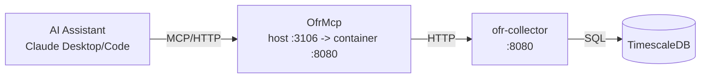

# OfrMcp

MCP server exposing OfrCollector financial stress and funding market data to AI assistants.

## Overview

Wraps the OfrCollector REST API as MCP tools so Claude Desktop and Claude Code can query the Financial Stress Index (FSI), Short-term Funding Monitor (STFM), and Hedge Fund Monitor (HFM) datasets. All observations are pre-collected into TimescaleDB by the backend service, so reads are sub-second.

## Architecture


```mermaid
flowchart LR
    AI[AI Assistant<br/>Claude Desktop/Code] -->|MCP/HTTP| MCP[OfrMcp<br/>host :3106 -> container :8080]
    MCP -->|HTTP| API[ofr-collector<br/>:8080]
    API -->|SQL| DB[(TimescaleDB)]
```

## Features

- **FSI access**: Financial Stress Index with category and regional contribution breakdowns
- **STFM access**: Repo, SOFR, T-bill, money market, and commercial paper rates
- **HFM access**: Hedge fund leverage and risk indicators from SEC filings
- **Admin tools**: Trigger collections, manage series, backfill history
- **MCP streamable HTTP transport** on `/mcp` (single endpoint)

## Configuration

| Variable | Description | Default |
|----------|-------------|---------|
| `OFRCOLLECTOR_API_URL` | Backend OfrCollector base URL | `http://ofr-collector:8080` |
| `OFRCOLLECTOR_MCP_TIMEOUT_SECONDS` | HTTP client timeout (seconds) | `30` |
| `ASPNETCORE_URLS` | Kestrel bind address | `http://+:8080` |

## API Endpoints

The MCP server's public surface is its set of MCP tools, served over streamable HTTP at `POST /mcp`. A plain `GET /health` endpoint is also exposed for container healthchecks.

### FSI Tools (Financial Stress Index)

| Tool | Description | Parameters |
|------|-------------|------------|
| `get_fsi_latest` | Latest FSI observation with category and regional breakdowns | none |
| `get_fsi_history` | Historical FSI observations | `start_date`, `end_date`, `limit` |

FSI breakdowns: Credit, Equity Valuation, Funding, Safe Assets, Volatility (categories); US, Advanced Economies, Emerging Markets (regions).

### STFM Tools (Short-term Funding Monitor)

| Tool | Description | Parameters |
|------|-------------|------------|
| `list_stfm_series` | List all active STFM series | none |
| `get_stfm_latest` | Latest observation for a series | `mnemonic` |
| `get_stfm_observations` | Historical observations | `mnemonic`, `start_date`, `end_date`, `limit` |

### HFM Tools (Hedge Fund Monitor)

| Tool | Description | Parameters |
|------|-------------|------------|
| `list_hfm_series` | List all active HFM series | none |
| `get_hfm_latest` | Latest observation for a series | `mnemonic` |
| `get_hfm_observations` | Historical observations | `mnemonic`, `start_date`, `end_date`, `limit` |

### General Tools

| Tool | Description | Parameters |
|------|-------------|------------|
| `categories` | List all available OFR data categories | none |
| `health` | Get OfrCollector backend health status | none |

### Admin Tools (Collection Management)

| Tool | Description | Parameters |
|------|-------------|------------|
| `trigger_fsi_collection` | Trigger immediate FSI collection | none |
| `trigger_fsi_backfill` | Trigger FSI historical backfill | `start_date` (required), `end_date` |
| `trigger_stfm_collection` | Trigger STFM collection | `dataset` (optional) |
| `trigger_hfm_collection` | Trigger HFM collection | `dataset` (optional) |

### Admin Tools (Series Management)

| Tool | Description | Parameters |
|------|-------------|------------|
| `add_stfm_series` | Add new STFM series (auto-fetches metadata) | `mnemonic`, `backfill` (default true) |
| `toggle_stfm_series` | Enable/disable STFM series | `mnemonic` |
| `delete_stfm_series` | Delete STFM series and observations | `mnemonic` |
| `trigger_stfm_series_collection` | Trigger collection for one STFM series | `mnemonic` |
| `trigger_stfm_series_backfill` | Trigger backfill for one STFM series | `mnemonic`, `start_date`, `end_date` |
| `list_stfm_series_admin` | List all STFM series including inactive | none |
| `add_hfm_series` | Add new HFM series (auto-fetches metadata) | `mnemonic`, `backfill` (default true) |
| `toggle_hfm_series` | Enable/disable HFM series | `mnemonic` |
| `delete_hfm_series` | Delete HFM series and observations | `mnemonic` |
| `trigger_hfm_series_collection` | Trigger collection for one HFM series | `mnemonic` |
| `trigger_hfm_series_backfill` | Trigger backfill for one HFM series | `mnemonic`, `start_date`, `end_date` |
| `list_hfm_series_admin` | List all HFM series including inactive | none |
| `register_stfm_series_secmaster` | (Re-)register an existing STFM series with SecMaster | `mnemonic` |
| `register_hfm_series_secmaster` | (Re-)register an existing HFM series with SecMaster | `mnemonic` |
| `register_fsi_secmaster` | Register all FSI event-stream ids with SecMaster | none |

## Project Structure

```
OfrCollector/
├── mcp/
│   ├── Client/           # HTTP client + DTOs for OfrCollector API
│   ├── Tools/            # MCP tool definitions (OfrCollectorTools.cs)
│   ├── Program.cs        # Entry point: MCP streamable HTTP on /mcp
│   ├── OfrMcp.csproj     # net10.0, ModelContextProtocol.AspNetCore 1.2.0
│   └── Containerfile     # Multi-stage build, non-root runtime
├── src/                  # Backend OfrCollector service
├── tests/                # Backend unit tests
└── migrations/           # EF Core migrations
```

## Development

### Prerequisites
- VS Code with Dev Containers extension
- Access to shared infrastructure (TimescaleDB, observability stack)

### Getting Started

The devcontainer lives at the parent `OfrCollector/` level and covers both the backend service and the MCP project.

1. Open in VS Code: `code OfrCollector/`
2. Reopen in Container (Cmd/Ctrl+Shift+P -> "Dev Containers: Reopen in Container")
3. Build: `dotnet build mcp/OfrMcp.csproj`
4. Run: `dotnet run --project mcp/OfrMcp.csproj`

### Build Container

The container is built by the ansible deploy playbook with the monorepo root as build context:

```bash
cd /home/james/ATLAS
sudo nerdctl build -t ofr-mcp:latest -f OfrCollector/mcp/Containerfile .
```

## Deployment

```bash
cd /home/james/ATLAS
ansible-playbook deployment/ansible/playbooks/deploy.yml --tags ofr-mcp
```

## Ports

| Port | Description |
|------|-------------|
| 8080 | MCP streamable HTTP (container-internal) |
| 3106 | Host port mapped to container 8080 |

MCP endpoint: `http://mercury:3106/mcp`
Health endpoint: `http://mercury:3106/health`

## Claude Desktop / Claude Code Integration

The server uses MCP's streamable HTTP transport (not SSE, not stdio). Configure clients that support HTTP transport to call:

```
http://mercury:3106/mcp
```

For Claude Desktop, which speaks stdio, bridge via `mcp-proxy` (or any stdio<->HTTP MCP proxy). Add to `~/.config/Claude/claude_desktop_config.json` (Linux) or `~/Library/Application Support/Claude/claude_desktop_config.json` (macOS):

```json
{
  "mcpServers": {
    "ofr-collector": {
      "command": "uvx",
      "args": ["mcp-proxy", "http://mercury:3106/mcp"]
    }
  }
}
```

## See Also

- [OfrCollector](../README.md) - Backend service documentation
- [Model Context Protocol](https://modelcontextprotocol.io/) - MCP specification
